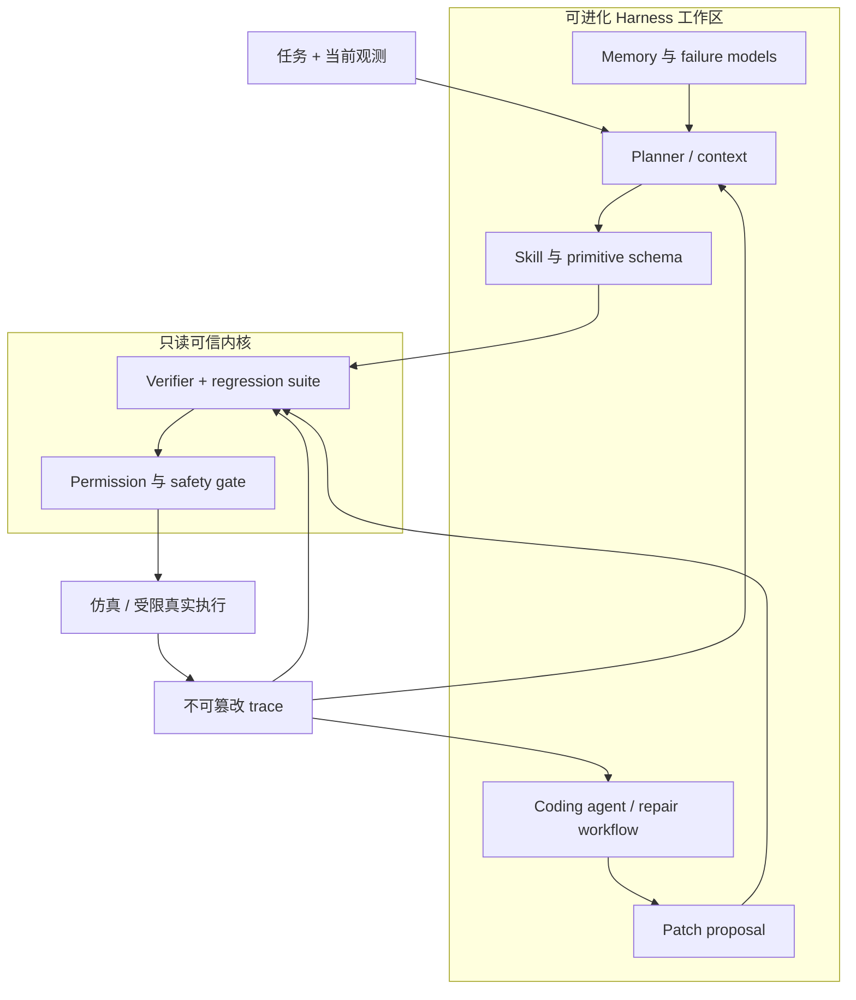

# 机器人Harness工程

核心判断：本项目可以被更精确地定义为“机器人 harness engineering”：让基础模型、VLA、传统控制和 robot skill 在一个可观测、可测试、受权限约束的运行时中协作，并只允许 coding agent 修改明确划定的工作区。

## 定义

Harness 不是单个 prompt，也不是某个 agent framework 的名字。它是包围基础模型或 policy 的运行系统，决定：

- 模型在每一步看到哪些任务、观测、历史和失败证据。
- 模型可以调用哪些 skill、tool 和 primitive，以及参数 schema。
- 调用如何执行、何时停止、如何返回新状态。
- trace、memory、版本和 artifact 如何持久化。
- 结果由什么 evaluator 判断，哪些修改可以被接受。
- 哪些权限、预算和安全规则永远不能由自改进循环绕过。

[[Harness VLA]] 展示了 robot execution harness 的一个具体实例；[[Harness Engineering for Self-Improvement - 综述解读|Harness Engineering for Self-Improvement]] 则给出了从 context、workflow 到 harness code 自优化的更一般框架。

## 三种不同的改进对象

讨论“机器人自进化”时必须说明到底在改什么：

| 改进对象 | 例子 | 优点 | 主要风险 |
| --- | --- | --- | --- |
| 模型权重 | VLA fine-tuning、RL、continual learning | 能学习难以手写的感知与接触控制 | 数据和算力高、难归因、易遗忘 |
| Skill 实现 | 几何计算、fallback、pre/postcondition、skill-local monitor | 局部、可解释、可测试、可回滚 | 只能修复可代码化失败 |
| Harness | context、tool schema、workflow、memory policy、middleware | 可改善长时序组织、诊断和工具使用 | 编辑面更大，容易 reward hack 或破坏抽象边界 |

本项目当前最可验证的主目标是第二类，必要时只开放少量第三类 surface。第一类可以作为 learned skill 的独立训练路线，但不应和代码修复同时变化，否则实验难以归因。

## 机器人 Harness 的控制回路



这个图刻意把执行 trace、verifier 和 safety gate 放在进化工作区之外。coding agent 可以读取它们，但不能删除失败、改评分函数、提高预算或关闭安全限制。

## 可编辑面与保护面

### 第一阶段可编辑面

- 单个 skill 的参数、几何计算和异常处理。
- precondition、postcondition 和 failure classification。
- fallback 与有限状态机转移。
- 针对已知 failure 的测试用例。
- task-specific memory 和有来源的 global failure model。

### 高风险可编辑面

- planner system prompt 和全局 tool description。
- middleware、超时、重试与 primitive serialization。
- 跨任务共享的 runtime completion detector。
- 跨 skill 的共享 perception 或 world-state code。

这些修改可能同时影响大量任务，必须使用更宽的 held-out regression suite 和人工审查。

### 默认只读面

- tracer 原始记录和历史评估结果。
- 外部 success predicate、benchmark adapter、verifier、held-out tests 与评分聚合逻辑。
- 模型身份、推理预算和工具权限。
- 速度、力、碰撞、关节限制、工作空间和急停。
- 真实机器人部署审批与 rollback controller。

## 证据驱动的修改协议

每个 harness 或 skill edit 都应写成可证伪声明：

```yaml
evidence:
  trace_ids: [trial_023, trial_031]
terminal_cause: postcondition_timeout
causal_behavior: grasp_attempt_used_invalid_depth
target_component: skills/grasp_mug/perception.py
root_cause_hypothesis: transparent_handle_depth_holes
proposed_change: add_depth_validity_filter_and_body_fallback
expected_fix:
  - transparent_mug_success_rate_up
at_risk_regressions:
  - valid_handle_preference_down
held_in_tests:
  - transparent_handle_depth_holes
held_out_tests:
  - opaque_handle_visible
  - handle_occluded
```

这里把 terminal cause、causal behavior 和 target component 分开。相同 timeout 可能来自错误 grounding、控制器卡住或 postcondition 写错，不能仅凭最终标签决定修改位置。

## Memory 不是无限上下文

机器人 harness 至少需要三类持久状态：

1. **Task trace**：某个任务成功或失败时的 primitive 顺序、参数绑定和中间状态。
2. **Global operating knowledge**：跨任务复用的 success rule、failure model 和适用条件。
3. **Version history**：每个 patch 的证据、测试、得分、风险、拒绝原因和回滚点。

Memory 更新应增量、可追溯并带失效规则。新经验不能直接覆盖旧规则；发生冲突时要保留来源、适用场景和 benchmark 结果。

## 与现有七层架构的关系

[[核心架构]] 的七层可以映射为两部分：

- **Harness control plane**：任务大脑、Skill Registry、Execution Monitor、Coding Agent、Verifier。
- **Robot execution plane**：感知与世界状态、Skill Executor，以及 learned policy 和传统控制。

[[Harness VLA]] 证明 control plane 可以把冻结 VLA 作为 `VLA_ACT` primitive 使用。但本项目还要增加它没有覆盖的 software maintenance plane：根据 trace 修改 skill/harness，经过 [[Robot CI-CD与安全门]] 后版本化发布。

## 研究边界

- **已有证据**：固定 harness、memory 和 primitive composition 可以显著改善冻结 VLA 在仿真扰动下的表现。
- **已有证据**：coding benchmark 中，受限 harness edit 配合 held-in/held-out verifier 可以提高 agent 表现。
- **合理推断**：同样的可观测性、受限编辑和外部 verifier 原则适用于 robot skill repair。
- **尚未验证**：自动 harness evolution 在真实机器人上的长期收益、安全性和 sim-to-real 泛化。

因此，近期研究目标仍应表述为：

> 执行反馈驱动的 robot skill 自调试与受限 harness 改进，而不是任意自修改的通用机器人。

## 最小落地顺序

1. 冻结 planner、verifier 和安全内核，只允许修复单个 skill。
2. 加入 component-level attribution，测 agent 是否修改了正确模块。
3. 开放 memory rule 和少量 tool schema，测 harness-updating 与 harness-benefit。
4. 最后才考虑 workflow 或 middleware evolution，并扩大 held-out 回归和人工审批。
