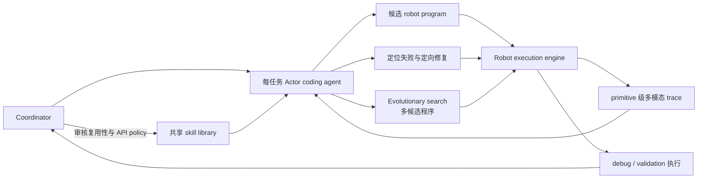

# ASPIRE

核心判断：ASPIRE 是目前对本项目最强的直接近邻和最重要的 novelty threat。它已经完整实现“细粒度多模态执行 trace → coding agent 定位失败 → 修改机器人程序 → 重新执行验证 → 把修复提炼进跨任务 skill library”的循环；因此，本项目不能再把这条宽泛链路本身当作创新，而必须收缩到 **RPent/Harness VLA 中共享 skill implementation 的受限修复、失败类型路由、hidden regression 与安全门**。

## 元信息

- 标题：ASPIRE: Agentic /Skills Discovery for Robotics
- 全称：Agentic Skill Programming through Iterative Robot Exploration
- 作者：Runyu Lu、Yubo Wu、Ethan Kou、Letian Fu、Wenli Xiao、Ajay Mandlekar、Yinzhen Xu、Guanya Shi、Ken Goldberg、Ang Chen、Mosharaf Chowdhury、Yuke Zhu、Linxi “Jim” Fan、Guanzhi Wang
- 版本：arXiv v1，2026-06-30
- 页数：43
- 本地 PDF：[[Source/Papers/aspire-2607.00272.pdf|本地 PDF]]
- 链接：[arXiv:2607.00272](https://arxiv.org/abs/2607.00272)；[项目主页](https://research.nvidia.com/labs/gear/aspire/)
- 角色：[[执行反馈自调试]]、[[自进化代码Agent与评估器]] 与机器人 skill library 的最直接相关工作；必须作为本项目论文叙事与实验设计的第一优先级对照。

![[Source/Papers/aspire-2607.00272.pdf#page=2]]

## 一句话版

ASPIRE 让 coding agent 在一个能暴露 perception、grasp、motion planning 和 control 细粒度 trace 的机器人执行环境中反复写、跑、诊断和修复 task program，再由 coordinator 将经过执行验证、具有复用价值的修复压缩成文本化 skill，并通过 evolutionary search 扩展候选程序空间。

## 为什么这篇论文会改变本项目的问题定义

在读 ASPIRE 之前，我们还可以把“执行失败后自动修改机器人代码，并把经验积累进技能库”视为较新的系统组合。ASPIRE 已经覆盖了这条主线中的大部分环节：

1. 它不只看 episode reward，而是记录 primitive 级别的调用、输入、输出、状态码、关键帧、overlay、grasp candidate 和 motion-plan result。
2. coding agent 可以自主检查 trace、形成失败假设、修改 Python robot program，并通过重新执行验证。
3. 成功修复不会随当前任务结束而丢弃，而会被压缩成 failure signature、适用条件、repair strategy 和代码草图，供未来任务检索。
4. 当单轨 debugging 陷入局部最优时，它会对 robot program 做群体式 evolutionary search。
5. 它已经在 LIBERO-Pro、Robosuite、BEHAVIOR-1K 和真实双臂机器人上给出跨任务、跨 embodiment 的证据。

所以，本项目与它的区别不能只是“我们也用代码”或“我们也保留技能”。更精确的边界是：

- ASPIRE 主要生成和修复 **每个任务的 robot program**，共享库中保存的是经 coordinator 提炼的 **文本化修复知识与代码草图**。
- 本项目拟修改的是 RPent/Harness VLA codebase 中被多个任务共同调用的 **既有 skill/monitor implementation**，并把 patch 当作有版本、可回滚、需通过 hidden regression 的软件制品。
- ASPIRE 的 executor 负责 task-level validation，但论文没有展示类似 [[Robot CI-CD与安全门]] 的跨旧任务回归门、patch provenance、严重安全违规约束和可信 evaluator 隔离。
- 本项目需要预注册 plan/memory-repairable、code-repairable 与 policy-limited failure，证明 agent 知道何时不该改代码；ASPIRE 更关注把任务做成，而不是识别“最小充分干预层”。

换言之，ASPIRE 抢占了宽泛的系统愿景，却也帮我们暴露了一个更窄、更可证伪的问题：**共享实现级 patch 是否能在预算匹配、final-blind、回归非劣与安全约束下，提供 fixed Harness VLA 无法得到的增益？**

## 系统总览



这里的 `/skills` 不是固定的人类手写 primitive 集合。底层允许调用的 perception、planning、control API 仍然是固定边界；`/skills` 保存的是 agent 从失败中归纳出的、可在未来 program synthesis/debugging 时作为 in-context guidance 使用的修复模式。

## Section-by-section

### Abstract：贡献不是单次修复，而是让调试经验复利

摘要把传统机器人编程的困难归因于多模态感知、接触动力学、环境变化和执行失败之间的耦合。ASPIRE 提出三个联动组件：

- closed-loop robot execution engine：暴露可诊断的 primitive trace；
- continually expanding skill library：把验证后的修复变成可检索知识；
- evolutionary search：并行探索不同 task sequence 和 control program，而不是只沿一条 trajectory 反思。

论文报告的 headline result 包括：在 LIBERO-Pro 的某些 manipulation perturbation 上相对 prior method 最多提升 77 个百分点；Robosuite 双臂 handover 从 20% 提升到 92%；BEHAVIOR-1K 某些长时序任务最多提升 32 个百分点；LIBERO-Pro Long 零样本总体成功率约 30.5%，而 CaP-Agent0 为 3.8%。这些都是论文 v1 的结果，本库尚未独立复现。

### 1. Introduction：为什么只给 episode reward 不足以修机器人程序

引言的核心论点是，robot-program failure 通常是多组件因果链。一次失败可能来自目标检测、坐标变换、grasp proposal、motion planning、接触动力学或 recovery。如果只告诉 agent “reward=0”，它既不知道查什么，也容易修改错误组件。

论文进一步指出，已有 coding-agent robot 系统往往不积累调试经验：第一百个任务仍像第一个任务一样从头发现同类错误。ASPIRE 模仿机器人工程师的工作方式——回放 trace、查看 overlay 和 trajectory、定位子系统、修改实现，再把经验内化成复用规则。

这一论证直接支持本项目的 [[执行反馈自调试]]，但也提醒我们：记录更多数据不等于找到因果。trace 必须以 primitive/component 为索引，并能回答“哪一个调用首次使状态偏离成功轨迹”。

### 2. Method：Coordinator–Actor 架构

Coordinator 管理共享 skill library，并把各任务分发给 actor coding agent。每个 actor 的上下文只保留当前任务、当前程序和相关执行 trace；actor 之间不交换完整聊天记录或原始 rollout，而是通过 library 中压缩后的 transferable finding 间接共享经验。

这种设计解决两个工程问题：

- 防止跨任务 raw trace 把 context window 撑爆；
- 让 library entry 成为显式的知识接口，而不是不可审计的长聊天历史。

但它也引入一个关键可信度问题：coordinator 如何判断一个修复“可复用”，而不是一次 seed-specific workaround？论文依赖 debug validation 和 coordinator 审核，尚未给出跨旧任务的强 regression admission rule。

### 2.1 Robot Execution Engine：把失败定位到 primitive

Engine 对每个 perception、planning、grasp 和 control call 记录：

- 调用的 API、输入、输出与 return status；
- 调用前后的 RGB keyframe；
- segmentation/depth overlay；
- grasp candidates、object poses；
- motion planner result 与 collision feedback。

它没有把整段视频无差别塞给模型，而是保留 primitive 前后的关键证据。这是一个重要设计取舍：原始信息过少会隐藏根因，过多又会让 agent 被无关帧淹没。

论文的 radio 例子很具体。机器人已经正确找到红色收音机，因此 perception 不是根因；但多个 `navigate_to_pose` 候选点都落在桌边 collision buffer 内，连续返回 `PLANNING_ERROR`。agent 据此没有去改 segmentation prompt 或 grasp，而是写出 multi-angle approach：围绕物体旋转 45°、90° 或 180° 的 approach vector，找到可行一侧后重新定位和抓取。

这与本项目希望的 repair report 格式高度一致：

```text
观察：目标位姿稳定，但多个导航调用返回同类 planner error
归因：目标点距障碍边界过近，而非 perception/grasp 失败
假设：改变 approach direction 可恢复可达性
修改：加入 multi-angle fallback
验证：新 seed 上重新执行，并检查旧导航任务回归
```

差别在最后一行：ASPIRE 验证当前任务和 validation seed；本项目还要求隐藏的 unaffected regression suite。

### 2.2 Skill Library：保存的是修复模式，而非完整 task program

Library entry 可能属于 localization、perception prompting、grasping constraint、navigation recovery、motion primitive、scene reasoning 或 debugging workflow。taxonomy 不是事先固定，而是从实际验证过的修复中形成。

每条 skill 至少包含：

- failure signature；
- when-to-apply condition；
- repair strategy；
- 必要时附代表性代码草图。

Radio 修复被保存成“若障碍附近的 navigation target 连续触发 planning error，则旋转 approach vector 搜索其他可达侧”，而不是保存“抓红色收音机”的整段任务程序。这种抽象解释了为什么经验能跨对象和 embodiment 迁移。

Actor 提交 structured finding；coordinator 审核是否遵守 allowed API policy、是否具有跨任务价值，再串行写入共享 library，避免并发写冲突。附录还明确禁止读取 simulator ground truth、资产 XML/URDF 或 success predicate，说明作者已意识到 benchmark leakage 风险。

不过，“通过 debug configuration”与“可复用”仍不是同一个命题。若没有以 library entry 为顶层单位的 held-out tasks 和旧任务 regression，library 可能积累彼此冲突、过期或过度具体的规则。论文自己也在 Limitations 承认长期 pruning、ranking 与 re-validation 尚未解决。

### 2.3 Evolutionary Search：搜索对象是可执行程序

单个 agent 的 iterative debugging 容易反复微调同一失败策略。ASPIRE 因而维护候选 program history，每一轮从当前 top-3 program、残余 failure trace 和 skill library 出发生成 `K` 个候选，逐一在 debug seeds 执行，再保留更好的 program。达到阈值或耗尽 `T` 轮后，最佳 program 在独立 validation set 上验证，随后提取 reusable pattern。

关键点是，搜索的 fitness 来自真实 simulator execution，而不是 LLM 自评；同时 trace 会进入下一代候选条件。它比“生成 N 个 patch，然后按语言模型置信度选一个”更可信。

对本项目而言，evolutionary search 可以作为候选 patch generator，但最终选择不能只用 repair task reward。必须把 hidden regression、安全违规和复杂度成本共同纳入 gate，否则搜索越强，越容易找到 evaluator loophole。

### 3.1–3.3 Experimental Setup、Benchmarks 与 Protocol

仿真实验统一使用 Claude Code + Claude Opus 4.6（1M context），在 CaP-X/MuJoCo Playground 中写 Python program；环境与 API 固定。benchmark 包括：

- LIBERO-Pro：Object、Goal、Spatial 三个 suite 的位置扰动与指令扰动；
- Robosuite：7 个 contact-rich 单臂/双臂任务；
- BEHAVIOR-1K：两个长时序移动操作任务；
- LIBERO-Pro Long：用 LIBERO-90 累积的 library 做未见长任务零样本迁移。

主要 coding baseline 是 CaP-Agent0；还对比 OpenVLA、π0、π0.5。LIBERO-Pro 中 ASPIRE 在 seeds 51–65 调试、66–80 做候选选择、1–50 做最终评测；每个 task 最终只运行一份生成程序。CaP-Agent0 则会针对每个 evaluation seed 重新推理和重试，因此 ASPIRE 的优势不是靠 test-time 每 seed 重新生成得到的。

这套拆分值得借鉴，但本项目还需再加一层：repair agent 永远看不到的 final-blind set，以及不触发目标缺陷的 unaffected regression tasks。否则 agent 可能通过反复查询 validation feedback 过拟合。

### 3.4 Main Results：强结果主要来自 execution engine

LIBERO-Pro 的 macro-average 如下：

| 方法 | Pos | Task | Overall |
| --- | ---: | ---: | ---: |
| π0.5 | 25% | 1% | 13% |
| CaP-Agent0 | 20% | 16% | 18% |
| ASPIRE | 77% | 67% | 72% |

分 suite 看，ASPIRE 在 Object 上达到 98%/95%，Goal 为 81%/45%，Spatial 为 51%/60%。这说明它并非所有组合都接近饱和；空间关系与复杂 goal 仍留下较大失败空间。

Robosuite 七任务均值从 CaP-Agent0 的 68% 提升到 81%，最显著的是双臂 handover：20% → 92%。但 nut assembly 仍只有 9%，two-arm lift 还从 74% 降到 71%，提示 library/repair 并非单调改善。

BEHAVIOR-1K 中，radio task success 从 CaP-Agent0 的 56% 提升到 88%，soda-can task 从 72% 提升到 88%。这里采用 interactive block-by-block generation，和 LIBERO-Pro 的“一份 program 跨 seeds”协议不同，比较时不应混成一个统一 sample-efficiency 结论。

### 3.5 Zero-Shot Transfer：经验规模有整体趋势，但单任务并不单调

用 `N=0/25/50/90` 个 LIBERO-90 source tasks 建 library，LIBERO-Pro Long 的零样本总体成功率从 4.7% 增至 13.7%、21.5%、30.5%。完整 `N=90` library 达到 Pos 22.6%、Task 38.3%，明显高于 CaP-Agent0 的 5.2%/2.4%。

但逐任务表显示明显非单调：例如某些 task 在 `N=50` 成功、到 `N=90` 反而下降。这支持“经验总体复利”，却不能证明 library 越大必然越好，也强化了本项目对 conflict detection、versioning、回归和 skill retirement 的需求。

### 3.6 Real-Robot Transfer：迁移的是调试先验，不是 simulator policy

论文把仿真中发现的三条 skill 作为 in-context guidance，交给使用另一套 embodiment/API 的真实双臂 robot coding agent。它不是直接部署仿真 policy，而是比较真实机器人调试时有无该先验。

- bowl-on-plate：两组最终均为 20/20，但总 token 从 8.65M 降到 5.11M；
- soda-can lift：13/20 → 19/20，总 token 从 61.94M 降到 6.58M；
- drawer：无 skill 为 0/20，有 skill 为 11/20，总 token 也显著下降。

这是有价值的跨 embodiment 初证，但只有 3 个选定技能，不能推出完整 library 可无筛选地迁移到真实机器人。安全 reset、自动 success detection 与长期 autonomous loop 仍未闭合。

### 3.7 Ablations：dense trace 的贡献大于 evolutionary search

论文把 base system、execution engine 和 evolutionary search 分开。在 LIBERO-Pro 上，宏观平均成功率大致从 14% 提升到 62%，再由 evolutionary search 提升到 72%。因此最主要的收益来自“可诊断执行环境 + iterative repair”，搜索是解决残余难例的增量组件。

这直接形成可验证假设：本项目的 structured component trace 应显著优于 terminal reward/raw transcript；如果没有这一增益，就没有理由承担复杂 tracer 的工程成本。

### 4. Related Work

论文把自身放在 code-as-policy、软件工程 agent、open-ended skill library 和 self-improving agent 的交叉点。它与 Voyager 式 library 的区别是：entry 来自有 failure attribution 的机器人执行修复，而不是只记录成功程序或文本反思；与 reward/curriculum evolution 的区别是：搜索和保存的对象是 executable robot program 与修复知识。

### 5. Limitations

论文明确承认：

- 真实机器人仍缺自动 success detection、安全 reset、safety monitoring 和 calibration maintenance；
- 高度依赖 Claude Opus 4.6 与 1M context，未验证小模型能否维持循环；
- 固定 API 限制可表达行为，缺失底层 sensing/control primitive 时仍需人类扩展；
- library 可能陈旧、重复、冲突或误导，长期管理尚未解决；
- debugging/evolutionary search 消耗大量 LLM 调用与 rollout。

### 6. Conclusion

结论强调的不是一次 benchmark patch，而是经验随任务数增长形成复用 library，并在新任务、长时序任务和真实 embodiment 上降低后续调试成本。对本项目而言，这个结论应被当作“强相关证据”，而不是可以直接复述的新主张。

## 一个贯穿本项目的具体例子

假设 RPent 中多个任务共用 `move_to_object()`。某个实现总把接近点放在物体与桌边之间，导致 planner 连续返回 collision error。

- ASPIRE 路线：actor 修改当前 task program，加入 multi-angle approach；成功后把该策略写成文本 skill，未来程序生成时检索。
- 本项目路线：定位到共享 `move_to_object()` implementation，在 allowlist 中提交 patch；先在触发缺陷的 held-in cases 验证，再在 unseen objects/layouts、所有调用该 primitive 的旧任务和安全约束上做 hidden gate；通过后产生新版本，否则回滚。
- [[Harness VLA]] fixed baseline：不改 implementation，只允许 planner 通过 memory/retry 改变调用顺序和参数。

三者可能生成相似的 Python 片段，但研究对象不同：ASPIRE 研究 agentic program discovery 与知识复利；Harness VLA 研究冻结 primitive 的编排；本项目研究 **共享软件组件的受验证演化**。

## 关键实验与证据总结

| 问题 | 论文证据 | 对本项目的含义 |
| --- | --- | --- |
| 细粒度 trace 是否有用 | engine ablation 约 14% → 62% | structured trace 必须做成独立 ablation |
| 多候选搜索是否有增益 | 再由约 62% → 72% | 可作为 patch search，但必须预算匹配 |
| 技能能否跨任务复用 | Long zero-shot overall 4.7% → 30.5%（N=0→90） | library growth 要用未见任务评估 |
| 是否能跨 embodiment | 3 个真实机器人技能降低 token，并改善 2/3 任务成功率 | 只能视为初证，不能替代系统性 sim-to-real |
| 是否存在负迁移 | per-task library scaling 与部分 Robosuite 指标非单调 | 必须有 regression、conflict 与 retirement 机制 |

## 局限与批判

### 已有证据支持的局限

- 最强结果依赖 frontier coding model、超长上下文和大量 rollout，论文没有把每个 task 的完整 LLM token、环境交互与 wall-clock 成本统一报告成 success–cost curve。
- Library admission 的“验证”主要围绕当前修复与 validation seeds，未展示持续扩张过程中对所有旧技能的隐藏回归。
- 多个 benchmark 使用不同执行协议；LIBERO-Pro 是固定 program 跨 held-out seeds，BEHAVIOR-1K 是增量 block generation，因此不宜只用一个总体数字概括。
- 真实机器人证据是挑选的 3 个技能，且尚无 fully autonomous lifelong loop。

### 合理推断

- 强搜索器和 rich trace 也更可能发现 simulator/evaluator shortcut；禁止 ground-truth API 是必要条件，但还不足以排除 reward hacking。
- Skill library entry 是语言和代码草图，长期可组合性依赖基础模型解释；它不像 typed, executable, versioned module 那样能直接做静态依赖分析。
- ASPIRE 未按“最小充分干预”划分 failure；有些成功可能本可由 plan/memory 调整完成，不足以单独证明共享 code repair 的必要性。

## 与 Harness VLA、RPent 和本项目的精确边界

| 维度 | Harness VLA / RPent fixed mode | ASPIRE | 本项目拟验证 |
| --- | --- | --- | --- |
| 低层/解析 API | 固定 | 固定允许集合 | 可信内核固定 |
| 每任务 program | planner 组合固定 primitive | actor 自主生成并修复 | planner 固定或预算匹配 |
| 共享 memory | task/global memory | 文本化 repair skill library | 作为对照冻结或单独因子 |
| 共享 skill implementation | 不修改 | 不是主要演化对象 | **允许白名单内 patch** |
| 验证重点 | task success/retry | debug + validation execution | **hidden repair + regression + safety** |
| 失败路由 | planner 在线处理 | 以完成任务为中心 | **plan/code/policy/out-of-scope 预注册** |
| 发布语义 | 更新 memory/recipe | admission 到 in-context library | **版本、回滚、provenance** |

因此，ASPIRE 应成为 related-work 第一段和实验 reviewer simulation 的默认对手。我们的 primary baseline 仍应是同一 RPent codebase 的 strongest plan/memory-only Harness；若资源允许，再在共同 defect subset 上实现 ASPIRE-style task-program repair，回答“为什么一定要改共享 implementation，而不是只修每任务程序”。

## 对实验假设的影响

1. **收缩主假设**：不能检验“机器人能否根据 trace 修程序”，而应检验“共享 implementation patch 是否在 code-repairable failure 上优于 task-program/memory repair”。
2. **增加 program-repair baseline**：除了 memory-only，还需要允许 agent 改当前 task program、但不改共享 skill 的 ASPIRE-style 对照。
3. **必须报告成本**：统一限制 repair traces、环境交互、候选数、token 和 wall-clock，或报告 success–cost Pareto curve。
4. **加入 library regression**：每个新 patch 不只跑触发任务，还要跑所有依赖该 component 的旧任务和安全用例。
5. **分开修复与积累**：先证明 single-patch conditional repair，再研究多个 patch 连续进入 library 后是否出现冲突、遗忘和非单调收益。
6. **保留 abstention**：对 policy-limited、evaluator/hardware 和 API-missing failure，正确行为是拒绝改代码并升级，而不是搜索到某个 benchmark workaround。

## 我会追问的问题

- 如果让 ASPIRE 只能修改共享 skill implementation，而不能修改 task program，它的收益和失败模式会怎样变化？
- Coordinator 的 admission precision 是多少？被收入 library 的修复有多少在未见任务上有正迁移、零作用或负迁移？
- 在统一 token、rollout 和候选预算后，execution engine、library retrieval 与 evolutionary search 各自贡献多少？
- 如果 final evaluator 完全隐藏，agent 只能看到有限 gate feedback，当前结果还能保持多少？
- 是否存在“当前任务成功，但破坏另一任务”的 program/skill repair？论文的 library 是否能检测并撤销？
- 把文本化 skill 编译为 typed implementation + contract + tests 后，跨 embodiment 的优势会增加，还是会因为接口差异反而下降？
