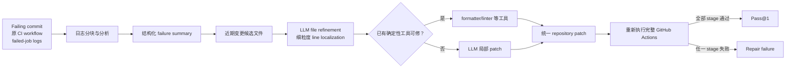
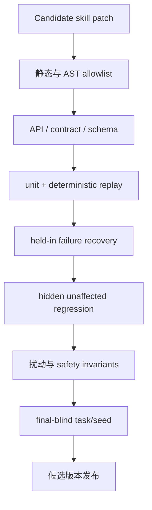

# CI-Repair-Bench

核心判断：CI-Repair-Bench 说明可信修复不能只看某个单元测试是否转绿，而要把补丁放回原 repository workflow，重新经历环境、依赖、格式、静态分析和测试等全部关卡；这正是本项目提出 Robot CI 的软件工程依据，但“完整 CI 通过”仍不等于 hidden semantic correctness，更不等于真实机器人安全。

## 元信息

- 标题：CI-Repair-Bench: A Repository-Aware Benchmark for Automated Patch Validation via CI Workflows
- 作者：Rabeya Khatun Muna、Md Nakhla Rafi、Tse-Hsun (Peter) Chen
- 版本：arXiv v2，2026-05-04
- 页数：31
- 本地 PDF：[[ci-repair-bench-2604.27148.pdf|本地 PDF]]
- 链接：[arXiv:2604.27148](https://arxiv.org/abs/2604.27148)；[官方仓库](https://github.com/RabeyaMuna/CI-REPAIR-BENCH)；[数据集](https://huggingface.co/datasets/ci-benchmark-user/ci-repair-bench)
- 角色：[[Robot CI-CD与安全门]] 的 repository-level workflow 参照；[[Benchmark与实验平台]] 中 trace、fault localization、完整验证与成本核算的 benchmark 参考。
- 阅读状态：已按 arXiv v2 全文精读。PDF 标题页仍带期刊模板占位字段，应视作预印本。

![[ci-repair-bench-2604.27148.pdf#page=1]]

## 一句话版

CI-Repair-Bench 从真实 GitHub Actions 中构造 567 个 failure episodes；repair agent 只拿失败 commit、workflow 和长日志生成一个 repository-level patch，最终不靠局部测试或 LLM judge，而是重新执行完整 CI pipeline，只有所有活跃阶段都从失败变为成功才计为 Pass@1。

## 为什么对本项目重要

机器人 skill patch 也不应只回答“触发失败的那条 episode 修好了吗”。它必须同时满足：

```text
代码可解析/可导入
-> API/contract 一致
-> 单元和 replay 通过
-> 仿真任务恢复
-> unaffected tasks 不回归
-> safety invariants 不违反
-> 才能进入硬件候选
```

CI-Repair-Bench 的关键启发是：这些验证不是互相替代的指标，而是同一次候选发布的多阶段 conjunction；任一 stage 失败，patch 就不能发布。

它还提醒我们，failure trace 不只是程序 exception。环境版本、dependency resolution、workflow configuration 和静态工具输出也属于诊断证据。不过第一篇 robot code-repair 论文仍应保持更窄的 editable scope：允许修改 skill workspace，不允许修改 evaluator、hidden tests、预算器和安全门，避免 agent 通过改 CI 来“修复”CI。

## Benchmark 与参考系统总览



论文贡献有两层：

1. **Benchmark**：真实、可重放、带多标签 failure taxonomy 的 CI episodes。
2. **Reference repair framework**：log analysis -> fault localization -> patch generation 的单候选基线，用四个 LLM backbone 运行。

不要把 reference framework 的 18.9% 当作 benchmark 上限；它只是证明数据集可执行，并暴露哪些 failure types 仍困难。

## Section-by-section

### Abstract 与 Section 1：CI repair 不等于 source-code unit-test repair

作者指出传统 APR benchmark 常有五个不足：

1. repair target 限于 source code。
2. correctness oracle 只看测试。
3. 固定环境排除了 dependency/environment failures。
4. diagnosis 依赖 issue description，而不是长而噪声的 CI logs。
5. 验证只覆盖简化的部分 workflow stages。

CI-Repair-Bench 因此允许 repository-level changes，包括 source、dependency specification、configuration 和 workflow 文件；并用原生 GitHub Actions 的完整 workflow 重跑作为最终 oracle。

这对本项目形成一个看似矛盾但实际需要分阶段处理的结论：

- 长期 Robot CI 应能发现代码、配置、模型版本、环境和 evaluator 等多类失败。
- 第一篇 code-repair 实验必须冻结 trusted kernel，只开放 skill implementation；否则无法区分“修 skill”与“改测试/改环境让错误消失”。

### Section 2：与 issue-repair benchmark 的边界

SWE-bench 等 repository benchmark 已经比函数级 APR 更真实，但仍主要在固定 container 中跑 unit/integration tests。CI-centric 数据集如 GitBug-Actions、ActionsRemaker 和 LCA-CI-Repair 引入 workflow execution，却规模较小或只保留单一 workflow/job。

CI-Repair-Bench 的区别是：

- 多个相互依赖 jobs。
- conditional paths。
- 多环境/配置重复执行。
- nested/reusable workflows。
- build、dependency、config、static analysis 和 tests 共同作为 oracle。

这更接近生产部署 gate，但也使 benchmark 长期复现依赖外部 Actions、runner 和依赖生态。

### Section 3.1：任务与指标

输入：

- failing commit 的 repository state。
- 对应 CI workflow 配置。
- failed run 的执行日志与错误 artifacts。

输出：一个 candidate repository patch。

评测步骤：

1. checkout failing commit，创建隔离 benchmark branch。
2. 选择失败 workflow。
3. 为成本和可重复性做标准化：保留验证语义，移除无关 workflow、重复 OS/Python matrix，以及发布 artifact 等非验证步骤。
4. 应用候选 patch。
5. 在 GitHub Actions 中重新执行标准化 workflow。
6. 只有 workflow 从 failure 完整转为 success，且没有新 CI failure，才算成功。

主要指标：

- `Top-1/3/5`：预测排序前 k 个文件中是否包含至少一个 ground-truth repair file。
- `MAP`：整体文件排序质量。
- `Applied Patches`：成功应用并送入 CI 的候选数量。
- `Pass@1`：第一个、也是唯一候选经过完整 CI 后成功的比例。

这里要注意 Top-k 定义只要求命中**至少一个** ground-truth file；跨文件修复中可能漏掉其余必需文件，因此高 Top-k 不保证最终修复。

### Section 3.2：数据构建

#### Repository selection

作者从 Python GitHub repositories 中筛选：

- stars 和 forks 至少 1,000。
- 数据收集时（2025 年初）过去 90 天内活跃。

活跃窗口也与 GitHub Actions logs 默认 90 天后删除有关。最终保留 103 个 repositories。

#### Failure-success pair

每个 episode 是同一 branch、同一 workflow 上的：

```text
failing commit
-> 最近的 subsequent passing commit
```

保留条件包括至少一个修改文件为 Python source，并排除 release、deployment、Dependabot、documentation 等非 program-validation workflows。这个筛选与论文强调“可修非代码 artifact”之间存在一个重要局限：纯 YAML、纯 dependency 或纯环境修复若没有 Python 文件变化，可能在构建阶段就被排除，因此非代码 failure 的代表性可能低于叙事给人的印象。

#### 清洗与可重放

人工排除：

- self-hosted runner。
- organization-restricted infrastructure。
- deprecated runner。
- 不支持的第三方服务。
- confidential secrets。
- dependency drift、服务不可用或 non-deterministic outcome。

随后移除非验证步骤、压缩重复 matrix，但保留 setup、dependency install、static analysis 和 tests。

#### Ground-truth patch extraction

passing commit 可能混有 refactor、feature、formatting 或 dependency maintenance，不能直接作为 oracle patch。作者根据：

- failed-job logs。
- workflow validation steps。
- changed artifacts。

抽取与 failure 因果相关的修改，逐步应用到 failing commit，并通过完整 CI 重新执行寻找能恢复成功的最小修改集合。

这比直接用 commit diff 更可靠，但“最小”是由抽取流程与 CI oracle 定义的，不是形式上的全局最小补丁。

#### Dataset assembly

每个实例包含：

- repository owner/name/branch。
- failing/passing SHA。
- workflow name/path/configuration。
- failed job logs。
- ground-truth patch。
- 一个或多个 failure-type labels。

最终为 567 个 episodes、103 个 repositories、893 个 labels。label 数大于实例数，因为一个 workflow 可以同时有多类 failure。

### Section 3.3：benchmark 维护

runner、package、action 和外部服务会随时间失效。论文计划周期性重验证：

- 将 deprecated component 更新到最接近、仍保留原 validation intent 的版本。
- 若新环境引入额外 failure，只把恢复端到端 CI 所需的最小附加改动并入 ground-truth patch。

这使 benchmark 更可运行，但也意味着实例不是静态文物。任何论文复现必须固定：

- benchmark release/version。
- workflow snapshot。
- runner image。
- dependency lock。
- ground-truth patch revision。

否则同一个 instance ID 的实际任务可能发生漂移。

### Section 3.4 的具体实例：Diffusers formatting failure

示例来自 Hugging Face Diffusers。CI 运行 `ruff format --check`，日志明确指出某 Python 文件的 import block 未排序。ground-truth patch 只是把 `safe_open` import 移到 formatter 要求的位置。

这是 reference framework 最擅长的 failure：

```text
日志明确给出工具 + 文件 + 规则
-> 运行同一 deterministic formatter
-> 完整 CI 验证
```

对机器人项目，相应 easy tier 是：

- schema/type mismatch。
- formatter/linter。
- unit/contract test 明确指出某个函数和字段。

而“抓取失败但日志只有 task failure”更像论文中的 dependency/environment tier：根因分布在多个组件，不能从单一局部错误直接映射到 patch。

### Section 4.1：CI log analysis

CI 日志可能超过上下文窗口。reference framework：

1. 按 token 分块并保持执行顺序。
2. 超过预算时优先保留最近 chunks。
3. 早期 chunks 只有包含 error、exception、non-zero exit 等显式信号才保留。
4. LLM 逐块迭代，维护 intermediate structured state。
5. 最终输出只基于日志证据的 summary 与 relevant file paths。

论文另设 BM25 retrieval 对照：按 lexical overlap 找日志 chunks 和可能相关文件，再由 LLM 汇总。

映射到机器人 trace 时，“优先最后一段”只能作为启发，不能照搬。许多物理失败的根因发生在更早的 perception、transform 或 staging 阶段，最后帧只显示结果。更合适的是 primitive-boundary + causal dependency indexing。

### Section 4.2：fault localization

三步缩小范围：

1. **Change-based candidates**：从失败 commit 和近期 history 收集修改文件，向前追溯到上一次成功 CI 或 metadata 不可用。
2. **LLM file refinement**：只有 diff 与 failure summary 有明确因果证据时才保留文件。
3. **Fine-grained localization**：建立 functions/classes/imports outline，分块读取文件，输出精确 line range、issue type、scope 和证据。

它比 perfect localization 更真实，但仍依赖“失败通常由近期 change 引入”的假设。机器人长期运行中，latent bug 可能只因新场景被触发，而代码最近没有修改，因此还需根据 runtime call graph 和 skill registry 搜索。

### Section 4.3：patch generation

先选择修复策略：

- 若 CI workflow 已使用 formatter/linter 等 deterministic tool，由 LLM 生成工具安装和运行命令，优先自动修复。
- 否则让 LLM 只修改 localization 指定区域，要求最小、局部、无关代码不变。

所有修改合并为统一 patch，用 three-way merge 应用，然后完整重跑 CI。reference framework 只生成一个候选，因此 Pass@1 不依赖 best-of-N selection。

值得警惕的是：让 LLM 自由生成安装/运行命令扩大了 supply-chain 与权限面。Robot CI 中 deterministic fixer 列表必须由 trusted kernel allowlist 提供，不能让 agent 下载任意工具。

## Section 5.1：四个模型的 end-to-end repair

| Model | Applied patches / 567 | Pass@1 |
| --- | ---: | ---: |
| GPT-5-mini | 455 | 18.9%（107 个） |
| DeepSeek-Coder | 438 | 15.9% |
| DeepSeek-Chat | 416 | 13.2% |
| GPT-4o-mini | 420 | 7.9% |

文件 localization：

| Model | Top-1 | Top-3 | Top-5 | MAP |
| --- | ---: | ---: | ---: | ---: |
| GPT-5-mini | 45.33 | 53.97 | 58.55 | 42.53 |
| DeepSeek-Coder | 42.50 | 50.44 | 52.38 | 38.83 |
| GPT-4o-mini | 42.50 | 50.97 | 54.50 | 38.26 |
| DeepSeek-Chat | 41.62 | 47.27 | 48.15 | 37.92 |

最关键的发现是 localization 相近，Pass@1 却相差超过 2 倍。GPT-4o-mini 的 Top-1 与 DeepSeek-Coder 同为 42.50%，Top-3 甚至略高，但 Pass@1 只有 7.9% vs 15.9%。

此外，73%–89% 已成功应用的 patches 最终仍未通过 CI。对 GPT-5-mini，455 个可应用 patch 只有 107 个通过。这证明：

```text
patch 可应用
≠ 定位正确
≠ 修复完整
≠ repository workflow 通过
```

机器人研究同样不能把“agent 输出了合法 diff”或“held-in episode 成功”当作最终 repair success。

## Section 5.2：Agent log analysis 与 BM25 的质量—成本权衡

端到端结果：

| Model | Agent Pass@1 | BM25 Pass@1 | 相对下降 |
| --- | ---: | ---: | ---: |
| GPT-5-mini | 18.9% | 10.6% | 43.9% |
| DeepSeek-Coder | 15.9% | 9.9% | 37.7% |
| DeepSeek-Chat | 13.2% | 9.5% | 28.0% |
| GPT-4o-mini | 7.9% | 1.9% | 75.9% |

GPT-5-mini 全 567 实例的 stage-wise 成本：

| 策略 | 总 tokens | API cost | API calls |
| --- | ---: | ---: | ---: |
| Agent analysis | 195.49M | \$295.12 | 16,108 |
| BM25 retrieval | 34.81M | \$62.03 | 5,253 |

Agent 分析使用：

- 5.6 倍总 token。
- 4.8 倍 API cost。
- 3.1 倍 API calls。

它确实更有效，但这不是 budget-matched ablation。论文证明“更深的日志推理值得更多资源”，没有单独证明在相同 token/调用预算下 agentic analysis 仍优于 retrieval。

对 H5 来说，这一点非常关键：structured trace 组若拥有更多 model calls 或更长上下文，不能把全部增益归因于 trace 表达。

## Section 5.3：12 类 CI failure

论文把 893 个 labels 分为：

### Code-level

- Code Formatting
- Code Linting
- Syntax Error
- Runtime Error
- Test Failure
- Assertion Error
- Type Checking

### Project-level

- Dependency Issues
- Package Installation Error
- Configuration Error

### Environment-level 与文档

- Environment Error
- Doc/Docstring

最强配置 GPT-5-mini + Agent 的代表性结果：

| Failure type | Occurrences | 修复数 | 比例 |
| --- | ---: | ---: | ---: |
| Code Formatting | 121 | 43 | 35.5% |
| Code Linting | 208 | 37 | 17.8% |
| Test Failure | 115 | 15 | 13.0% |
| Runtime Error | 85 | 9 | 10.6% |
| Syntax Error | 68 | 7 | 10.3% |
| Dependency Issues | 148 | 10 | 6.8% |
| Package Install Error | 48 | 0 | 0% |
| Configuration Error | 34 | 1 | 2.9% |
| Environment Error | 32 | 1 | 3.1% |

论文总结 repairability 由 **signal locality** 主导：

- formatter/linter 日志直接给 violation 与 location，容易映射为确定性 edit。
- dependency/config/environment 的信号间接、分布式，往往要求跨文件、工具链和外部上下文推理。
- 更强模型主要放大 already-tractable categories，没有解锁最难类别。

这是本项目 failure taxonomy 的重要补充：除了按“最小充分干预”分类，还应记录 observability/locality。两个同属 code-repairable 的 bug，若一个有精确 contract failure、另一个只有稀疏任务失败，难度完全不同。

## Section 6–8：讨论、威胁与结论

作者将失败原因归纳为：

- log-bounded reasoning：日志只暴露第一个或表层失败。
- cross-file/dependency reasoning 不足。
- configuration 需要项目特定知识。
- fail-fast 隐藏后续错误，只有重跑后才逐步出现。

论文明确承认：

- LLM 非确定性会在各 stage 传播。
- CI workflow 本身可能因环境与外部依赖不稳定。
- Pass@1 不给 partial fix credit。
- logs 通常只显示第一个失败步骤。
- 仅覆盖 Python repositories。
- ground-truth patch 从历史 commit 抽取，可能有噪声。
- workflow 和依赖会漂移，需要持续维护。

还应增加三项批判：

1. **完整 CI 是更宽 oracle，不是完备 oracle。** workflow 没有检查到的语义和安全问题仍会漏过；应与 [[STING]] 式 test-adequacy audit 结合。
2. **标准化 workflow 可能改变真实执行语义。** 移除重复 matrix 与非验证 steps 能节省成本，但某些平台特定或 artifact-interaction bug 可能随之消失。
3. **多标签统计不能直接相加理解为独立 cases。** 一个成功 patch 会同时计入多个 failure labels；per-type 修复数不是互斥样本，也不能据此简单估算总体贡献。

## 对 H5、H2、hidden tests 与预算的影响

### H5：支持“语义化 trace analysis 有用”，但不是预算匹配证据

Agent log analysis 相比 BM25 显著提高 localization 与 Pass@1，说明长而异构的 execution artifacts 需要跨 chunk 整合，不是关键词检索即可解决。

但 Agent 使用 5.6 倍 tokens，因此本项目 H5 应比较：

1. outcome-only。
2. BM25/固定检索的 raw trace。
3. 预算匹配的 structured causal trace。
4. 允许额外预算的 full agentic analysis，作为 upper-resource point。

并同时报告：

- top-1 component localization。
- final-blind repair success。
- trace tokens。
- LLM calls。
- environment rollouts。

### H2：failure taxonomy 应同时包含 intervention 与 signal locality

CI-Repair-Bench 的 12 类 surface error 有助于分析，但本项目更需要二维标签：

| 维度 | 例子 |
| --- | --- |
| 最小充分干预 | plan/memory、code、policy、trusted kernel |
| 信号可观测性 | explicit-local、distributed-cross-component、latent/partial |

例如：

- `skill contract 参数类型错`：code + explicit-local。
- `frame transform 漏用`：code + distributed trace。
- `VLA 从未学会透明物体抓取`：policy + latent。
- `success predicate 读错 simulator flag`：trusted kernel + explicit/latent。

H2 的成功不是所有类别都修复，而是在不可编辑/非 code 类别上正确 abstain，并把 failure 升级到合适路径。

### Hidden tests：完整 workflow 与 hidden gate 是两条正交轴

CI-Repair-Bench 把 workflow/config 和日志作为输入，因此 agent 大体知道验证阶段；最终执行是外部的，但不代表 hidden semantic tests 足够强。

Robot CI 应同时具备：

- **workflow breadth**：static、contract、unit、sim、regression、safety。
- **test secrecy**：最终 seeds/tasks 不进入 agent context。
- **test strength**：用 mutation survivors 检查 false acceptance。
- **submission limits**：避免 agent 通过反复 gate feedback 反推 hidden cases。

“关卡很多”和“测试充分”不能互相替代。

### 预算：完整验证是主要资源，必须共享

CI-Repair-Bench 的参考系统只有一个最终 candidate patch，因此 Pass@1 较干净。本项目也应固定：

- 每个 failure 可提交到 hidden gate 的候选数。
- 每个候选的仿真 episodes/seeds。
- fail-fast 是否允许；若允许，不同方法实际执行的 stages 可能不同。
- 重跑不稳定 case 的统一规则。
- CI/rollout wall-clock、tokens、API calls 和 GPU/robot time。

如果 ours 允许多次“修一个 failure -> 暴露下一个 failure -> 再修”，baseline 也应获得同样 deployment/validation rounds；否则收益可能只是额外 CI feedback。

## 迁移到本项目的 Robot CI 设计

### 可信输入记录

每个 repair instance 至少保存：

```yaml
repo_commit:
rpent_commit:
environment_image:
vla_checkpoint:
planner_model:
memory_snapshot:
task_and_seed:
failed_primitive:
structured_trace:
editable_scope:
budget:
```

### 多阶段 gate



每一 stage 都应输出：

- pass/fail。
- 失败类型。
- 可公开给 repair agent 的压缩 feedback。
- 只供 evaluator 审计的完整日志。

### 可编辑与只读边界

第一版：

- 可编辑：skill implementation、skill-local monitor/postcondition、allowlisted tests。
- 只读：external evaluator、hidden tests、workflow definition、budget counter、model/checkpoint、safety limits、deployment/rollback。

长期可研究配置/CI 自修复，但必须作为独立 task 和权限层，不能与 skill-code repair 混在同一 primary result。

## 我会追问的问题

- 若不简化 OS/Python matrices 和 workflow steps，567 个实例中有多少仍能稳定重放？
- 只命中一个 ground-truth file 的 Top-k 对 multi-file repairs 有多大高估？
- Agent log analysis 在与 BM25 严格等 token、等 calls 后还剩多少优势？
- 纯非代码修复因“至少修改一个 Python 文件”的筛选损失了多少，12 类分布是否因此偏斜？
- 完整 CI 通过的 patch 中，还有多少会被 mutation-strengthened tests 或人工语义审查拒绝？
- 对机器人 fail-fast gate，是否应一次返回所有静态/仿真失败，还是逐层隐藏信息以防 evaluator leakage？
- 如何冻结一个可长期重放的 simulation/environment image，避免 Robot CI 像 GitHub Actions 一样随依赖漂移？
