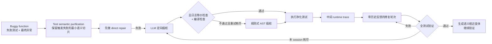

# DebugRepair

核心判断：DebugRepair 给 [[问题定义与实验假设]] 的 H5 提供了目前最直接的软件修复证据：相较只看最终异常和失败测试，先主动插桩、观察中间运行状态，再在固定预算内迭代修复，确实能显著提高正确补丁数量；但它依赖完美 fault localization、显式失败测试和确定性软件执行，不能直接证明同样机制在部分可观测、带噪声的机器人环境中成立。

## 元信息

- 标题：DebugRepair: Enhancing LLM-Based Automated Program Repair via Self-Directed Debugging
- 作者：Linhao Wu、Yifei Pei、Zhen Yang、Kainan Li、Zhonghang Lu、Hao Tan、Xiran Lyu、Jia Li、Yizhou Chen、Pengyu Xue、Kunwu Zheng、Dan Hao
- 版本：arXiv v1，2026-04-21
- 页数：27
- 本地 PDF：[[debugrepair-2604.19305.pdf|本地 PDF]]
- 链接：[arXiv:2604.19305](https://arxiv.org/abs/2604.19305)
- 角色：[[执行反馈自调试]] 的 trace-ablation 依据；[[Robot CI-CD与安全门]] 中 instrumentation、验证预算与 patch gate 的软件工程参照。
- 阅读状态：已按 arXiv v1 全文精读。该版本仍保留 ACM 模板中的占位年份、会议/DOI 字段，正文也写明实现将在后续版本发布，因此应视作未正式发表、尚待独立复现的预印本。

![[debugrepair-2604.19305.pdf#page=1]]

## 一句话版

当 LLM 只知道“测试失败在哪里”却不知道“错误状态如何形成”时，DebugRepair 让模型先净化失败测试、在可疑函数中插入语义保持的打印语句、执行得到中间状态，再以“直接修复失败 -> 带 trace 修复 -> 新一轮重新插桩”的层级循环生成补丁。

## 为什么对本项目重要

这篇论文不是机器人论文，但它把本项目一个容易被当作直觉的判断变成了可测机制：

> failure trace 的价值不在于保存更多日志，而在于暴露能区分错误假设的中间状态。

它对本项目有四个直接作用：

1. 支持 H5：structured component trace 应比 terminal outcome/raw transcript 更利于根因定位和修复。
2. 给出 instrumentation 安全门：模型生成的观测代码必须通过“去掉日志后与原程序等价”以及编译检查；失败时退回确定性插桩。
3. 明确预算不能只报“尝试次数”。DebugRepair 分别限制 debugging session、session 内 repair round、patch augmentation 和 instrumentation retry。
4. 暴露测试门的不足：通过当前测试的 plausible patch 不等于正确 patch。机器人版本因此必须有 final-blind、跨任务回归和安全测试，而不能只验证触发修复的那条 episode。

## 机制总览



真正的因果链不是“日志越多越好”，而是：

```text
去除无关测试路径
-> 选择可判别的内部变量
-> 语义保持地观测这些变量
-> 用动态证据推翻症状级错误假设
-> 在显式预算内验证候选补丁
```

## Section-by-section

### Abstract 与 Section 1：问题不是没有反馈，而是反馈停在症状层

论文把 LLM-based APR 分成 retrieval-based、feedback-based 和 hybrid 三类，集中批评第二类：许多迭代修复方法会把 stack trace、编译错误或失败测试重新喂给模型，但这些信息通常只描述失败最终如何表现，没有呈现导致失败的中间状态。

作者提出三个模块：

- **Test Semantic Purification**：从失败测试中抽取最小失败触发上下文。
- **Simulated Instrumentation**：让 LLM 主动预测关键变量和断点并加入打印语句；无效时用规则式 AST 插桩兜底。
- **Debugging-Driven Conversational Repair**：在 session 和 round 两层循环中，用新 trace 与历史失败补丁迭代。

这里最值得保留的判断是：terminal failure 与 causal evidence 不是同一种反馈。映射到机器人：

- “抓取失败”是 outcome。
- “闭爪前目标中心在相机系的位置、变换后抓取点、夹爪闭合宽度、抬升后物体相对位姿”才可能是区分坐标系错误、空抓和滑落的 causal trace。

### Section 2：Chart-24 说明 trace 如何推翻错误修复假设

`getPaint(value)` 先把原始输入 `value=-0.5` 截断为合法的 `v=0.0`，却错误地继续使用原始 `value` 计算颜色通道 `g=-127`。只给 `IllegalArgumentException` 时，模型会生成“把 `g` 再截断到 0–255”的 plausible patch；它消除了异常，却掩盖了错误变量引用。

插桩后，模型看到：

```text
value = -0.5
v = 0.0
g = -127
```

这组三元状态直接排除了“缺少末端 clamp”的表层解释，指向“后续计算没有使用已经 clamp 的 `v`”。正确修复是将 `value` 替换为 `v`。

对机器人版本，等价例子是：

```text
camera_point = [0.21, -0.08, 0.63]
world_point  = [0.21, -0.08, 0.63]   # 可疑：变换前后完全相同
ee_target    = [0.21, -0.08, 0.63]
```

仅看“末端没有到目标”可能诱导模型增加重试或容差；看到坐标链后，才有证据定位 frame transform 被跳过。这个例子是**迁移性推断**，不是原论文实验。

### Section 3.1：三阶段框架

系统首先尝试只基于 buggy function 与最终错误的 direct repair。只有 direct repair 失败后，才进入插桩与 trace-driven repair。这一点重要，因为动态插桩有额外成本，简单单行错误可能仅凭症状即可修复。

论文因此隐含了一个尚不完整的路由器：

```text
简单、症状充分 -> direct repair
症状不足 -> instrumentation + trace repair
```

但它没有“不可修复/不应修改”的 abstention 分支，不能支持本项目 H2 的 selective repair。

### Section 3.2：Test Semantic Purification

真实单元测试可能包含多个 assertion 和多段 setup，只有其中一条语义链触发当前错误。论文以失败 assertion 为起点，对测试语句做向后切片：

- 若前序语句定义了当前所需变量，加入切片。
- 若方法调用可能修改当前所需对象的内部状态，也加入切片。
- 因对象别名可能在第一次遍历后才被发现，重复遍历直到依赖集合不再扩展。
- 最后递归补回测试类中所依赖的 helper method 与 class field。

它不是简单删除未失败的 assertion，而是保留到达失败语义所需的 data dependency 和 implicit state modification。

实验中，purification 使插桩输出的平均 token 数减少 18.6%。这说明 trace compression 应以因果依赖为单位，而不是机械截断最后若干行。

机器人对应物不是“把视频压短”，而是围绕失败 primitive 保留：

- 输入对象、坐标与 robot state 的 provenance。
- 所调用的 transform、controller 和 postcondition。
- 影响该状态的前序 primitive。
- 必要的相机帧或状态片段。

如果只保存最后一帧或最后一条 error string，就没有复制论文真正有效的 purification 思路。

### Section 3.3：Simulated Instrumentation

LLM 先根据净化测试、buggy function、fault location 和错误信息预测关键变量，再在函数入口、赋值、条件、循环、调用和返回附近加入打印语句。

由于 LLM 可能顺手修改业务逻辑，论文设置两层一致性门：

1. 删除所有 print/comment 后，instrumented function 必须与原函数逐行等价。
2. instrumented function 必须成功编译。

若最多 10 次 LLM 插桩仍未通过，系统启用规则式 AST 插桩。规则会记录变量赋值、条件值、循环条件和返回值，并用临时变量避免为了日志而重复求值有副作用的表达式。

这一部分对 [[Robot CI-CD与安全门]] 的关键启发是：**instrumentation 本身也是代码修改，也需要可信验证。** 机器人上还要额外检查：

- 不得改变控制频率和 action timing 到足以影响行为。
- 不得读取或暴露 hidden evaluator 状态。
- 不得修改 actuator command、stop predicate 或 safety interlock。
- 日志开销不能造成 real-time deadline miss。

### Section 3.4：Debugging-Driven Conversational Repair

修复采用两层循环：

- 每个 session 开始先 direct repair。
- 若失败，则生成或更新插桩，采集一份新 runtime trace。
- session 内最多进行 `K_round` 次带 trace 和历史错误的补丁细化。
- 如果仍失败，清空当前对话历史，开启新 session 和新 trace，避免在错误假设上继续局部搜索。

默认预算是：

| 预算项 | 默认值 |
| --- | ---: |
| debugging sessions `N_session` | 6 |
| 每个 session 的 repair rounds `K_round` | 4 |
| patch augmentation queries | 8 |
| LLM instrumentation 最大尝试 | 10 |
| 每个 bug 的最大候选 patch 数 | `6 × 4 + 8 = 32` |

找到第一个通过全测试的 plausible patch 后，系统还让 LLM 生成逻辑相似但实现不同的 patch variants，再对这些变体跑同一测试套件。作者称其为 patch augmentation，用于增加找到语义正确修复的机会。

需要注意：这并没有增强测试 oracle，只是在固定 oracle 下扩大候选补丁集合。因此它不能替代 [[STING]] 式 hidden/regression suite strengthening。

### Section 4：实验设置

数据集：

| Benchmark | 总 bug | Single-Function | Single-Hunk | Single-Line |
| --- | ---: | ---: | ---: | ---: |
| Defects4J v1.2 | 391 | 255 | 154 | 80 |
| Defects4J v2.0 | 438 | 228 | 159 | 78 |
| QuixBugs-Java | 40 | 40 | 37 | 37 |
| QuixBugs-Python | 40 | 40 | 40 | 40 |
| HumanEval-Java | 163 | 163 | 163 | 74 |

主要 backbone 是 GPT-3.5；另评估 DeepSeek-V3、Qwen2.5-7B、Qwen2.5-Coder-7B 和 Qwen2.5-32B。温度为 1.0。最重要的实验前提是使用 **perfect fault localization**：系统已知需要修改的函数或位置。

指标区分：

- `# Plausible`：通过已有全部测试。
- `# Correct`：人工判断与 developer patch 语义一致。

这一区分恰好说明本项目不能把 held-in success 当作最终正确性。

### Section 5.1–5.2：总体效果与复杂度

以 GPT-3.5 为 backbone、每 bug 最多 32 个候选时：

| 数据集 | Correct / Plausible |
| --- | ---: |
| Defects4J v1.2 | 111 / 146 |
| Defects4J v2.0 | 113 / 137 |
| Defects4J 合计 | 224 / 283 |
| QuixBugs-Java | 40 / 40 |
| QuixBugs-Python | 40 / 40 |

论文报告 Defects4J 上比 ReinFix 多修 11 个 bug，比 TSAPR 多 23 个；但不同 baseline 的候选预算从 32 到 5000 不等，部分数字来自各自论文而非同一套重新运行，因此 headline 排名不应替代预算匹配实验。

复杂场景中，DebugRepair 的优势更明显：

- GPT-3.5 下，Defects4J v1.2/v2.0 的 Single-Function 正确修复数为 111/113。
- DeepSeek-V3 下相应为 139/156。
- 对简单 Single-Line bug，额外 trace 有时只是增加上下文；论文也承认在 Defects4J v1.2 上略低于部分强 baseline。

这支持本项目把 H5 设为按 failure family 分层的假设，而不是预期 trace 对所有错误都同样有益。

### Section 5.3：跨模型结果

在 Defects4J 两版合计上：

| Backbone | Vanilla 正确修复 | + DebugRepair | 增量 |
| --- | ---: | ---: | ---: |
| Qwen2.5-7B | 86 | 107 | +21 |
| Qwen2.5-32B | 124 | 195 | +71 |
| Qwen2.5-Coder-7B | 111 | 141 | +30 |
| GPT-3.5 | 142 | 224 | +82 |
| DeepSeek-V3 | 155 | 295 | +140 |

作者将五个模型的平均相对提升概括为 51.3%。一个值得在机器人实验中复用的做法是：至少在一个较弱和一个较强 repair model 上重复 trace ablation，以检验收益是否只是某一模型的 prompt 偶然性。

### Section 5.4：组件消融

GPT-3.5、Defects4J 上：

| 变体 | Plausible | Correct | Correct 相对下降 |
| --- | ---: | ---: | ---: |
| 完整 DebugRepair | 283 | 224 | — |
| 去掉 test purification | 215 | 164 | 26.8% |
| 去掉 simulated debugging | 213 | 165 | 26.3% |
| 去掉 patch augmentation | 283 | 173 | 19.9% |
| 只用规则式插桩 | 233 | 189 | 15.6% |
| 去掉规则式兜底 | 227 | 181 | 19.2% |

最关键的证据不是“完整系统最好”，而是：

- 去掉动态 trace 后，correct fix 从 224 降到 165。
- 去掉 purification 后也几乎同幅下降，说明噪声控制与信息增加同样重要。
- 去掉 augmentation 后 plausible 数不变而 correct 数下降，证明“通过当前测试”与语义正确之间存在明显间隙。
- LLM 定向插桩与确定性兜底互补。

### Section 5.5：训练截止后的 bug

HumanEval-Java 共 163 个 bug：

| 方法 | 候选预算 | Correct |
| --- | ---: | ---: |
| ChatRepair | 500 | 130 |
| ContrastRepair | 160 | 137 |
| DebugRepair | 32 | 153 |

作者用其发布时间晚于 GPT-3.5 训练 cutoff 来降低记忆泄漏疑虑。不过 HumanEval-Java 是由开发者将 HumanEval 程序翻译为 Java 后人工注入 bug，不等同于时序隔离的真实仓库 bug；这只能算有限的 contamination check。

### Section 6：预算与成本

超参数曲线显示，从每 session 1 轮增加到 2 轮收益最明显；继续增加 session、round 和 augmentation 后均出现边际收益递减。

Defects4J、GPT-3.5 上报告：

| 方法 | 候选 patch / bug | token / bug | 当时价格 / bug |
| --- | ---: | ---: | ---: |
| ChatRepair | 500 | 210k | \$0.14（按新价格重算） |
| RepairAgent | 117 | 270k | \$0.14 |
| TSAPR | 32 | 40k | \$0.06 |
| DebugRepair | 32 | 38k | \$0.036 |

货币成本依赖当时 API 定价，不能跨年份直接作为结论。真正可迁移的指标是 token、模型调用、候选数和测试执行数。

### Section 7–9：威胁、相关工作与结论

论文明确讨论：

- correct patch 依赖人工判断；采用两人双盲、第三人仲裁。
- 公开 benchmark 可能进入训练语料。
- 只覆盖 Java/Python 和三个 APR benchmark。
- SWE-bench 默认不给显式失败测试，因此 DebugRepair 不能直接用于该设置。

还应补充三点批判：

1. **完美 fault localization 是很强的免费信息。** 若机器人实验把 failing component 直接告诉 agent，就只能检验 conditional repair quality，不能同时宣称完成 failure attribution。
2. **插桩的语义保持检查仍偏句法。** 删除日志后的行级等价与编译成功，未检查 logging 的 timing、并发和 I/O 副作用；机器人实时控制的风险更大。
3. **当前版本缺少独立复现。** arXiv v1 的出版元数据仍是占位符，代码也只承诺后续发布。

## 对本项目 H5、H2、hidden tests 与预算的影响

### 对 H5：支持，但要复刻因果结构

H5 可具体写成：

> 在相同 repair model、候选补丁数、环境交互数和最终验证预算下，提供经过因果切片的 primitive-level 中间状态，比只提供 terminal outcome 和原始 transcript，提高故障组件定位准确率与 final-blind repair success，并减少无关 trace token。

至少需要三组：

1. terminal outcome / stack-trace analogue。
2. raw full episode trace。
3. purified structured trace。

否则只做“有 trace vs 无 trace”，无法证明是信息质量而不是 token/算力增加。

### 对 H2：论文没有支持 abstention

DebugRepair 的停止条件是找到 plausible patch 或耗尽预算，没有区分：

- plan/memory-repairable；
- code-repairable；
- policy-limited；
- evaluator/hardware/infeasible。

因此 H2 必须单独评估 routing 与 correct abstention，不能引用本文作为证据。尤其在 policy-limited case 上，系统应拒绝反复改 code，而不是把预算耗尽当作“识别不可修复”。

### 对 hidden tests：patch augmentation 不是 hidden gate

论文已经用 `Plausible != Correct` 证明现有测试会过拟合；但它仍用同一测试套件筛选补丁变体。机器人 benchmark 应进一步设置：

- held-in failure trace：允许修复 agent 看到。
- hidden gate：只返回受限 pass/fail，限制尝试次数。
- final-blind seeds/tasks：整个 repair 过程不可见。
- unaffected regression suite：验证共享 skill 没有破坏旧任务。
- safety suite：独立于任务成功率。

这一设计应与 [[STING]] 的 mutation-guided test strengthening 联合使用。

### 对预算：把 trace 采集也计入成本

机器人版本的预算表至少应包含：

| 预算维度 | 为什么必须单列 |
| --- | --- |
| repair-agent tokens / calls | 防止更长 trace 等价于免费算力 |
| instrumentation proposals | 插桩本身会调用模型 |
| environment rollouts | 机器人/仿真执行是主要成本 |
| patch candidates | 对齐 APR 的 patch-size 比较 |
| hidden-gate submissions | 防止用反复提交探测 hidden tests |
| wall-clock 与 GPU/robot time | 相同 token 不等于相同系统成本 |

建议把 DebugRepair 的 `session × round` 结构用于 pilot，但先采用更小预算，例如 `2 sessions × 3 rounds`，再报告 success-cost Pareto 曲线，而不是预设 32 个候选都免费。

## 可迁移到 Robot CI 的最小实现

1. 将 agent 可插桩范围限制在 skill workspace 的 allowlist 函数。
2. 插桩 patch 先过 AST diff：除 logging hook 外不得修改控制逻辑。
3. 用统一 tracer 记录 typed state，不允许 agent 自由打印 evaluator 私有状态。
4. 先在 replay/simulation 执行，生成 primitive-level structured trace。
5. 将 trace 与失败假设、候选 patch、测试结果绑定为一个 repair record。
6. 找到 held-in plausible patch 后，不直接部署；进入 hidden regression、安全门和 final-blind evaluation。
7. 每次 instrumentation、rollout 和 patch submission 都计入统一预算。

## 我会追问的问题

- 当 fault localization 从 perfect 降为真实 top-k component attribution 时，224 个正确修复还剩多少？
- purification 的收益来自更短上下文，还是来自更准确的因果依赖？用等 token 的随机截断对照会怎样？
- LLM 插桩究竟选择了哪些变量；其 trace 是否比规则式插桩有更高的信息增益？
- patch augmentation 在没有人工 developer patch 的真实部署中，如何选择多个 plausible variants？
- 如果日志改变时序、并发或控制循环，怎样证明 instrumentation 真正语义保持？
- 在机器人任务中，何时应重新插桩，何时应判断为 policy-limited 并停止代码修复？
