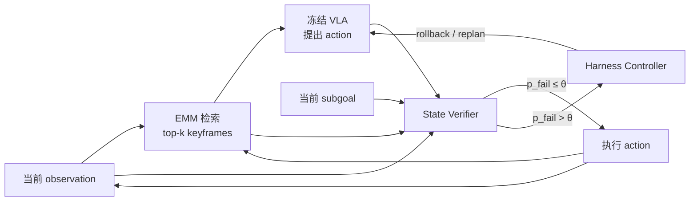

# HELM

核心判断：HELM 是本项目最应该采用的“非代码恢复”强 baseline 之一。它把冻结 VLA 的长时序失败拆成 memory、pre-execution verification 和 recovery 三个 execution-loop gap，并用 episodic memory、learned state verifier 与 rollback/replanning 分别处理；因此，任何 code-repair 方法都必须在同等 memory、failure detection、retry 和 rollout 预算下超过 HELM 类 harness，才能证明改代码确有必要。

## 元信息

- 标题：HELM: Harness-Enhanced Long-horizon Memory for Vision-Language-Action Manipulation
- 作者：Zijian Zeng、Fei Ding、Huiming Yang、Xianwei Li
- 版本：arXiv v1，2026-04-20
- 页数：14
- 本地 PDF：[[Source/Papers/helm-2604.18791.pdf|本地 PDF]]
- 链接：[arXiv:2604.18791](https://arxiv.org/abs/2604.18791)
- 角色：[[VLA路线]] 与 [[机器人Harness工程]] 中 failure detection、memory 和 recovery 的强相关工作；其 LIBERO-Recovery protocol 可直接影响 [[Benchmark与实验平台]]。

![[Source/Papers/helm-2604.18791.pdf#page=2]]

## 一句话版

HELM 不训练 VLA backbone，而是在其外部增加 CLIP-keyframe episodic memory、一个根据“当前观测 + 候选动作 + 子目标 + 历史 memory”预测近期失败的轻量 MLP，以及负责 rollback/forward recovery 的 harness controller，从而把长时序 manipulation 的失败隔离并恢复。

## 为什么重要

HELM 对本项目最大的价值不是又提供一个 memory 模块，而是形成了一个必须击败的替代解释：

> 观察到执行失败后，或许根本不需要修改 skill code；只要记住已完成子目标、在动作执行前预测风险，并在失败后 rollback/replan，就能得到大部分收益。

如果我们的 code-evolving RPent 比 fixed Harness VLA 好，却没有加入 HELM 类 verifier/recovery，对 reviewer 而言，收益可能只是更多重试、更好的 failure detector 或更长 memory，而不是 code patch。

论文还提供 LIBERO-Recovery：在随机子目标边界注入物体位移或 gripper state flip，测整个任务能否恢复完成。这比只比较自然 rollout success 更适合控制 failure timing 和 severity。

## 系统机制



HELM 的贡献集中在 execution-time augmentation，不生成或修改共享 skill implementation。

## Section-by-section

### Abstract：长上下文没有补上 execution loop

摘要把长时序 VLA 的系统性失败归纳为三个 gap：

- memory gap：早期子目标证据离开固定窗口；
- verification gap：候选动作执行前没有可行性/语义检查；
- recovery gap：失败后从已损坏状态继续，错误级联。

在 LIBERO-LONG 上，论文报告 OpenVLA 从 58.4% 提升到 HELM 的 81.5%；把 context history 从 `H=8` 扩到 `H=32` 只达到 63.8%。核心论点是：问题不只是 token/context 不够长，而是缺少带结构的记忆、预执行判断和恢复控制。

### 1. Introduction：三个 gap 是不同干预层

论文给出典型长任务：先把 mug 放进 cabinet，之后再处理 bowl。到 `t=47` 时，`t=12` 的 mug placement 已经离开历史窗口，VLA 可能再次尝试放 mug，破坏场景状态。

三个 gap 虽然会连锁，但干预方式不同：

- `F_M` 需要记住“已完成什么”；
- `F_V` 需要在动作落地前判断物理/语义风险；
- `F_R` 需要从失败状态回退或另寻路径。

这对本项目的 failure taxonomy 有帮助，但不应与 plan/code/policy 分层混淆。HELM 的 taxonomy 描述 execution loop 中“怎样坏掉”，我们的 taxonomy 还要回答“最小充分修复发生在哪一层”。

### 2. Related Work

论文将冻结 VLA 视为 reactive action generator，与 memory agent、LLM reflection 和 hand-written detector 区分。HELM 强调 State Verifier 是 **pre-execution** prediction，而 Reflexion 等是 episode 后反思；Inner Monologue 虽会根据 detector replan，但 detector 是人工规则，且没有 memory-conditioned learned verifier。

### 3. Problem Formulation and Failure Analysis

长任务被写成 `T=(τ,s0,G)`，有 `K≥3` 个有序子目标；VLA 只看固定长度 history `H`，总任务 horizon 远大于 `H`。

论文在 200 个 OpenVLA LIBERO-LONG episodes 上人工标注 83 个失败 episode，两名标注者 Cohen’s κ=0.81。作者报告失败涉及 memory 41%、verification 33%、recovery 26%，18% episode 同时含两个以上 mode。

Context scaling 结果：

| 历史长度/方法 | TSR |
| --- | ---: |
| H=8 | 58.4% |
| H=16 | 61.2% |
| H=32 | 63.8% |
| H=64 | 65.1% |
| Oracle history | 67.3% |
| HELM | 81.5% |

这支持“单纯拼接更多 frame 不是 structured memory/recovery 的替代”，但并不证明所有 VLA architecture 都有相同结论；实验只围绕特定 backbone 和 reactive conditioning 方式。

### 4.1 Overview

每一步执行：

1. EMM 根据当前视觉检索历史；
2. 冻结 VLA 根据当前 observation、task、subgoal 和 memory 提出 action；
3. SV 输出 `p_fail`；
4. 若超过阈值，HC recovery；否则执行；
5. 更新 memory 与 subgoal stack。

### 4.2 Episodic Memory Module

EMM 是 key-value store：

```text
k_i = CLIP-ViT-B/32(o_i)
v_i = (keyframe, subgoal, status, timestep, state delta)
```

State delta 包括 gripper pose 和由 depth 得到的 object position。写入触发：

- 子目标成功；
- 检测到失败；
- 每 20 步 checkpoint。

检索按当前图像与 keyframe embedding 的 cosine similarity 取 top-3。超过 50 条后，每个子目标只保留最近 checkpoint。检索结果序列化为 structured text，追加到 VLA language input。

这里的关键不是“无限记忆”，而是 event-triggered write + semantic retrieval + bounded compression。其风险是 CLIP 视觉相似不必然等于因果相关，尤其在相似厨房布局或物体状态细微变化下。

### 4.3 State Verifier：核心学习组件

SV 估计：

```text
P(fail_t | o_t, a_t, g_t, M_t)
```

网络是 3 层 MLP `[1024→512→256→1]`，ReLU、dropout 0.1。视觉输入把当前 CLIP embedding 与最相关 memory key 拼接，再加入投影后的 action 和 text-embedded subgoal。推理约 12ms/step。

训练数据为 OpenVLA 在训练任务上的 50K rollout triples；若未来 5 步内 task progress 下降，则当前样本标为 failure。使用 weighted BCE（positive weight 4.0）、Adam、`lr=1e-4`、batch 256，在单张 A100 上约 2 小时。阈值 `θ_v=0.65`。

5-step label horizon 是经验选择：1-step AUROC 0.712，5-step 0.847，10-step 0.831。去掉 memory context 后 AUROC 降至 0.791，说明 verifier 判断“这个动作现在是否错”确实依赖历史，而不只依赖当前几何。

值得警惕的是，这个 label 定义把“未来 5 步进度下降”归因于当前 action，仍可能产生 delayed-causality noise。它适合作为风险预测器，不是严格 root-cause oracle。

### 4.4 Harness Controller

HC 维护由 VLA 分解得到的 subgoal stack，并训练一个与 SV 类似的 completion detector。出现高 `p_fail` 或 completion negative 时：

1. 从 EMM 取最近成功/checkpoint；
2. 发出 goal-conditioned recovery sequence，目标是“回到该状态”；
3. 把失败子目标重新压回 stack；
4. 把 failure entry 加入 context。

最多恢复 3 次。HELM 默认 rollback；若真实环境动作不可逆，HELM-Fwd 从当前损坏状态生成 forward recovery。

Rollback 在仿真中很强，却也是最难直接搬到物理世界的假设。抓碎物体、液体倾倒或人机接触不能简单“回到 keyframe”。

### 5.1 Experimental Setup

评测包括：

- LIBERO-LONG：10 tasks、每 task 5–6 subgoals、500 evaluation episodes；
- CALVIN ABC→D：最多 5 步的完成 chain；
- LIBERO-Recovery：在 LIBERO-LONG 子目标边界注入 controlled perturbation，测 Recovery Success Rate。

论文设计了 9 类 baseline/variant：OpenVLA、长 context、oracle memory、rule verifier、5-model ensemble、同 50K 数据预算 LoRA、Reflexion、HELM-Fwd，以及换 Octo backbone 的 HELM。

这比只对比裸 VLA 更有说服力，尤其是同数据预算 LoRA 和 forward recovery；本项目应沿用这种“每个可能的简单解释都有对应 baseline”的设计。

### 5.2 Main Results

| 方法 | LIBERO-LONG TSR | SCR | Recovery RSR | CALVIN chains |
| --- | ---: | ---: | ---: | ---: |
| OpenVLA | 58.4 | 74.2 | 12.3 | 3.02 |
| H=32 | 63.8 | 78.1 | 14.7 | 3.24 |
| Oracle Memory | 72.4 | 83.6 | 28.5 | 3.41 |
| Rule Verifier | 65.2 | 79.3 | 19.8 | 3.18 |
| Ensemble ×5 | 67.9 | 80.8 | 22.3 | 3.29 |
| LoRA, 50K | 69.3 | 81.4 | 18.2 | 3.31 |
| Reflexion | 63.1 | 77.8 | 21.4 | 3.19 |
| HELM-Fwd | 76.3 | 86.2 | 38.7 | 3.44 |
| HELM | **81.5** | **89.3** | **54.2** | **3.58** |

以上为论文报告的 3 seeds mean，原文同时给出 standard deviation，本库尚未复现。

HELM-Fwd 与 rollback HELM 的差距很关键：rollback 额外带来 5.2pp TSR 和 15.5pp RSR。真实机器人实验不能照搬默认 HELM，应该把 forward recovery 作为更诚实的主对照。

换到 Octo backbone，TSR 从 51.2% 提升到 72.8%，提供了 model-agnostic 初证。

### 5.3 Ablation

| Variant | TSR | 相对 full |
| --- | ---: | ---: |
| HELM full | 81.5 | — |
| w/o EMM | 70.3 | -11.2pp |
| w/o SV | 73.1 | -8.4pp |
| SV w/o memory context | 79.2 | -2.3pp |
| w/o rollback | 75.2 | -6.3pp |
| w/o EMM & SV | 62.4 | -19.1pp |

EMM 是最大单组件贡献，SV 与 rollback 也各有独立增益。这里 `SV w/o memory context` 只比 full 低 2.3pp 的命名容易误读：它不是“去掉 SV”，而是保留一个不看 memory 的 verifier。

### 5.4 Mechanism Analysis

- Retrieval：random 64.3%、recency 71.4%、CLIP 81.5%、fine-tuned retriever 82.1%；CLIP 接近专门训练 retriever。
- Memory top-k：`k=1` 为 77.2%，`k=3` 为 81.5%，`k=5` 为 81.8%，因此选 3。
- Oracle subgoal decomposition：84.2%，只比 HELM 高 2.7pp，说明主要瓶颈不在 task decomposition。
- 论文报告 HELM 把 memory、verification、recovery failure 分别降低 76%、61%、82%。

### 6. Limitations

论文明确承认：

- 每个 environment 需要约 50K rollout steps 训练 SV，限制 zero-shot deployment；
- rollback 假设动作可逆，真实机器人通常不成立；
- 全部主要实验在 LIBERO/CALVIN simulation，SV 和 CLIP retrieval 的 sim-to-real 未验证；
- VLA subgoal decomposition 在 4.3% episodes 失败；
- 推理额外开销约 12ms/step，约为 backbone 的 15%。

此外，论文 checklist 表明代码尚未公开、计划 acceptance 后发布。因此现阶段应视为一篇协议描述较完整但未由本库独立复现的 preprint。

### 7. Conclusion

结论把 HELM 定位为 backbone scaling 的补充：长时序可靠性不仅依赖更大的 VLA，还依赖外部执行管理。这个判断与 [[Harness VLA]] 一致，也进一步抬高了 code evolution 必须超过的 baseline 强度。

## LIBERO-Recovery 协议

在随机中间子目标边界 `k*∈{2,...,K-1}` 注入两种等概率 perturbation：

- object displacement：三轴各从 `U(-5cm,5cm)` 采样；
- gripper state flip。

扰动没有额外视觉标记。RSR 定义为受扰 episode 最终仍完成整个任务的比例。论文每 seed 评估 300 个 perturbed episodes。

这个协议可以直接改造成我们 failure-family benchmark 的一部分，但它本身主要产生 state/recovery failure，不一定是 code-repairable defect。若强行让 code agent 修它，会把 transient disturbance 与 implementation bug 混在一起。更合适的用法是：

- 作为 plan/memory/recovery negative control；
- 检验 code repair agent 是否能正确 abstain；
- 作为 patch 通过后的 robustness regression suite。

## 具体例子

任务为“拿 mug 放 cabinet，再拿 bowl 放 plate”。裸 OpenVLA 在后期忘记 mug 已完成，重新执行 mug placement。HELM 检索到早期成功 keyframe，将“mug 已在 cabinet”注入 context，从而继续 bowl 子目标。

另一个例子中，drawer 打开后 pen 位移，SV 对下一动作给出 `p_fail=0.81>0.65`；HC 回到最近 checkpoint，第二次成功抓 pen。

这两种问题都不要求修改 `pick()` 或 `open_drawer()` 的代码。如果我们的 repair system 在这些 case 上生成 patch，反而说明 attribution/routing 有问题。

## 局限与批判

### 已有证据

- 所有主要实验均为仿真；论文尚未验证真实机器人 rollback、visual domain shift 与安全恢复。
- SV 的 failure label 是“5 步内 progress 下降”，不是 component-level root cause；其风险预测可能把后续 planner 错误归到当前 action。
- Oracle memory 仍显著低于 HELM，表明结果来自多模块与额外 recovery budget；比较时必须匹配执行次数。
- Completion detector 与 subgoal decomposition 都会影响 TSR，却不是独立完全无误的 oracle。
- 代码尚未公开，当前无法核对 implementation 与 paper protocol。

### 合理推断

- EMM 中 object positions 来自 depth、task completion 依赖 simulator labels/训练 detector；移到真实机器人时可观测性可能显著下降。
- 以 image similarity 检索 keyframe 可能取回视觉相似但语义状态不同的 memory，产生高置信错误。
- Recovery 最多 3 次给 HELM 增加了环境交互预算；code-repair 方法若只允许一次执行，比较不公平。
- LIBERO-Recovery 的 ±5cm 与 gripper flip 是可控扰动，但不足以代表 frame-convention、unit、postcondition 或 API contract 等 implementation defect。

## 与 Harness VLA、RPent 和本项目的精确边界

| 维度 | HELM | Harness VLA / RPent | 本项目 |
| --- | --- | --- | --- |
| Backbone | 冻结 OpenVLA/Octo | 冻结 VLA primitive | 冻结 |
| Persistent state | episodic keyframes | task/global recipe memory | 冻结或作为独立实验因子 |
| Failure detector | learned pre-execution SV | observation/evaluator + planner | trusted trigger + component trace |
| Recovery | rollback/forward replan | restaging/retry | plan recovery或 implementation patch |
| 修改 skill code | 否 | 否 | 是，限 allowlist |
| 主要证明 | execution-time harness 提升 | frozen VLA 可被 agentic harness 驾驭 | code-repairable failure 上共享 patch 的额外收益 |

因此，HELM 与 Harness VLA 应共同构成 strongest non-code family。实验不一定要完整重实现 HELM 网络，但至少应提供等预算的 memory + verifier + retry/replan baseline；否则 code repair 的独立贡献无法识别。

## 对实验假设的影响

1. **Primary comparison** 不能只用 buggy frozen system，而应对比 strongest plan/memory/recovery-only system。
2. **Failure taxonomy** 中加入 HELM-style transient recovery cases，作为“正确答案是不改代码”的 negative control。
3. **预算拆分**：分别报告 adaptation rollouts 与 deployment/recovery rollouts；匹配最大 retry 次数、VLA calls 和 wall-clock。
4. **Trigger 与 repair 分离**：第一篇可先用同一个 trusted failure trigger，只比较收到相同 trace 后的 conditional repair quality；SV 本身另做独立指标。
5. **回归测试**：把 LIBERO-Recovery perturbations 用作 patch 后 robustness suite，检查修复某个 deterministic bug 是否降低对 transient disturbance 的恢复能力。
6. **真实机器人边界**：默认使用 forward recovery，不把 simulator rollback 当作可部署能力。

## 我会追问的问题

- 在严格匹配 executable actions、retries 和 environment interactions 后，HELM 相对其他 baseline 的收益还剩多少？
- SV 是在 training tasks 上用 50K steps 训练；遇到全新的 skill/API 或 implementation bug 时 AUROC 如何？
- 如果错误来自共享 primitive 的稳定系统性 bug，HC 会否反复 rollback 到同一个失败点？这正是 code repair 应发挥作用的区域。
- Memory retrieval 取错历史时，系统有没有 calibrated abstention 或 provenance 检查？
- 在不可逆、接触丰富任务中，forward recovery 与受验证 code patch 哪种更节省真实机器人试错？
- 能否把 HELM 的 `p_fail` 与 component-level trace 联合，用于先路由到 plan recovery，再在重复同源失败后升级为 code repair？
