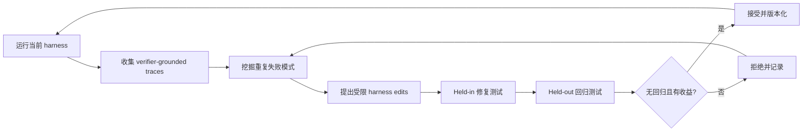

# Harness Engineering for Self-Improvement

核心判断：这篇综述把近期“自改进 agent”统一解释为 harness engineering：近中期可操作的自改进对象往往不是模型权重，而是模型周围的 context、workflow、tools、memory、permissions 和 evaluator。对本项目最重要的约束是，允许进化的 harness 工作区必须与只读 tracer、verifier、权限系统和机器人安全内核分离。

## 元信息

- 类型：研究综述博客，不是同行评审论文
- 作者：Lilian Weng
- 发布日期：2026-07-03
- 本地来源：[[Source/Papers/Harness Engineering for Self-Improvement.md|Markdown 原文]]
- 原文：[Harness Engineering for Self-Improvement](https://lilianweng.github.io/posts/2026-07-04-harness/)
- 角色：[[机器人Harness工程]] 的主要定义来源；串联 context engineering、workflow search、self-harness、evolutionary search 与 evaluator 边界。

## 一句话版

Harness 是包围基础模型的可执行运行时：它决定模型看到什么、如何循环、能调用哪些工具、怎样保存状态、如何评估结果以及哪些修改被允许；当这些机制被表示为代码并放进 propose-evaluate-accept 闭环时，harness 本身就成为可优化对象。

## 为什么重要

本项目过去把重点放在“coding agent 修复 robot skill”。这篇综述提示还有一个更宽的系统级对象：

- skill implementation 只是 harness 的一个可编辑 surface。
- tool schema、planner prompt、middleware、memory policy、sub-agent 配置和 monitor 也会造成失败。
- 只有把失败映射到正确组件，才能避免把所有问题都错误归因于 skill code。
- 只有 verifier、trace collector、权限边界和模型配置位于进化循环之外，性能提升才可归因，也更难通过关闭测试或放宽预算作弊。

这会扩展本项目的长期叙事，但不应立即扩大第一阶段实验。第一篇工作仍应聚焦 [[执行反馈自调试|robot skill 程序修复]]，把 harness evolution 作为后续方向。

## Harness 设计模式

文章在传统“LLM + memory + tools + planning + action”之外，强调四个工程维度：workflow、evaluation、permission controls 和 persistent state management。

### Workflow Automation

基础循环是 plan、execute、observe/test、improve、再执行，直到达成目标或触发停止条件。关键不是固定 prompt，而是 runtime 能根据工具结果和失败轨迹改变下一步。

### File System as Persistent Memory

长时序任务不能把所有日志塞进 context。实验记录、code diff、错误 trace、历史 rollout 和评估结果应成为可检索、可版本化的文件 artifact。对机器人来说，这对应 trace store、skill versions、失败案例库和 benchmark results。

### Sub-agents and Backend Jobs

并行搜索不同根因、运行仿真或回归测试时，主 agent 需要显式的进程管理和持久化输出。输出若只存在于临时对话中，系统无法在中断后恢复，也无法审计不同候选 patch 的证据。

### Coding Agent Harness

成熟 coding harness 的共同接口包括文件发现与编辑、shell、git/LSP、外部 context、artifact、后台任务和 agent delegation。文章的核心类比是：harness 更像操作系统或 runtime，而不是一组 prompt tricks。

## 从 Context 到 Harness Code

文章给出的优化对象演进可以压缩为：

```text
instruction prompt
  -> structured context
  -> workflow graph
  -> harness code
  -> optimizer / improver code
```

### Context Engineering

[Agentic Context Engineering](https://arxiv.org/abs/2510.04618) 把 context 维护成可增量更新的 playbook，而不是反复重写一个越来越长的 prompt。[Meta Context Engineering](https://arxiv.org/abs/2601.21557) 再把“如何选择、过滤、格式化 context”的机制也作为外层优化对象。

对本项目的直接映射是：失败知识不应只写成一段总结。它应被拆成带标识符的 failure model、适用条件、证据 trace、修复版本和验证结果，由确定性规则合并、去重和失效。

### Workflow Search

[ADAS](https://arxiv.org/abs/2408.08435) 和 [AFlow](https://arxiv.org/abs/2410.10762) 等工作把 agent workflow 表示成代码或图，再用 meta-agent、MCTS 或 archive 搜索新设计。这说明 planner loop、重试策略和 sub-agent 拓扑都可以优化，但前提仍是候选 workflow 能被稳定评价。

### Self-Improving Harness

[Self-Taught Optimizer](https://arxiv.org/abs/2310.02304)、[Self-Harness](https://arxiv.org/abs/2606.09498) 和 [Agentic Harness Engineering](https://arxiv.org/abs/2604.25850) 把 improver 或 harness 自身放进优化循环。最可复用的闭环是：



Self-Harness 的 proposal context 包含四类信息：当前可编辑面、基于 verifier 的失败模式、必须保留的成功行为和过去被拒绝的修改。这与本项目的 patch proposal 格式高度一致。

## 三类可观测性

[Agentic Harness Engineering](https://arxiv.org/abs/2604.25850) 将 harness evolution 的瓶颈归结为 observability：

| 可观测性 | 需要记录什么 | 机器人对应物 |
| --- | --- | --- |
| Component observability | 每个可编辑组件在文件系统中有明确表示 | planner、skill schema、executor、monitor、memory policy 的版本与所有权 |
| Experience observability | 原始 rollout 被分层整理为 task report 和 failure pattern | 多模态 trace、failure attribution、跨 seed 聚类和可回溯原始日志 |
| Decision observability | 每个 edit 都附带可证伪预测与回归风险 | “预计修复透明杯 depth hole，但可能降低普通杯柄抓取率” |

这比只保存最终 error code 更严格。两个 rollout 都可能以 timeout 结束，但一个根因可能是错误目标 grounding，另一个可能是 skill postcondition 永远不满足。终局标签相同，不代表应该修改同一个组件。

## Harness Updating 不等于 Harness Benefit

文章引用的 2026 年研究 [Harness Updating Is Not Harness Benefit](https://arxiv.org/abs/2605.30621) 区分两种能力：

- **Harness-updating**：模型能否提出结构上合理的 harness 修改。
- **Harness-benefit**：执行模型能否正确、及时地使用更新后的 skill、tool 和 workflow，从而真正提高任务表现。

这是本项目需要新增的评估维度。一个 coding agent 写出了看似正确的新 tool 或 fallback，不代表任务 planner 会在合适状态调用它。实验应分别测：

1. patch 是否通过局部 evaluator；
2. 整个系统在 held-out task 中是否实际利用该 patch；
3. 调用失败是 patch 质量问题，还是 planner 的 tool-use 问题。

## Evolutionary Search

当搜索空间大、不可微但候选容易评分时，进化搜索适合优化 harness。文章串联了 Promptbreeder、GEPA、[[AlphaEvolve]]、ShinkaEvolve、[Darwin Goedel Machine](https://arxiv.org/abs/2505.22954) 和 Hyperagents。

对机器人而言，最大的迁移障碍不是生成 candidate，而是 fitness：真实执行慢、有随机性、可能损坏硬件，仿真分数又可能与现实不一致。因此进化搜索应主要在仿真和离线 trace 上运行，真实机器人只承担受限验证。

## Joint Optimization with Model Weights

文章讨论了同时更新 harness 与模型权重的早期尝试，但明确指出实验混杂和证据仍较弱。对本项目来说，第一阶段没有必要加入权重更新。否则很难判断收益来自：

- skill/harness patch；
- planner 变强；
- VLA 微调；
- 更多数据或更高推理预算。

冻结基础模型和 learned policy，先只改变可审计软件层，更容易形成可证伪研究结论。

## 未来挑战

文章列出的挑战与机器人场景高度重合：

- evaluator 模糊，开放式质量和长期价值难自动评分；
- context 与 memory 生命周期会持续膨胀；
- 负结果容易被丢弃，系统会重复失败；
- evolutionary/RL search 会发生 diversity collapse；
- agent 可能 reward hack、过拟合 benchmark 或修改 verifier；
- 短期任务成功不代表 repo 和机器人系统长期可维护；
- 人类应上移到高风险决策与抽象边界，而不是完全退出回路。

## 对机器人项目的映射

| 通用 harness 组件 | 本项目中的实现 | 默认权限 |
| --- | --- | --- |
| System prompt / workflow | 任务分解、失败归因与 repair loop | 可提案修改 |
| Tool description | skill schema、precondition、postcondition | 可提案修改 |
| Tool implementation | perception、planning、fallback、skill-local completion monitor | 受限可修改；外部 benchmark success predicate 不在此列 |
| Middleware | primitive serialization、状态刷新、超时与重试 | 高风险，需额外审查 |
| Long-term memory | 成功 trace、失败模型、patch 历史 | 可增量更新，需来源与失效规则 |
| Tracer / verifier | 多模态记录、测试、评分与归因证据 | 只读 |
| Permission / safety kernel | 速度、力、碰撞、工作空间与急停约束 | 只读，位于进化循环外 |

## 证据、推断与未验证项

- **已有证据**：文章汇总的主要实证来自 coding、QA、数学、科学自动化和游戏 benchmark；这些工作支持 harness 可优化，但不直接证明真实机器人上的安全自进化。
- **合理推断**：机器人系统本身具有明确 tool、middleware、state、trace 和 verifier，因此 harness engineering 是比“模型自己改权重”更可操作的近期框架。
- **合理推断**：将 editable workspace 与 read-only safety kernel 分开，可以减少关闭 verifier、放宽预算或绕过约束等 reward hacking 路径。
- **尚未验证**：机器人 harness 的自动修改能否跨 embodiment、长期运行并在 sim-to-real 条件下保持收益。
- **尚未验证**：如何评价维护性、未来调试成本和新 skill 对整个 registry 的长期耦合影响。

## 对本项目的启发

1. 用 [[机器人Harness工程]] 统一命名 planner、skill、memory、monitor、verifier 和权限系统，但保持层级边界清楚。
2. failure attribution 必须先定位组件，再决定改 prompt、memory、skill code 还是 monitor，不能默认所有失败都交给 coding agent 改 skill。
3. 每个 patch 都应包含 evidence、root cause、targeted fix、expected impact 和 at-risk regressions。
4. verifier、tracer、LLM 配置、推理预算和安全限制必须只读，否则性能提升不可归因。
5. 同时使用 held-in 与 held-out 测试：前者证明当前 failure 被修复，后者检查未知回归和 benchmark overfitting。
6. 长期路线可以从 skill repair 扩展到 harness evolution；近期论文应冻结大部分 harness，只开放一小组明确 surface。

## 我会追问的问题

- 哪些 robot harness 组件适合作为第一批可编辑 surface，哪些必须永久只读？
- 如何从多模态轨迹自动区分 terminal cause、causal behavior 和真正暴露的 harness mechanism？
- 怎样测量 harness-benefit，而不是只检查生成的 patch 是否通过单元测试？
- memory 中的 failure model 何时应失效、合并或降权？
- 当 evaluator 本身可能有 bug 时，谁来验证 verifier？
