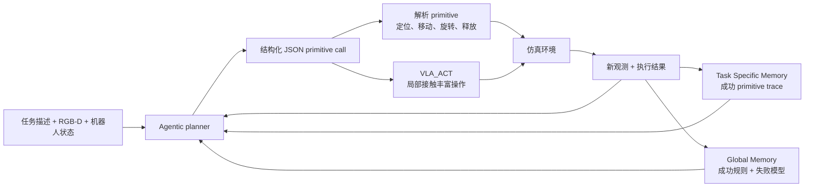

# Harness VLA

核心判断：Harness VLA 是目前与本项目混合架构最直接的系统近邻之一。它证明了无需微调 VLA，也可以把冻结 VLA 降格为一个可重试的接触丰富 primitive，再由带记忆的 agentic planner 负责语义重绑定、非接触运动、失败重试和长时序组合；但它没有修改 skill 代码，因此还不是“执行反馈驱动的 robot skill 自进化”。

## 元信息

- 标题：Harness VLA: Steering Frozen VLAs into Reliable Manipulation Primitives via Memory-Guided Agents
- 作者：Yixian Zhang、Huanming Zhang 等
- 版本：arXiv v3，2026-07-15
- 本地 PDF：[[harness-vla-2607.08448.pdf|本地 PDF]]
- 链接：[arXiv:2607.08448](https://arxiv.org/abs/2607.08448)；[项目主页](https://harnessvla.github.io/)
- 角色：[[VLA路线]] 与 [[机器人Harness工程]] 的直接交叉工作；也是 [[研究切口与实验路线]] 必须加入的 fixed-harness baseline。

![[harness-vla-2607.08448.pdf#page=1]]

## 一句话版

Harness VLA 不让 VLA 端到端完成整个任务，而是把它封装成 `VLA_ACT`，只处理抓取、受约束放置、开关门等接触丰富阶段；planner 用解析 primitive 完成定位、移动、重定向、释放和重试，并用成功 trace 与失败模型指导后续任务。

## 为什么重要

这篇论文把本项目过去偏架构性的判断变成了一个强实证参照：

1. VLA 和传统控制不是二选一。VLA 可以成为 skill library 中一个有明确接口和作用域的执行器。
2. 很多 VLA 部署失败并不要求改权重。语义目标重绑定、空间换位、起始姿态和重试策略可以由外部 harness 修复。
3. 记忆的价值不只是保存聊天历史，而是保存可重新 grounding 的成功程序结构，以及跨任务复用的成功规则和失败模型。
4. 本项目若只做 planner + memory + 固定 primitive，会和 Harness VLA 高度重合。真正需要证明的新意是：能否根据 failure trace 修改、测试和版本化 skill/harness 实现。

## 系统机制

系统的关键不是增加大量 skill，而是学习一个固定 primitive library 的 operating range：什么阶段交给解析控制，什么时候调用冻结 VLA，失败后应如何重新 staging。

## Section-by-section

### Abstract

摘要把 VLA 的优势限定在局部接触丰富控制，把其部署弱点归纳为语义重定向、目标重绑定、空间布局变化和不稳定接触。论文提出的解决方法是：固定 primitive vocabulary，不微调 VLA，用记忆增强 planner 组合解析 primitive 与 `VLA_ACT`。

论文报告：相对各自最强相关 baseline，Harness VLA 在 LIBERO-Pro 和 RoboCasa365 上分别提高 38.6 与 25.4 个百分点，并在 RoboTwin clean-to-randomized 上达到 58.4%。这些数字来自论文自己的评测协议，尚未在本 wiki 中独立复现。

### Introduction

引言指出两条路线各自承担了过多职责：

- 端到端 VLA 被要求同时完成语言 grounding、长时序组合和低层控制。
- coding agent 若只使用解析 API，又很难完成不规则抓取、狭窄放置和 articulated-object interaction。

Harness VLA 的非对称分工是：解析 primitive 穿过分布外的非接触区域，冻结 VLA 只在与训练分布相近的局部接触区域工作。这比笼统地说“VLA 是某个 skill 的实现”更具体，因为 planner 还负责把当前状态重新变换到 VLA 可工作的局部状态。

### Framework

每一轮 planner 读取任务、RGB-D、proprioception 和两类 memory，输出一个 JSON primitive call。primitive 执行到内部 postcondition 后返回新观测，planner 再决定下一步。planner 不直接产生 torque、joint target 或 action chunk。

论文把运行分成两个阶段：

1. **Exploratory bootstrapping**：在一个 reference seed 上允许 `RESET` 和较宽松预算，搜索可行的 primitive composition。
2. **Deployment evaluation**：禁用 `RESET`、缩短预算，在新 seed 或扰动场景中复用并重新 grounding 已保存的程序结构。

两类 memory 的职责不同：

| Memory | 保存什么 | 部署时怎么用 |
| --- | --- | --- |
| Task Specific Memory | 成功 rollout 的 JSONL primitive 顺序，以及符号化后的参数绑定 | 作为任务级程序骨架，在当前 RGB-D 中重新定位对象和坐标 |
| Global Memory | 跨任务成功规则、empty grasp、false success、unstable staging 等失败模型 | 避免重复已知错误，决定重试、重定位或切换 primitive |

### Unified Primitive Interface

共享 manipulation interface 包含 6 个解析 primitive 和 1 个 VLA primitive；RoboCasa365 另外加入移动底盘 primitive。主要接口包括：

- `MOVE_TO`、`MOVE_POSE`：自由空间移动和带姿态约束的移动。
- `ROTATE_WRIST`、`ROTATE_PITCH`：局部姿态调整。
- `SET_GRIPPER`、`RELEASE`：夹爪状态和释放。
- `VLA_ACT`：冻结 VLA 的短时 action-chunk 调用。
- `NAVIGATE_TO`、`MOVE_BASE`：厨房尺度的移动底盘 staging。

`VLA_ACT` 带 prompt、chunk budget 和 early-return predicate。它被视为一次可观察、可中止、可重新 staging 的局部尝试，而不是持续接管整个 episode 的黑箱 policy。

### Experiments

论文在 LIBERO、LIBERO-Pro、RoboCasa365 和 RoboTwin C2R 上使用不同的冻结 VLA backend，但保持统一 `VLA_ACT` 接口。

| 设置 | 直接或最强相关 baseline | Harness VLA | 主要结论 |
| --- | ---: | ---: | --- |
| 标准 LIBERO | 冻结 `pi_RLinf` 95.3% | Claude Code planner 96.0% | 封装后基本保留原 VLA 的标准任务能力 |
| LIBERO-Pro | 冻结 `pi_RLinf` 50.0%；RATS 43.8% | Codex 72.1%；Claude Code 82.4% | 语义重定向和位置交换下显著改善 |
| RoboCasa365 | RLDX-1 加权 30.0% | Codex 55.4%；Claude Code 48.6% | 移动 staging 与长时序组合带来收益 |
| RoboTwin C2R | 直接 LingBot-VLA 50.4% | Codex 58.0%；Claude Code 58.4% | 固定 VLA 在双臂随机化场景中受益 |

需要谨慎解释论文强调的“LIBERO-Pro 提高 38.6 个百分点”：RATS 的 43.8% 只平均其报告的 6 个非 LIBERO-10 cells，而 Harness VLA 的 82.4% overall 覆盖 8 个 cells。这个 headline 遵循原论文口径，但不是完全同构的 aggregate comparison；更干净的内部对照是同一协议下冻结 `pi_RLinf` 的 50.0% 与 Harness VLA 的 72.1%/82.4%。

一个值得注意的对照是 LIBERO-Pro Goal：无目标设置 memory 的 zero-shot 版本在 instruction redirection 上仍达到 79.0%，但 position swap 只有 31.0%；使用 bootstrapped memory 后两者分别为 87.0% 和 87.0%。这说明语义重绑定较多来自在线 planner，而空间扰动更依赖 reference trace 中学到的 staging 结构。

### Mechanism Analysis

论文用三个 finding 解释收益：

1. **Planner-level re-grounding**：当前任务目标与视觉布局发生变化时，planner 显式重绑定对象和目标，不让冻结 VLA重复训练时行为。
2. **Planner-staged retry**：一次 grasp 或 placement 失败后，planner 先重新定位末端或底盘，再调用 `VLA_ACT`，把局部接触失败隔离在当前子任务。
3. **Analytic decomposition**：解析 primitive 处理 free-space transport、姿态、导航、release 和 post-contact repositioning，把 VLA 留给真正需要 learned control 的阶段。

## 具体例子

论文在 LIBERO-Pro 中展示了把牛奶盒放进篮子的例子。冻结 VLA 在中间尝试后可能只把物体放到篮边或没有形成稳定抓取；planner 检查新观测，重新 staging 末端，再次调用 `VLA_ACT`，最后用解析移动与 release 完成任务。

这个例子对本项目的价值在于：一次失败应被定位为“当前接触 primitive 的可恢复失败”，而不是让整个长时序 rollout 继续积累错误。对应到 [[执行反馈自调试]]，trace 需要记录每次 primitive 的前后状态、postcondition 和重试理由。

## 局限与批判

### 论文明确承认的局限

- 高层 planner 与低层 VLA 之间仍是开放反馈回路，没有联合训练。
- 没有利用环境 reward 或人类偏好联合微调。
- 缺少细粒度 image captioning，限制了拥挤长时序场景中的结构推理。
- 固定 vocabulary 无法在反复组合暴露缺失抽象时自动发现新 skill。

### 对本项目更关键的局限

- **已有证据**：primitive vocabulary 在部署前固定，系统更新的是 memory 和调用方式，不是 primitive 实现。因此它不能证明 skill code repair 可行。
- **已有证据**：主要结果来自仿真 benchmark，并依赖 benchmark completion predicate、RGB-D 和环境内嵌控制器。它没有验证真实硬件上的安全门、sim-to-real gap 或物理损伤风险。
- **合理推断**：每个任务先用一个 reference seed 构造 Task Specific Memory，可能把一部分难题转化为“程序轨迹迁移”；这仍然是有价值的 few-shot 方法，但不能和完全未见任务的自主演化混为一谈。
- **合理推断**：Codex 与 Claude Code planner 的差异会影响最终得分，说明 harness benefit 仍受基础模型的多模态 grounding 和长时序工具调用能力制约。
- **尚未验证**：如果让 agent 修改 primitive、monitor 或 memory update code，收益是否还能在 held-out 场景持续，同时不产生 reward hacking 和安全回归。

## 对本项目的启发

1. 把 learned policy 定义成有 schema、postcondition、budget 和 stop predicate 的 typed skill，例如 `VLA_ACT`，不要让它直接接管整个任务。
2. 将 task-specific trace 与 global failure model 分开；前者保存可重用程序结构，后者保存跨任务诊断知识。
3. 在 evaluator 中加入“重新 staging 后的局部重试”baseline，避免把简单 retry 收益误归因于代码修复。
4. 论文实验必须加入 Harness VLA-style fixed harness：同样的 planner、memory 和 primitive，只禁止修改代码。只有 code-repair 版本在 held-out failure 上继续提升，才能证明本项目的新贡献。
5. skill 自进化应发生在 [[Robot CI-CD与安全门]] 内：候选修改只能进入可编辑工作区，完成 held-in 修复、held-out 回归和安全检查后才能发布。

## 我会追问的问题

- 如果拿掉 reference-seed Task Specific Memory，只保留 Global Memory，四个 benchmark 的下降分别是多少？
- 收益中有多少来自语义重绑定，有多少来自额外控制预算和重复 VLA 调用？
- completion predicate 是否泄露了仿真器内部状态，真实机器人上用什么可观测 postcondition 替代？
- 哪些重复 primitive composition 应被编译成新 skill，如何验证它不是 benchmark-specific macro？
- 把固定 `VLA_ACT` 替换为可版本化的 learned skill 后，如何回归其旧任务和安全边界？
