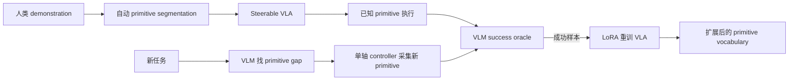
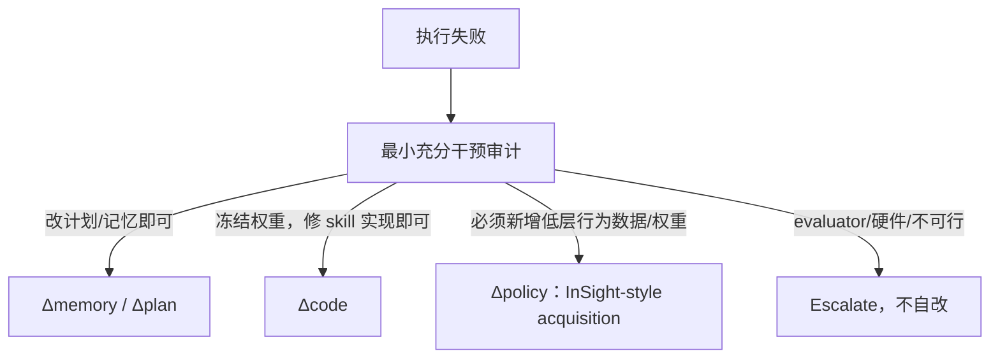

# InSight

核心判断：InSight 展示了一条与代码修复正交且必须正面对比的“policy skill acquisition”路线：当任务缺少可执行的低层运动 primitive 时，它让 VLM 找出 primitive gap、用受限单轴控制器采集成功 rollout，再微调 steerable VLA 把新 primitive 写回权重；因此它应成为本项目定义 policy-limited failure 的操作性参照，而不是被归入 code repair。

## 元信息

- 标题：InSight: Self-Guided Skill Acquisition via Steerable VLAs
- 作者：Maggie Wang、Lars Osterberg、Stephen Tian、Ola Shorinwa、Jiajun Wu、Mac Schwager
- 版本：arXiv v1，2026-06-23
- 页数：19
- 本地 PDF：[[insight-2606.24884.pdf|本地 PDF]]
- 链接：[arXiv:2606.24884](https://arxiv.org/abs/2606.24884)；[项目主页](https://insight-vla.github.io/)
- 角色：[[VLA路线]] 中的 autonomous policy acquisition；为 [[问题定义与实验假设]] 的 policy-limited route 和 abstention control 提供具体对照。

![[insight-2606.24884.pdf#page=1]]

## 一句话版

InSight 先把人类完整任务 demonstration 自动切成语言标注的 primitive episodes，使 \(\pi_0.5\) 能按细粒度 primitive prompt 被 steer；遇到新任务时，VLM 对照现有 vocabulary 找出缺失的单轴 primitive，用低层 controller 尝试参数、用 VLM oracle 筛选成功样本，再 LoRA 微调 VLA，令新增 primitive 可被以后任务复用和组合。

## 为什么重要

本项目必须回答一个边界问题：失败究竟需要改 Python skill，还是需要给 learned policy 增加训练数据？

InSight 给出了后者的完整闭环：

如果任务的最小充分干预是“采集 rotation/sweep demonstration 并更新 VLA 权重”，那么把它包装成 code repair 会掩盖真正的 policy capability expansion。相反，如果不改权重、只修 frame transform、primitive contract 或 postcondition 就能恢复，则应归入 code-repairable。

## Section-by-section

### Abstract 与 Introduction：从 test-time composition 转向持久 policy expansion

论文从“VLA 的能力受训练数据中的 skill 限制”出发。作者认为许多新任务并非完全新颖，而是已知 primitive 与少量缺失 primitive 的组合：

- block flipping 复用 approach、grasp、lift，只缺 rotation；
- sweeping 与 scooping 共用 approach 和 lowering，只缺 lateral push；
- pouring 复用 grasp、lift、transport，只缺 forward tilt 与 return upright。

既有 LLM/VLM planner 可以在测试时组合固定 skill，但不会改变 learned policy。InSight 则把 VLM 用作主动数据 acquisition agent：识别缺什么、生成缺失动作、判断成功、把成功数据加入训练集并更新 VLA。

论文报告在没有任何目标 skill 人类 demonstration 的条件下，覆盖 block flip、drawer close、twist、pour、sweep，并在真实机器人 pouring 上达到 96%，在 14-primitive twist-then-pour 上达到 80%。

### Section 2：与 planner、steerable policy 和 continual learning 的关系

作者把近邻路线分为四类：

- steerable policy 用密集语言标签暴露低层控制接口，但 primitive set 固定；
- hierarchical/skill discovery 从 demonstration 或交互中发现可复用片段；
- LLM/VLM robotics 在测试时规划或生成轨迹，但不持久扩展 policy；
- continual learning 通过 expert routing、skill subspace 或联合重训保留旧技能。

InSight 的组合点是：以 fine-grained language steerability 为接口，用 VLM 找 gap，用数据 flywheel 把 gap 编译回同一个 VLA。

### Section 3.1.1：skill、plan、primitive 与 gap

论文的定义值得直接借用：

- **skill**：自然语言描述的目标能力，例如“拧开瓶盖并把内容倒入碗中”；
- **plan**：VLM 为完成该 skill 生成的 primitive 序列；
- **primitive**：带自然语言标签、由 VLA 端到端执行到 termination 的可复用 action segment；
- **primitive vocabulary \(V\)**：VLA 已训练过的 primitive labels；
- **primitive gap**：计划中的 \(p_i\notin V\)。

每个 primitive 有 precondition 和 effect，并被限制为一个 dominant motion mode：单轴 translation、rotation 或 gripper transition。这个限制把复杂 acquisition 问题降成较可控的局部运动学习。

### Section 3.1.2：自动切分人类 demonstration

Stage 1 将未切分的人类 teleoperation 自动转成 primitive dataset：

1. VLM 根据任务描述生成预期 primitive sequence；
2. gripper open/close command 给出强边界；
3. end-effector pose 被转换为 `xy`、`z`、`rxy`、`rz` 等 dominant-axis tag；
4. VLM 结合视频帧、运动量和 gripper transition 对齐 primitive 名称与 frame boundary；
5. 每个 segment 成为独立 training episode，语言 prompt 就是 primitive label。

作者为 action space 增加一个 \([0,1)\) 的 learned progress channel，以 segment 内 normalized timestep 监督。执行时 progress 超过通常为 0.95 的阈值就结束 primitive；也可由低运动 auto-advance 或 VLM completion check 终止。

### Section 3.2：VLM-guided acquisition loop

面对新任务，VLM 先生成完整 plan，并把不在 vocabulary 中的步骤标记为 gap。每个 gap 必须是一个单轴动作：

- translation：`dx`、`dy`、`dz`，单位米；
- gripper-local rotation：`drx`、`dry`、`drz`，单位度；
- 参数包括 axis、signed magnitude 和 `already_complete`。

已知 primitive 由 steerable VLA 执行；gap 由解析 controller 执行。若一个任务有 paired motion，例如向前倒瓶与回正，系统创建两个独立 gap，并把前一步参数传给后一步以保持一致。

完整 plan 执行后，VLM 比较固定外部相机的 before/after image，判断整个任务是否成功。成功 trial 中的新 primitive 被加入训练集，失败 trial 丢弃。收集到足够样本后，原 primitive 数据与新增 primitive 一起用于 LoRA retraining。

### Implementation：具体模型与四种 VLM 角色

实验使用 \(\pi_0.5\)，以 LoRA 微调 Gemma-2B backbone 与 Gemma-300M action expert，其余权重冻结。输入包括：

- 外部与 wrist 两个 \(224\times224\) RGB view；
- end-effector pose；
- gripper state。

输出是 end-effector delta、absolute gripper command 和 progress channel。

Gemini 3 Flash 被用于四种严格 JSON 角色：

1. demonstration segmentation；
2. task plan 与 primitive-gap flagging；
3. gap axis/magnitude proposal；
4. primitive completion 与全任务 success oracle。

这个细节说明系统不是单一模型的“自主发现”。它是 VLA、VLM planner、解析 controller、VLM evaluator 和 retraining pipeline 的混合系统。

### Section 4.1：从 pick-and-place 获得 block flipping

训练数据只有 150 条 block 侧放状态下的人类 pick-and-place demonstrations，经自动切分得到超过 700 个 primitive episodes、7 种 primitive。目标 flip 需要数据中不存在的 `rotate-block`。

结果：

- 收集 59 个成功 rotate primitive 后，完整 flip 成功率约 19%；
- 153 个成功 primitive 后约 52%；
- 246 个成功 primitive、对应 479 次总尝试后达到 75%；
- 图中人工示范/任务设置的 upper bound 为 80%；
- 相同 rollout budget 下，SAC baseline 完整 flip 为 0%，虽然 23% episode 能到达 block、10% 能 grasp，但从未完成 lift-and-rotate。

这支持“利用已有 primitive，只针对 gap 收集数据”比从头 RL 更 sample-efficient；但 479 次 simulation attempts 仍不是小预算。

### Section 4.2：从 drawer opening 获得 closing

基础数据只有 50 条 drawer-opening demonstration，被切成：

1. move to handle；
2. close gripper；
3. pull drawer open。

drawer closing 从“抽屉已开”开始，对基础 approach primitive 是 OOD initial state。系统周期性调用 VLM completion check，决定 approach 是否已经足够，并切换到新 `push drawer closed` primitive。

82 次 acquisition episodes 产生 70 个成功 close-drawer primitives；联合重训后，最终 VLA 在 25 次评估中 drawer close 成功率 100%，并保留 drawer opening 能力。主要 acquisition 失败是 VLM 选错运动轴。

这个实验说明 completion monitor 可以桥接不完美的旧 primitive，但也表明 evaluator 与 segmentation 对数据质量有直接控制权。

### Section 4.3：真实 xArm 的 twist、pour 与组合

基础 VLA 只看过 50 条从顶部和侧面抓瓶子的 pick-and-place demonstrations。目标需要数据中没有的 twist 与 pour。

对照是：

- 只在这 50 条基础数据上 fine-tune 的 \(\pi_0.5\)；
- CaP-X，代表 VLM 在测试时直接组合/生成 motion、但不更新 learned policy；
- InSight，额外加入自主采集的 primitive episodes。

25 次评估的 end-to-end 结果：

| 任务 | \(\pi_0.5\) base | CaP-X | InSight |
| --- | ---: | ---: | ---: |
| Twist cap open | 0% | 32% | 92% |
| Pour beans into bowl | 0% | 16% | 96% |
| Twist then pour，14 primitives | —/接近不可完成 | 4% | 80% |

组合任务没有 end-to-end demonstration。InSight 把已获得的 twist 和 pour primitive 与基础 pick/place primitive 串成 14 步计划，说明新增 primitive 有一定 compositional reuse。

真实数据 acquisition 成本为：

| 新 skill | 获得 20 个成功 primitive 所需 trials | Robot time | VLM time | Wall-clock |
| --- | ---: | ---: | ---: | ---: |
| Twist | 23 | 23.8 min | 8.4 min | 39.7 min |
| Pour | 31 | 49.6 min | 26.9 min | 85.3 min |

统一 VLA 在新增 twist/pour 后，对原始 top/side pick-and-place 的 15 次评估均为 100%；图中的原始 \(\pi_0.5\) top-grasp baseline 为 86%、side-grasp 为 100%。这提供了初步 retention 证据，但覆盖的旧任务非常窄。

### Section 4.4：从 scooping 获得 sweeping

基础 demonstration 只有 scooping。VLM 判断 approach 与 lowering 可复用，只缺水平 lateral push。系统自主收集 sweeping primitive，最终在真实机器人上 5/5 成功。

这是 contact-rich、non-prehensile 的有趣扩展，但 5 次测试不足以估计稳定成功率或安全风险。

### Conclusion、Limitations 与 Future Work

作者明确承认：

- gap execution 只支持单轴 motion，限制 primitive 复杂度；
- 当前只保留成功 rollout，尚未利用 failure analysis；
- 每次真实 rollout 需要人类 reset；
- 可考虑 waypoint、trajectory optimization、online RL 或 real-to-sim-to-real/world model；
- 尚未扩展到 mobile manipulator 或 humanoid。

这些限制说明 InSight 是受控的 targeted acquisition pipeline，还不是开放世界、无人值守的 lifelong learner。

## 具体机器人例子

假设 RPent/Harness VLA 要“握住瓶身，把瓶子向前倾倒 110°，再回正”。失败后有两个候选解释：

### Code-repairable

现有 `rotate_pitch` 本来能执行这段轨迹，但实现把 gripper-local `dry` 错映射成 world-frame yaw。冻结 VLA 权重，只修改 frame transform 就能在 held-out bottle pose 上恢复。这属于 code repair。

### Policy-limited

系统没有能在接触、负载和视觉闭环下稳定倒液体的 learned primitive；解析单轴 controller 只能生成 acquisition demonstration，最终必须用 20 条成功 rollout 微调 VLA，才能稳定执行。这属于 InSight-style policy acquisition。

实验分类应由“最小充分干预”预注册，而不是看我们的 code agent 是否碰巧修成功：若替换/训练 policy 才能恢复，就必须路由到 policy-limited。

## 对本项目的启发

### 1. 把 InSight 作为边界系统，而不是主 baseline 的弱版本

第一篇 code-repair 论文的 primary comparison 仍应是预算匹配的 plan/memory-only Harness。InSight 适合做 policy-limited subset 的 oracle intervention 或扩展 baseline，用来证明系统能识别“不要继续改代码，应该采数/训练”。

### 2. 将 failure routing 写成三种持久更新

这比“所有失败都进入 coding agent”更可证伪，也更安全。

### 3. 借用 primitive vocabulary 与 gap contract

skill registry 不仅记录函数名，还可记录：

- semantic effect；
- precondition/postcondition；
- dominant motion mode；
- implementation type：analytic、learned 或 hybrid；
- evidence coverage；
- 是否已有可训练 policy；
- 允许的 code patch 与 policy update 路径。

### 4. 不让同一个 VLM 同时拥有生成与最终验收权

InSight 用同一类 VLM 完成 plan、gap proposal、completion check 和 success oracle。对 autonomous data collection 这是工程捷径；对本项目的代码发布则风险过高。candidate generator 与 hidden evaluator 必须隔离，关键 task success 尽量由 simulator state、几何/力学 predicate 或人工盲审确认。

### 5. 评估 selective repair

在 policy-limited controls 上，我们的方法的正确行为不是提高 code patch success，而是：

- 不产生无意义 patch；
- 正确 abstain/escalate；
- 指出缺失 primitive 与所需证据；
- 不消耗过多真实机器人尝试；
- 不造成旧 skill 回归。

## 局限与批判

- **“自主”仍依赖人类 reset**：真实机器人每条 rollout 都需要人工恢复环境。
- **gap 被人为限制为单轴**：这使 VLM parameter proposal 可行，却不能代表复杂 contact-rich skill discovery。
- **VLM oracle 可能污染数据**：误判的成功 rollout 会被写回 VLA；论文没有给出 oracle precision/recall 或独立人工审计率。
- **成功样本过滤忽略失败信息**：失败原因没有被用于调整下一次 proposal，数据效率仍可提升。
- **retention 证据很窄**：只测少数 base pick-and-place trials，不能证明长期 continual learning 下无 catastrophic forgetting。
- **baseline 范围有限**：SAC 从头学习与 CaP-X zero-shot 都不是所有 policy-acquisition 方法中的最强对手。
- **统计规模不均衡**：sweeping 只有 5 次评估；部分结果没有置信区间。
- **安全门不足**：真实 rollout 的 single-axis controller 由 VLM 给幅度，论文主要用 success oracle，未系统报告碰撞、力或安全违规。

## 我会追问的问题

- 谁来可靠地判断“现有 primitive 做不到”，而不是 planner 只是没找到正确组合？
- primitive gap 按 semantic effect 命名后，如何识别两个名字不同但控制分布相同的重复 skill？
- VLM oracle 的 false-positive rate 是多少，加入一条错误 demonstration 会造成什么后果？
- 新 primitive 在未见 object geometry、payload 和 camera pose 上是否仍可复用？
- 如果同时允许 code patch 和 policy acquisition，什么证据决定先走哪条路径？
- 经过 10、50、100 次 skill expansion 后，原始能力的 retention 与模型容量如何变化？
- 能否先在 world model/仿真中验证 VLM-proposed motion，再将少量候选放到真实机器人？
