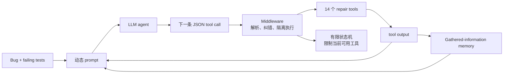

# RepairAgent

核心判断：RepairAgent 证明了 autonomous coding agent 相比固定 repair loop 的真正优势不是“多问几次 LLM”，而是能在假设形成、代码检索、repair ingredient 搜索、补丁生成和测试之间自主切换；但它默认获得完美 fault localization，并让一次 `write_fix` 最多采样 30 个变体，因此迁移到机器人时必须把状态机、工具权限、候选 patch 数和环境执行预算全部显式冻结。

## 元信息

- 标题：RepairAgent: An Autonomous, LLM-Based Agent for Program Repair
- 作者：Islem Bouzenia、Premkumar Devanbu、Michael Pradel
- 版本：arXiv v2，2024-10-28
- 页数：14
- 本地 PDF：[[repairagent-2403.17134.pdf|本地 PDF]]
- 链接：[arXiv:2403.17134](https://arxiv.org/abs/2403.17134)
- 角色：[[自进化代码Agent与评估器]] 的 agentic repair 基线；[[Robot CI-CD与安全门]] 中 typed tools、sandbox、test-and-revert 与状态机约束的直接参考。
- 阅读状态：已按 arXiv v2 全文精读。

![[repairagent-2403.17134.pdf#page=1]]

## 一句话版

RepairAgent 不是把“生成 patch -> 跑测试 -> 把错误喂回模型”写死，而是给 GPT-3.5 一组 14 个修复工具和一个有限状态机，让模型自主决定何时读代码、搜索相似 API、形成或放弃假设、生成补丁、运行测试以及结束修复。

## 为什么对本项目重要

它给本项目提供了一个比泛化 coding agent 更干净的软件基线：

- agent 的每一步必须落到 typed tool call，而不是自由 shell。
- 每个 patch 都在隔离环境中应用和测试，失败后自动回滚。
- agent 能保存跨 cycle 的结构化信息，避免重复读取和遗忘文件名。
- 状态机限制当前可用工具，减少无目标探索，但不固定具体调用顺序。

这与本项目的混合架构非常接近：

```text
RPent / Harness VLA execution trace
-> repair-specific agent tools
-> editable skill workspace
-> simulator / regression / safety gate
-> accept or rollback
```

不过 RepairAgent 解决的是 Java repository bug，不处理连续控制、policy-limited failure、真实硬件风险或共享 skill 的跨任务回归。

## 系统机制



系统循环的基本单位是一个 cycle：

1. 用当前动态 prompt 查询 LLM。
2. 解析并修正模型输出。
3. 执行一个工具调用。
4. 把工具结果与状态更新写入下一轮 prompt。

默认最多 40 cycles。

## Section-by-section

### Abstract 与 Section I：从固定反馈环转向自主工具使用

论文将当时的 LLM APR 概括为两代：

1. 单次 prompt：输入 buggy code，输出修复。
2. 固定迭代：运行候选 patch 的测试，把编译/测试错误加入下一轮。

作者认为第二代仍与人类 debugging 不同，因为人类会交错执行：

- 理解 bug。
- 搜索相关代码和 repair ingredients。
- 提出假设。
- 尝试 patch。
- 根据新证据改变假设。

RepairAgent 将这种顺序交给 LLM 决策，而不是硬编码成统一循环。论文称其为首个 autonomous LLM-based program repair agent；这个历史性表述应放在 2024 年论文语境中理解。

### Section II：什么叫 autonomous agent

论文给出两个条件：

1. LLM 自主规划并执行一系列 actions，而不是只回答固定 query。
2. actions 包含外部工具调用，使模型能改变和观测环境。

这一定义对本项目很实用：仅让模型多轮输出补丁，不足以称为 execution-feedback self-evolution；agent 至少要能主动请求诊断信息、选择验证动作，并根据结果调整计划。

### Section III-A/B：三组件与动态 prompt

RepairAgent 由三部分组成：

- 通用 LLM agent。
- 14 个 program-repair-specific tools。
- 在二者间编排的 middleware。

动态 prompt 分为静态与动态 sections：

| Prompt section | 性质 |
| --- | --- |
| Role、Goals、Guidelines | 静态 |
| State description | 动态 |
| Available tools | 动态 |
| Gathered information | 动态 |
| Output format | 静态 |
| Last command and result | 动态 |

`Gathered information` 相当于长时 memory，按工具来源组织输出；`Last command and result` 则提供最近一步的局部反馈。模型必须返回带 `thoughts` 与 `command{name,args}` 的 JSON。

这比把完整聊天历史原样累积更清晰，但论文也观察到：未修复 bug 会持续读入更多代码，最终把 prompt 塞满。

### Section III-C：状态机是 soft structure，不是固定脚本

状态机包含：

1. **Understand the bug**：运行测试、读取失败测试、fault localization、形成 hypothesis。
2. **Collect information to fix the bug**：搜索代码、相似 API、读取函数或生成 method body。
3. **Try to fix the bug**：写 patch、执行测试；失败时可回到前两态。
4. **Done**：确认至少一个 patch 通过测试后结束。

模型可以通过 control tools 主动切换状态，因此 FSM 只约束当前 action space，不强制统一路径。作者在早期实验中发现，没有状态机时 agent 会无目的探索或过早直接修复。

映射到机器人，本项目可以采用：

```text
Observe failure
-> Attribute mechanism
-> Gather causal trace / code context
-> Propose minimal patch
-> Verify in Robot CI
-> Publish / rollback / abstain
```

其中必须比 RepairAgent 多出 `abstain/escalate`，用于 plan/policy/trusted-kernel failures。

### Section III-D：14 个 repair tools

#### 读取与抽取

- `read_range`
- `get_classes_and_methods`
- `extract_method`
- `extract_tests`

#### 搜索与生成

- `search_code_base`
- `find_similar_api_calls`
- `generate_method_body`

`find_similar_api_calls` 搜索项目内相同 API 的其他调用，降低模型幻觉不存在参数或枚举值的风险。`generate_method_body` 调用另一个 LLM，根据方法前文与签名生成函数体，输入最多 12k tokens、输出最多 4k tokens。

#### 测试与补丁

- `run_tests`
- `run_fault_localization`
- `write_fix`

`run_tests` 会清理测试输出，删除项目外 stack frames，减少无关 prompt token。`run_fault_localization` 可返回 perfect localization 或运行 GZoltar；论文默认使用前者。

`write_fix` 接受 JSON patch，支持跨行、跨文件 insert/delete/modify。它在隔离代码库中应用 patch 并运行全测试；失败时自动恢复干净状态。一次调用默认最多采样 30 个 patch variants，去重后分别运行测试。

这带来一个重要评测问题：**一个 tool call 不等于一个 candidate patch，也不等于一次 test execution。**

#### 控制状态

- `express_hypothesis`
- `collect_more_information`
- `discard_hypothesis`
- `goal_accomplished`

这些工具把“我认为原因是什么”与“我要切换到哪类行动”变成显式状态变化，便于审计 agent 是否在错误假设上打转。

### Section III-E 与 Section IV：middleware、容错与隔离

LLM 可能输出错误 tool name、argument name、file path 或 JSON。middleware 依次：

1. 用 substring 与 Levenshtein distance 映射到合法工具。
2. 同样修正参数名。
3. 尝试修正无效参数值和路径。
4. 无法唯一修正时，把错误反馈给模型进入新 cycle。
5. 检测完全相同的重复调用并提醒模型。

工具在 Docker 隔离环境执行。实现基于 Python 3.10、AutoGPT、GPT-3.5-0125 和 ANTLR。

对 [[Robot CI-CD与安全门]] 而言，最可复用的不是字符串容错，而是三条边界：

- tool schema 与权限由可信内核定义。
- 修改在隔离 workspace 发生。
- 失败 patch 自动回滚，不污染下一次尝试。

### Section V-A：实验设置

- Defects4J：835 个真实 Java bugs，17 个项目；v1.2 为 395 个，v2 为 440 个。
- GitBug-Java：从 2023 年的 199 个 bugs 中随机取 100 个；19 个 single-line、64 个 multi-line、17 个 multi-file，用于降低 GPT-3.5 训练数据泄漏疑虑。
- Baselines：ChatRepair、ITER、SelfAPR。
- Correctness：先自动比较 developer patch；不一致时人工判断语义一致性。
- 默认使用 perfect fault localization。

### RQ1：有效性

Defects4J 总体：

| 指标 | 数值 |
| --- | ---: |
| 总 bug | 835 |
| Plausible fixes | 186 |
| Correct fixes | 164 |
| v1.2 correct | 74 |
| v2 correct | 90 |
| 与三项 baseline 都不重叠的 correct fixes | 39 |

按修改范围：

| 类型 | RepairAgent correct |
| --- | ---: |
| Single-line | 115 |
| Multi-line、单文件 | 46 |
| Multi-file | 3 |

RepairAgent 的总体 164 与 ChatRepair 的 162 接近，但更擅长 multi-line：46 vs ChatRepair 的 29。作者将其归因于 agent 能搜索 repair ingredients，并且 patch schema 不限制修改行数和文件数。

#### Closure-14 例子

buggy code 调用：

```java
cfa.createEdge(fromNode, Branch.UNCOND, finallyNode);
```

agent 用 `find_similar_api_calls` 在另一个文件找到相同 API 使用 `Branch.ON_EX`，以此作为 repair ingredient，正确替换枚举值。这个例子说明 repository search 提供的是项目内证据，不只是更多通用知识。

#### Time-27 例子

agent 使用 `generate_method_body` 生成缺失控制逻辑，从中发现需要加入的 `if` 分支，随后提出正确的多行 patch。它表明生成工具不一定直接产出最终答案，也可以作为 hypothesis/ingredient generator。

#### GitBug-Java 外部有效性

| 类型 | Bugs | Plausible | Correct |
| --- | ---: | ---: | ---: |
| Single-line | 19 | 11 | 9 |
| Multi-line | 64 | 8 | 4 |
| Multi-file | 17 | 0 | 0 |
| 合计 | 100 | 19 | 13 |

论文认为结果说明 data leakage 影响有限；更谨慎的解释是：single-line 上仍有效，但更复杂、更新的 bugs 显著更难，multi-file 为 0/17。

### RQ2：时间、token 与钱

- 每 bug 修复时间中位数：920 秒。
- 约 99% 时间花在工具执行，主要是运行测试。
- token 消耗中位数约 270k / bug；论文摘要将其概括为平均 270k。
- 按 2024 年 GPT-3.5 定价约 \$0.14 / bug。
- fixed bugs 约 21k tokens，而 unfixed bugs 约 315k tokens。

这说明失败 case 才是预算的主要消耗者：agent 会不断读取更多代码、扩张 prompt，直至 cycle budget 耗尽。

作者还报告一次修复平均约 117 个候选 patches，而不是表面上的 40 cycles；原因是一次 `write_fix` 可采样多个 variants。

### RQ3：消融

消融只在同一组随机 100 个 Defects4J bugs 上进行：

| 配置 | Plausible | Correct | 总成本 |
| --- | ---: | ---: | ---: |
| 完整 RepairAgent | 23 | 21 | \$16 |
| 无 search tools | 14 | 11 | \$28 |
| 无 state machine | 18 | 14 | \$31 |
| 只保留单 cycle memory | 9 | 6 | \$8 |
| realistic localization | 16 | 16 | \$29 |

几个关键结论：

- 去掉 search tools 后正确修复几乎减半，而且成本翻高，因为 agent 改为读取长代码段。
- 去掉 FSM 后 agent 经常不收集证据就直接 patch，效果下降且成本更高。
- 只保留一轮 memory 时 agent 会重复命令、忘记文件名和函数名。
- 从 perfect localization 换成 GZoltar 后，correct 从 21 降至 16、成本从 \$16 增至 \$29；这显示 fault attribution 不是可忽略的前处理。

### RQ4：工具如何被使用

平均每 bug 约 35 次 tool calls。`write_fix` 最频繁：

- fixed bugs 平均约 6 次。
- unfixed bugs 平均约 17 次。

未修复 case 中只有约 7% 的 `write_fix` 调用产生 plausible patch，而已正确修复 case 中约 44%。`run_tests` 单独调用较少，因为 `write_fix` 会自动运行测试。

这一数据提醒我们：若只报告 tool-call 数，会隐藏每次 `write_fix` 内部的 30-way sampling 与大量 test executions。

### Section VI–VIII：讨论、威胁与结论

论文承认：

- GPT-3.5 可能见过 Defects4J。
- benchmark 为每个 bug 提供至少一个 failing test，现实中未必存在。
- fault localization 不准确会降低诊断与修复。
- LLM 输出不确定；实验没有对每个 bug 做多 repair-agent seeds。
- agent 有时把简单 single-line bug 复杂化。
- multi-file bug 常只修到部分所需位置。

此外，本项目必须注意：

1. 通过当前 tests 的 plausible patch 仍可能过拟合；论文靠 developer patch 和人工审查判断 correct，并没有 agent 不可见的 final-blind suite。
2. `goal_accomplished` 只要求存在 test-passing patch，没有安全、性能或跨任务 regression gate。
3. perfect localization 默认设置把 bug attribution 从主任务中拿掉，不能直接支持执行反馈端到端自调试。
4. Docker 隔离只保护软件主机；真实机器人还需要 simulator、action shield、hardware limits 与人工审批。

## 对 H5、H2、hidden tests 与预算的影响

### H5：它应成为“无中间 runtime trace”的强 agentic baseline

RepairAgent 已拥有：

- failing tests 和清理后的测试输出。
- repository code reading/search。
- hypothesis memory。
- test feedback。
- 多轮自主工具选择。

但没有 [[DebugRepair]] 式主动插桩和中间运行状态。因此 H5 的公平对照不是 one-shot LLM，而是：

```text
RepairAgent-style tools + outcome-level feedback
vs.
相同 agent/tools/budget + purified structured execution trace
```

这样才能把收益归因于 trace，而不是“ours 有 agent，baseline 只有 prompt”。

### H2：FSM 不是 failure-type routing

RepairAgent 的状态机只表达 repair process stage，不判断 failure 的最小充分干预。它没有：

- plan/memory repair。
- policy-limited。
- trusted-kernel/evaluator failure。
- abstain 或 escalate。

本项目应在 `express_hypothesis` 后增加 typed diagnosis：

```text
plan_or_memory
code
policy
trusted_kernel
infeasible_or_unknown
```

只有 `code` 能进入 `write_skill_patch`。其他分类应分别调用 memory update、policy escalation 或停止。

### Hidden tests：`write_fix` 不能直接访问最终 gate

RepairAgent 每次 patch 都跑完整可见测试，且可反复采样 variants。如果同样开放机器人 hidden suite，agent 可以通过提交反馈逐步探测测试。

建议：

- held-in tests 可由 `write_fix` 反复使用。
- hidden gate 限制提交次数，只返回压缩结果。
- final-blind suite 不在修复回路中返回任何反馈。
- 采用 [[STING]] 式 mutant audit 检查 gate strength。
- developer/oracle patch 只用于 benchmark 构建和离线评分，不进入 agent context。

### 预算：至少记录五个嵌套层

| 层级 | RepairAgent 对应量 |
| --- | --- |
| agent cycles | 默认最多 40 |
| tool calls | 平均约 35 / bug |
| patch proposals | 平均约 117 / bug |
| test executions | 每个 patch variant 至少一次 |
| tokens/context growth | 中位约 270k / bug |

机器人版本还需加 environment rollouts、仿真步数、wall-clock、GPU 与 hardware time。primary comparison 必须对齐真正昂贵的最内层资源，而不只是对齐外层 cycles。

## 迁移到 Robot CI 的工具设计

可以将 14 个工具映射为受限机器人版本：

| RepairAgent | Robot repair tool |
| --- | --- |
| `extract_tests` | 读取失败 episode、primitive trace 与 contract |
| `search_code_base` | 搜索 skill registry、调用者和历史 patch |
| `find_similar_api_calls` | 查找同 primitive 在其他任务中的正确用法 |
| `express_hypothesis` | 提交 failure family、root cause 与证据 |
| `write_fix` | 在 allowlist workspace 生成最小 patch |
| `run_tests` | 静态、contract、unit、sim、regression、安全门 |
| `discard_hypothesis` | 显式否定诊断并保留审计记录 |
| `goal_accomplished` | 只能在可信 gate 签名后发布候选版本 |

必须新增：

- `request_structured_trace`
- `run_replay`
- `run_sim_perturbation`
- `check_safety_invariants`
- `abstain_and_escalate`
- `rollback_version`

其中 evaluator、hidden tests、budget counter、tool permissions 和 rollout termination 必须属于不可编辑 trusted kernel。

## 我会追问的问题

- 若所有方法统一候选 patch 数和 test executions，而不只统一 cycles，RepairAgent 的优势还剩多少？
- 在 realistic fault localization 下增加相同总预算，能否追回从 21 到 16 的下降？
- `find_similar_api_calls` 的收益有多少来自真实 repair ingredient，有多少来自 benchmark 中重复代码模式？
- long-term prompt memory 能否用结构化 evidence store 替代，以避免 unfixed cases 的 315k-token 膨胀？
- 多 repair-agent seeds 下 164 个 correct fixes 的置信区间是多少？
- 若加入 final-blind tests，186 plausible 中还有多少能保留？
- 对机器人 case，什么时候 agent 应停止搜索代码并判断为 policy-limited，而不是继续消耗 rollout？
