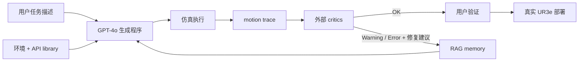

# RoboCritics

核心判断：RoboCritics 的最强证据不是“LLM 能自动修好机器人代码”，而是外部、基于真实 motion trace 的确定性 critics 比把安全规则写进 prompt 更可靠；这直接支持本项目把安全 critic 放进不可编辑可信内核，并让补丁生成与验收分权，但其小规模 HRI 研究尚未证明无人值守自动修复或形式安全保证。

## 元信息

- 标题：RoboCritics: Enabling Reliable End-to-End LLM Robot Programming through Expert-Informed Critics
- 作者：Callie Y. Kim、Nathan Thomas White、Evan He、Frederic Sala、Bilge Mutlu
- 版本：arXiv v1，2026-03-06；HRI 2026
- 页数：10
- 本地 PDF：[[robocritics-2603.06842.pdf|本地 PDF]]
- 链接：[arXiv:2603.06842](https://arxiv.org/abs/2603.06842)；[DOI](https://doi.org/10.1145/3757279.3785550)；[代码仓库](https://github.com/Wisc-HCI/RoboCritics)
- 角色：[[安全验证与机器人DSL]] 与 [[Robot CI-CD与安全门]] 的 motion-level critic 证据；补充 [[执行反馈自调试]] 中的 execution-grounded feedback。

![[robocritics-2603.06842.pdf#page=1]]

## 一句话版

RoboCritics 让 GPT-4o 依据环境和高层机器人 API 生成程序，在仿真执行后由五个外部 analytic critics 检查 space usage、collision、joint speed、end-effector “spearing” pose 和 pinch point，再把结构化违规反馈交回 LLM 生成修改，并要求用户在仿真中确认后才部署到 UR3e。

## 为什么重要

这篇论文针对一个常被忽略的事实：代码在语法和符号逻辑上正确，不代表它在物理执行中安全。

例如，prompt 中明确告诉 LLM “joint speed 不得超过阈值”，模型仍可能声称自己已经减速，但实际 trajectory 超速。只有运行 forward kinematics/trajectory proximity 后，外部 critic 才能看到物理结果。

对本项目而言，它支持四条设计原则：

1. critic 需要读取执行 trace，而不只读代码；
2. critic 必须独立于 patch generator；
3. feedback 应结构化并指向可执行修改，但不自动等同于可发布补丁；
4. action API 的表达力决定 critic 建议能否真正被修复。

## Section-by-section

### Abstract 与 Introduction：端到端指的是从自然语言到物理执行

论文面对的是 end-user robot programming：用户有领域任务知识，但不一定懂运动学、碰撞或速度约束。LLM 能把自然语言翻成机器人 API 程序，却产生难以检查的“黑箱代码”，错误还会产生物理后果。

作者提出两个问题：

1. 如何设计 expert-informed critics 来验证 LLM 生成的机器人程序？
2. critics 是否能提高 end-to-end 编程的安全性和可靠性？

RoboCritics 将 RAG-Modulo 式外部 verifier 扩展到 motion level，使用实际执行 trajectory，而不是只在 prompt 或 AST 层检查规则。

### Section 2：为什么符号验证还不够

既有路线包括 block-based programming、programming by demonstration、自然语言接口、LTL/formal logic 和 secondary LLM verifier。它们能降低编程门槛或检查部分 task logic，但 collision、joint speed、unsafe end-effector pose 等问题要到运动轨迹层才显现。

作者的核心立场是：LLM in isolation 不能可靠 self-correct。安全约束不能只作为生成 prompt 的一部分，而应被实现为外部可检查函数。

### Section 3.1：完整 workflow

系统闭环为：

用户选择启用哪些 critics。违规信息和候选 revision 通过 Fix 按钮交给 LLM；更新代码仍显示给用户检查，并可重新仿真。验证后的任务、程序和 feedback 被写入历史 memory，以供后续 RAG。

### Section 3.1.1：execution trace schema

每个 timestep 的状态为：

\[
s_t=\{J_t,F_t,P_t,\tau_t\}
\]

其中：

- \(J_t\)：joint angles；
- \(F_t\)：机器人 links 的 Cartesian frames；
- \(P_t\)：link pair proximity；
- \(\tau_t\)：timestamp。

critic 读取整条 \(\{s_1,\ldots,s_T\}\)，输出 `OK`、`Warning` 或 `Error`，同时附自然语言解释与修复 hint。

这是本项目 trace schema 的有用最小集合，但缺少 RGB-D、object state、force/torque、skill call boundary 和 task predicate。

### Section 3.1.2：五个 expert-informed critics

| Critic | 检查方法 | 输出逻辑 |
| --- | --- | --- |
| Space usage | trajectory 中 link positions 的 convex hull | 超过允许 workspace 的 50% 为 Warning，越界为 Error |
| Collision | gripper geometry 与环境物体的 AABB distance | penetration 为 Error；小于 \(d_{warn}\) 为 Warning |
| Joint speed | link reference point 在 world frame 的 Cartesian linear speed，作为 joint angular speed proxy | 超过 \(v_{warn}\) 为 Warning，超过 \(v_{max}\) 为 Error |
| End-effector pose | 运动方向与 finger direction 的夹角和速度构成 “spearing” risk score | 超过两级 score threshold 输出 Warning/Error |
| Pinch point | pairwise link proximity | 小于 \(d_{min}\) 为 Error；介于 \(d_{min},d_{max}\) 为 Warning |

这些 critic 是解析函数而非另一个 LLM。优势是行为可复查、阈值可版本化；但若几何模型、阈值或 proxy 不正确，输出也不等于真实安全证明。

特别要警惕 joint speed critic：论文计算的是 link point 的 Cartesian speed，称其为 joint speed proxy，并非直接读取每个关节的角速度。它适合风险提示，不应被误写成严格 hardware limit verifier。

### Section 3.1.3–3.1.5：模块化、自动 fix 与 RAG

critic 只依赖 execution trace，与 LLM 和 skill library 解耦。因此可增加 force limit、医疗流程 adherence 或 domain-specific constraint，而不改生成模型。

违规后，系统给出类似：

> joint speed 高于建议的 1 m/s；可在 `move_to` 前减速，但会增加 cycle time。

用户点击 Fix，反馈被送回 LLM，后者可能插入 `reduce_speed(20)`。这里的“自动修复”是 LLM 根据 critic hint 重写程序，不是 critic 自己证明或合成补丁。

RAG memory 保存 user request、generated program 和 critic feedback 的 tuple，使模型迭代旧程序而不是每轮从头生成。

### Section 3.2：实现

后端使用：

- GPT-4o 生成程序；
- `text-embedding-ada-002` 与 LangChain 做 RAG；
- Python/Flask；
- `move_to`、`open_gripper`、`reduce_speed`、`avoid_collision` 等预定义 API。

前端使用 React 与 Three.js。环境由 JSON 指定物体位置、尺度、姿态和标识。Lively IK 根据 URDF 产生 UR3e trajectory；通过仿真验证后的 joint states 再经 TCP/IP 发送到真实 UR3e。

因此结果依赖硬编码且与仿真一致的环境模型，不是在未知动态场景中在线感知并防护。

### Section 3.3：prompt-only critic 与外部 critic

作者先做一个三任务技术 validation：recycling、sorting、preparing breakfast。两组使用相同任务、API 与 LLM：

- embedded：把 critic rules 写入 system prompt，让 LLM 自查；
- external：程序执行后，由 trajectory-level critic 输出结构化 feedback。

每个任务最多尝试 5 次。程序质量按五个 critic 汇总为 0–10 分。

| 条件 | 平均尝试数 | 平均 program quality |
| --- | ---: | ---: |
| Embedded prompt-only | 2.3 | 6.3 |
| External motion-level | 5.0 | 7.7 |

prompt-only 较早宣称完成，却漏掉 collision、速度和姿态问题；external critic 用满五轮后分数更高。两组都没能可靠解决 pinch point，作者归因于尝试预算、API library 和初始 configuration 限制。

这是支持“外部 verifier 优于自我声明”的机制性证据，但样本规模只是三个任务，不应当作强统计结论。

### Section 4：用户研究设计

研究采用 between-subjects design：

- 18 人，男女各 9，年龄 19–68；
- `no-critic` 与 `with-critic` 两个条件；
- 三个任务：Recycling、Sorting、Preparing Breakfast；
- 先进行 10 分钟教程，每任务最多 10 分钟；
- 每次 session 约 60 分钟。

五个 critic 各打 0（Error）、1（Warning）、2（OK），合计为 0–10 program quality index。另记录交互日志，并使用 NASA-TLX、SUS 和 USE questionnaire。

### Section 5：关键结果

critic-assisted 组在前两个任务上显著提高 program quality：

| 任务 | With critic | No critic | 统计 |
| --- | ---: | ---: | --- |
| Task 1 | \(6.78\pm0.97\) | \(5.56\pm1.13\) | \(p=.026,\ d=1.16\) |
| Task 2 | \(6.67\pm0.87\) | \(5.44\pm1.24\) | \(p=.027,\ d=1.15\) |
| Task 3 | \(5.56\pm2.51\) | \(3.89\pm3.02\) | \(p=.221,\ d=0.60\)，不显著 |

USE、SUS 与 NASA-TLX 没有显著差异，即质量提高没有显示出明显主观负担代价。

访谈揭示三个设计张力：

- 用户最关注 collision、joint speed 和 space usage，但不同部署假设会改变 critic 优先级；
- 一键 Fix 降低门槛，也会诱导用户不检查、盲信自动修复；
- 过于保守的修复可能让机器人“为了不撞而卡住”，牺牲任务完成。

### Section 6–7：讨论、局限与设计含义

论文给出三项设计含义：

1. verifier 应跨越 planning、runtime/code executability 与 motion 三个抽象层；
2. 自动化程度需可调，用户应能选择 auto-correction、guided edit 或 manual refinement；
3. critic 能否修复受 API/skill library 表达力限制。只有 `reduce_speed` 时，模型会反复调一个参数，而不能改变 motion strategy。

作者明确承认：

- 仿真环境硬编码且静态；
- grasp API 很简单，不理解 object geometry；
- 尚未有 perception-aware critic；
- 真实部署期间 gripper 问题妨碍完整观察；
- critics 尚未与机器人专家做 cross-validation；
- 用户研究只有 18 人。

## 具体机器人例子

用户要求“把绿苹果放进白盒”。LLM 生成：

1. 到苹果上方；
2. 向下 0.2 m；
3. 闭合夹爪；
4. 上移；
5. 到白盒上方；
6. 释放。

代码在语义上合理，但仿真 trace 显示某个 `move_to` 使 link point 速度达到约 1.001 m/s，超过建议阈值。prompt-only 自检可能声称程序安全；外部 critic 根据 timestamp 与 link frame 计算速度，输出具体 Warning。LLM 据此在高风险移动前加入 `reduce_speed`。

对本项目，等价流程应是：

- repair agent 提交候选 `move_pose` patch；
- sandbox 仿真生成 motion trace；
- 只读 critic 检查速度、碰撞、工作区和夹点；
- 任何严重违规直接拒绝 patch；
- Warning 可进入风险/效率 trade-off，但不能由 agent 自行降低阈值消除。

## 对本项目的启发

### 1. 安全 critic 必须位于可信内核

critic 的代码、URDF、环境几何、阈值、hidden trace 和输出签名属于 [[Robot CI-CD与安全门]] 的只读 \(K\)。candidate patch 只能读取反馈，不能修改 critic 或过滤输出。

### 2. 至少建立四层 verifier

| 层 | 典型检查 |
| --- | --- |
| Static/runtime | import、syntax、API allowlist、timeout、资源限制 |
| Skill contract | precondition/postcondition、frame/unit、参数范围 |
| Motion safety | collision、速度、workspace、pinch、force/torque |
| Task/regression | success predicate、held-out task、旧任务非劣 |

RoboCritics 主要覆盖第三层；它不能替代其他层。

### 3. critic feedback 与 patch acceptance 分开

结构化 feedback 应包含：

- violation type 与 severity；
- 首次发生 timestep；
- 涉及的 skill call 和 link/object；
- observed value、threshold 与 margin；
- trace evidence；
- 可能的修复方向；
- critic version。

LLM 可据此提 patch，但是否接受仍由完整 hidden gate 决定。

### 4. 安全与任务完成应做约束优化

过于保守的 critic 修复可能让机器人停止不动。实验不应只报告“警报变少”，还需同时报告：

- held-out task success；
- severe/minor safety events；
- cycle time 与 path length；
- abstention/escalation；
- unaffected-task regression。

主假设应是安全非劣约束下提高任务恢复，而不是把所有动作压到零风险。

### 5. API expressiveness 是 failure routing 的信号

若 critic 连续指出同一问题，但 allowlist 内没有能实现替代 motion strategy 的 primitive，系统应 route 到 skill-library expansion 或人工工程，而不是无限重试参数修改。

## 局限与批判

- **不是形式证明**：五个阈值 critic 只覆盖已编码风险，且部分使用近似几何和 proxy。
- **小样本 HRI**：每组约 9 人，Task 3 差异不显著，不能得出广泛部署结论。
- **program quality 是自定义 proxy**：0–10 分由同一 critics 汇总，并非真实事故率或完整任务成功。
- **真实机器人验证不足**：环境静态且硬编码，论文没有系统量化 sim-to-real safety outcomes。
- **critic 与 evaluator 尚未专家校准**：作者明确未做 expert cross-validation。
- **一键修复可能诱导 automation bias**：用户可能不理解就反复点击。
- **受限 API 限制可修复性**：pinch point 在内外 critic 条件都未解决。
- **只检查已执行/仿真的轨迹**：对于传感器故障、环境变化和分支路径，单条 trace 不能提供覆盖保证。

## 我会追问的问题

- 五个 critic 对机器人专家标签的 precision、recall 和 severity calibration 是多少？
- joint speed proxy 为什么不用真实 joint velocity，二者在 UR3e 上的误差多大？
- 补丁通过一条 simulation trace 后，在几何扰动和不同 seed 上的 violation rate 如何？
- critic 之间冲突时怎样决策，例如避障路径增加 workspace usage 或 joint speed？
- 如何防止 repair agent 通过零动作、超慢动作或提前退出让 critic 全部返回 OK？
- 哪些 Warning 可自动接受，哪些必须人工批准，哪些 Error 必须硬拒绝？
- 当 critic 已发现问题但现有 skill API 无法表达修复时，系统怎样安全地停止并升级处理？
