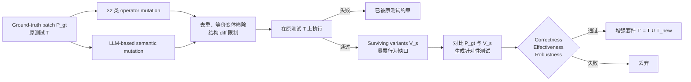

# STING

核心判断：STING 直接动摇了“补丁通过 benchmark tests 就算修复成功”的默认前提：在 SWE-bench Verified 中，77% 的实例至少允许一个语义改变的程序变体穿过原测试；因此本项目的 hidden gate 不能只是把已有测试藏起来，而必须主动证明这些测试能够杀死 plausible-but-wrong skill patches。

## 元信息

- 标题：Are Benchmark Tests Strong Enough? Mutation-Guided Diagnosis and Augmentation of Regression Suites
- 作者：Chenglin Li、Yisen Xu、Zehao Wang、Shin Hwei Tan、Tse-Hsun (Peter) Chen
- 版本：arXiv v1，2026-04-02
- 页数：12
- 本地 PDF：[[sting-2604.01518.pdf|本地 PDF]]
- 链接：[arXiv:2604.01518](https://arxiv.org/abs/2604.01518)
- 角色：[[Benchmark与实验平台]] 与 [[Robot CI-CD与安全门]] 的 test-adequacy 核心参考；用于约束 [[问题定义与实验假设]] 中 verifier ablation 和 final-blind evaluation。
- 阅读状态：已按 arXiv v1 全文精读。PDF 仍保留 ACM conference、年份与 DOI 占位字段，应视作未正式发表、尚待独立复现的预印本。

![[sting-2604.01518.pdf#page=1]]

## 一句话版

STING 从正确参考补丁出发，故意生成“接口不变但语义轻微错误”的程序变体；任何仍通过原测试的 surviving variant 都暴露了一个未约束行为，系统再针对该差异生成新测试，并只保留同时满足“通过参考补丁、杀死至少一个错误变体、对语义保持重构仍稳定”的测试。

## 为什么对本项目重要

代码自进化系统有两类能力，很容易被混成一个数字：

1. repair agent 能不能生成通过测试的 patch。
2. verifier 的测试能不能拒绝错误 patch。

如果第二项很弱，第一项的“成功率”越高，反而越可能是在奖励 test overfitting。STING 的贡献是把 verifier 从固定背景条件提升为需要单独诊断和增强的研究对象。

对机器人 skill repair，这意味着：

- held-in failure 是否消失，只能说明当前症状被修掉。
- hidden tests 是否隐藏，并不说明它们足够强。
- regression suite 需要覆盖边界输入、替代执行路径、接口属性、跨 primitive 数据流和状态转移。
- safety gate 也应通过 adversarial mutants 证明有拒绝能力。

## 方法主线



形式上，STING 追求的不是单纯增加 coverage，而是让新增测试同时满足：

```text
test(P_gt) = pass
test(v_surviving) = fail
test(semantic-preserving(P_gt)) = pass
```

前两项提供行为区分，第三项防止测试绑定参考实现的变量名、控制流写法或其他表面结构。

## Section-by-section

### Abstract 与 Section 1：benchmark 分数受 test oracle 上限制约

SWE-bench 类 benchmark 把“补丁通过随 issue 提供的 regression tests”作为 accepted repair。作者指出，这些测试通常只确认 issue 中可见症状，不完整表达修复的行为意图，因此 plausible-but-wrong patches 会被计为成功。

STING 与普通 test generation 的区别在于先做**缺口诊断**：

1. 构造接近正确补丁、但故意带语义偏差的 variants。
2. 看哪些错误行为没有被现有测试发现。
3. 针对这些具体差异生成测试。

这避免了盲目追求覆盖率时重复测试已经约束充分的区域。

### Section 2：与 mutation testing 和 test augmentation 的区别

传统 mutation testing 用预定义 mutation operator 衡量测试能杀死多少人为 fault；LLM test generation 则常直接根据代码或 issue 生成更多测试。STING 组合二者：

- operator mutants 提供细粒度、可解释的局部偏差。
- LLM mutants 提供跨语句、上下文相关的复杂偏差。
- surviving mutants 不是最终评分，而是生成针对性测试的 contrastive signal。

论文强调它与 UTBoost 等工作的差别：test weakness diagnosis 不依赖待评估 agent 已经生成哪些 patches，而是作为 benchmark 本身的属性独立构建。对本项目同样重要——不能根据 ours 的 patch 临时补测试，再用这些测试证明 ours 正确。

### Section 2.1 的具体例子：django-11276

issue 改变了 `escape()` 的输出格式。这个格式还会被下游 `urlize()` 消费，因此 developer/oracle patch 同时更新两个函数。一个 agent patch 只修改 `escape()`，却仍通过原测试，因为原测试只检查局部 escaped output，没有走到 URL 处理链。

STING 先生成一个修改 `urlize()` 的 surviving variant，证明下游路径没有被测试约束；随后生成端到端测试，让输入依次经过 `escape()` 和 `urlize()`，检查最终 URL。新测试：

- 在 oracle patch 上通过。
- 在只修 `escape()` 的 incomplete patch 上失败。

这与共享机器人 skill 的风险高度同构：修复 `move_pose()` 的当前抓取任务后，局部 postcondition 可能通过，但同一 primitive 在放置任务、不同 frame 或 fallback path 中已被破坏。验证必须沿下游调用链检查可观察行为。

### Section 3.1：两类 program variants

STING 只在 reference patch 的修改区域内变异；若修改行位于函数中，则以包围函数为 patch region。跨多个函数时分别处理。

#### Operator-based mutation

系统使用 32 个 Python mutation operators，覆盖：

- predicate/boolean：条件恒真/恒假、取反、`and/or`、比较边界等。
- arithmetic/numeric：数字和字符串常量、算术运算、`len(x)` 替换等。
- return/default：返回 `None` 等。
- loop/iteration：逆序、`break/continue`、零次/一次迭代、range 边界。
- data access/slicing：索引、字典访问、slice 边界。
- exception handling：异常类型、吞异常。
- structural：删除 decorator、list comprehension filter、augmented assignment 等。

每种兼容 operator 最多随机尝试 10 次，每个 variant 只做一个 site modification。

#### LLM-based mutation

LLM 输入 issue description、reference patch 与原测试，生成 10 个独立 variants。prompt 明确要求：

- 接口兼容、语法正确。
- 在参考补丁附近做局部行为改变。
- 像一个 plausible、略有错误的开发者实现。
- 禁止直接 unconditional return 或纯 refactor。

因为 LLM 看得到原测试，它会主动寻找测试未覆盖的条件、边界和控制流。这对 benchmark construction 有价值，但这种模型必须处于可信的离线构建侧，不能与参赛 repair agent 共享 hidden suite。

### Section 3.1 的过滤

生成后经过三类过滤：

1. 删除重复项以及只改 comment、format、docstring、logging message 的表面变体。
2. 用 LLM 判断并去除语义等价 mutation。
3. 用 structural diff 限制修改范围和文件，不接受额外 hunk、纯重命名、消息重排或 code motion。

等价 mutant 识别仍不是形式证明，后文的 robustness validation 才进一步控制风险。

### Section 3.2：surviving variant 是 test inadequacy 的诊断信号

每个 variant 在完整原测试上执行：

- environment error 或 timeout：丢弃，避免把基础设施问题误算成测试能力。
- 被任一测试杀死：说明当前行为已有约束。
- 通过全部测试：加入 `V_s`，作为可能的 under-constrained behavior。

这里的 survivor 不必等于真实 agent 会生成的 patch。它的用途是回答：“如果一个实现偏离正确语义，当前测试是否有机会发现？”

### Section 3.3：对比式测试生成

test generator 同时读取：

- reference patch `P_gt`。
- 一个 surviving variant `v_s`。
- 原测试 `T`。
- 项目测试文件片段，用于遵循测试框架与风格。

它先解释两者行为差异，再选择能让差异变成外部可观察结果的输入或执行条件。测试只能调用 public API，不得依赖内部变量或实现结构。

该阶段的两个原则：

- **Behavioral Differentiation**：在 `P_gt` 与至少一个 `v_s` 上产生不同结果。
- **Intent Alignment**：新增测试必须通过 `P_gt`。

### Section 3.4：三重测试验证

候选测试只有同时过三关才加入增强套件：

1. **Correctness**：在 reference patch 上通过。
2. **Effectiveness**：杀死至少一个原测试放过的 survivor。
3. **Robustness to Test Overfitting**：在对 reference patch 做语义保持变换后仍通过，并通过 LLM 的 implementation-specific screening。

语义保持变换包括：

- 一致重命名 identifier。
- 交换比较操作数。
- 重排无数据依赖语句。
- 拆分/合并 if。
- ternary 与 if-else 互换。
- for/while、list comprehension/loop 互换。
- 算术赋值和字符串格式写法互换。

这是本文最值得迁移的 verifier-of-verifier 思路：不仅测试 patch，也测试“测试是否会错误拒绝另一种正确实现”。

## Section 4：实验设计

- Benchmark：SWE-bench Verified 的 500 个 Python repository-level issues。
- 执行环境：官方隔离 Docker harness。
- 所有 LLM-based mutation 与 test generation 使用 `gpt-5-mini-2025-08-07`，reasoning level 为 medium。
- operator pipeline：32 类 operator，每类在兼容位置最多 10 次随机尝试。
- LLM mutation：每实例生成 10 个去重 variants。
- RQ1：原测试有哪些行为缺口？
- RQ2：增强测试改善多少覆盖与 assertion strength？
- RQ3：增强测试如何改变 top-10 repair agents 的评估？
- RQ4：新增测试具体检查了哪些行为？

## RQ1：原测试的约束缺口

核心数字：

| Variant 来源 | 受影响实例 | Surviving variants |
| --- | ---: | ---: |
| Operator-based | 50 / 500（10.0%） | 209 |
| LLM-based | 380 / 500（76.0%） | 1,915 |
| 合并去重 | 385 / 500（77.0%） | — |

LLM survivors 中 54.3% 是 condition modification；operator survivors 中 predicate/boolean 占 52.2%，arithmetic/numeric 占 32.1%。说明最常见缺口是分支和边界没有被输入触发。

对 20% survivor instances 的人工分析得到四类缺口，两位作者 Cohen’s κ 为 0.94：

| 测试缺口 | 占比 | 含义 |
| --- | ---: | --- |
| Insufficient Input Space Exploration | 55.8% | 没有覆盖边界值、其他合法配置 |
| Partial Patch Path Coverage | 19.5% | 只测主路径，漏 fallback/default |
| Weak Assertions | 16.9% | 只查表面值，漏类型、结构、metadata |
| Missing Environmental Context | 7.8% | 只在干净环境测试，漏已有状态或环境变量 |

这四类可以近乎原样转为 robot regression taxonomy：

- 位姿、对象大小、摩擦、遮挡的输入空间。
- grasp 成功路径之外的 retry/fallback。
- 只看任务成功，不看接触力、夹爪状态、轨迹约束。
- 只从 reset 状态测试，不测累积状态、已有物体或旧 memory。

## RQ2：测试覆盖与断言强度

STING 共生成 1,316 个候选测试，覆盖 236 个 test-weak instances；robustness 过滤后保留 1,014 个测试、覆盖 211 个 instances。论文在 threats 中说明 implementation-specific 过滤移除了约 23% 候选。

在这 211 个实例上：

| 指标 | 原测试 | 增强后 | 变化 |
| --- | ---: | ---: | ---: |
| Patch-region line coverage | 40.8% | 51.6% | +10.8 pp |
| Patch-region branch coverage | 41.7% | 51.2% | +9.5 pp |
| 每 issue assertions | 2.31 | 5.18 | +124.2% |
| Assertion density | 0.22 | 0.30 | +36.4% |
| Assertion type diversity | 1.56 | 3.14 | +101.2% |

line coverage 的配对 Wilcoxon `p < 0.001`，branch coverage 约 `p = 0.02`；三项 assertion 指标均 `p < 0.001`，rank-biserial effect size 为 0.55、0.48、0.52。

值得强调：coverage 上升不是 correctness 的充分条件。STING 更强的证据来自新增测试确实能拒绝原先通过的 agent patches。

## RQ3：更强测试改变排行榜

在 top-10 SWE-bench Verified agents 上，新测试使 resolved rate 全部下降，幅度为 4.2–9.0 个百分点；每个 agent 有 21–45 个原本被接受的 patch 被拒绝，并且 leaderboard 相对排名发生变化。

代表性结果：

| Agent | 原始 | 增强后 | 下降 |
| --- | ---: | ---: | ---: |
| live-SWE-agent, Claude 4.5 Opus | 79.2% | 75.0% | -4.2 pp |
| Atlassian Rovo Dev | 76.8% | 68.8% | -8.0 pp |
| TRAE | 75.2% | 66.2% | -9.0 pp |
| Harness AI | 74.8% | 67.8% | -7.0 pp |

LLM-guided tests贡献了大部分 kill，但 operator-guided tests 每个 agent 仍额外发现 3–6 个未被 LLM tests 捕获的 patch，证明两种 mutation 信号互补。

## RQ4：新增测试究竟检查什么

作者抽样人工分析 66 个新拒绝 patches，两位标注者 κ 为 0.92，归纳为：

| 新增行为检查 | 占比 |
| --- | ---: |
| 选择能区分行为的输入 | 54.5% |
| 端到端行为验证 | 40.9% |
| 状态转移后的验证 | 4.6% |

这比“多生成一些随机 seed”更具体。机器人 hidden tests 应刻意加入：

- 使两个实现产生分歧的边界位姿/对象属性。
- 跨 primitive 的端到端可观察效果。
- 执行过一次、状态改变后再次调用同一 skill。

## 局限与批判

### 论文明确讨论的威胁

- 某些 survivors 可能与 oracle patch 语义等价。
- generated tests 可能过拟合 oracle implementation；行为保持变换移除了约 23% 候选。
- RQ1/RQ4 有人工分类，不过 κ 分别为 0.94/0.92。
- 只评估 SWE-bench Verified：500 个 Python instances、12 个 repositories。
- LLM 模块只使用一个 GPT-5-mini 版本。
- 把 oracle patch 当作主要 correctness reference；若存在多个合法行为，测试可能错误拒绝有效替代。

### 对本项目更关键的局限

1. **它是 benchmark-construction 方法，不是在线 repair 方法。** 生成 mutations、反复运行完整测试和生成 1,316 个候选测试成本高，适合离线加固 gate，不应混入 ours 的部署预算。
2. **它依赖已知正确参考补丁。** 真实自进化部署没有 ground truth；可用于 planted-defect benchmark 和历史 bug，但不能成为在线 verifier 的唯一来源。
3. **软件的行为保持变换比机器人更容易。** 重命名变量通常不改变程序行为；但替换控制器、重排动作或改轨迹可能改变接触动力学，不能轻率视作等价。
4. **通过 oracle patch 仍不等于真实意图。** 若 ground-truth patch 本身只修复当前 CI、未覆盖安全或跨任务语义，STING 会继承该盲点。
5. **摘要中的“错误 variant”需要谨慎。** RQ1 的 77% 是过滤后 surviving variants 的实例比例，不等同于已人工证明 77% 的 benchmark 都接受真实错误 agent patch。

## 对 H4、H5、H2、hidden tests 与预算的影响

### H4：把 verifier 的拒绝能力变成可测量对象

H4 不能只比较“有 gate”与“无 gate”，还应检验 gate 是否真的拒绝 plausible-but-wrong patch。建议报告 mutation kill rate、false acceptance，以及对 behavior-preserving variant 的 false rejection；否则所谓 verifier 收益可能只来自一个很容易通过的测试集合。

### H5：防止把 trace 收益建立在弱 oracle 上

如果 structured trace 组产生更多“通过 held-in tests”的 patch，而测试本身不足，这会虚高 H5。H5 的 primary endpoint 应使用经 mutation audit 加固后的 final-blind suite，而不是 agent 可见的修复测试。

可以增加 verifier sensitivity 报告：

```text
mutation kill rate
false-accept rate on plausible wrong patches
false-reject rate on behavior-preserving variants
```

这样才能区分“trace 帮助产生正确 patch”和“trace 帮助更快过拟合测试”。

### H2：用 failure-family-specific mutants 检查错误路由

H2 要求在非 code-repairable case 上正确 abstain。可以为每类失败构造对照 mutants：

- plan/memory mutant：代码正确，但 recipe 或 binding 错。
- code mutant：共享 skill implementation 中的局部、可修复错误。
- policy-limited perturbation：固定 policy 的 operating range 不足。
- trusted-kernel mutant：evaluator/环境异常，只用于确认系统会升级处理，不允许 agent 修改。

若 agent 对非 code case 反复修改 skill，即使偶然通过当前测试，也应记为 routing error。STING 的 survivor 概念可以帮助构建“会骗过弱 gate 的错误路由 patch”。

### Hidden tests：从“隐藏”升级为“被审计”

建议离线构建四层测试：

1. **Held-in repair tests**：最小失败复现，agent 可见。
2. **Mutation-strengthened hidden gate**：针对 planted/history ground-truth patch 生成 survivors 与区分测试。
3. **Behavior-preserving acceptance tests**：确保不同但正确的实现不会被误拒绝。
4. **Final-blind task/seed/regression/safety suite**：从未参与 patch 选择。

hidden tests、mutation seeds、surviving variants 和 oracle patch 必须放在不可编辑可信内核，且不进入 agent trace。

### 预算：把 verifier 构建与 repair 运行分开

STING 的离线工作量至少包括：

- 每实例 32 类 operator、每类最多 10 次兼容位置尝试。
- 每实例 10 个 LLM semantic variants。
- 每个 variant 的完整原测试执行。
- 对每个 survivor 的测试生成。
- 候选测试在 oracle、survivor 和多种语义保持变换上的重复验证。

论文未提供统一 token、美元或 wall-clock 总成本。因此本项目应分别报告：

| 成本账本 | 是否计入 repair-agent 预算 |
| --- | --- |
| benchmark 一次性 mutation/test 构建 | 否，单独公开 |
| 每个方法共同使用的 hidden gate 执行 | 是，按相同提交上限 |
| ours 额外生成的 patch/trace/rollout | 是 |
| verifier 的周期性维护 | 单独报告 |

不能把 ours 专享的自适应测试生成作为免费基础设施，同时只限制 baseline 的固定测试。

## 迁移到 Robot CI 的具体方案

### 1. 先定义可观察语义

对每个可编辑 skill 建 typed contract：

```yaml
inputs:
  - object_pose_camera
  - robot_state
outputs:
  - commanded_pose
postconditions:
  - object_in_gripper
invariants:
  - workspace_bounds
  - max_velocity
  - collision_clearance
cross_task_regressions:
  - pick
  - place
  - open_drawer
```

没有可观察 contract，就无法判断一个 mutant 是“错误行为”还是另一种实现。

### 2. 构造真实而非玩具的 mutants

优先 mutation family：

- 坐标系/单位：漏 transform、轴交换、角度/弧度。
- 边界条件：`<`/`<=`、reachability threshold、gripper tolerance。
- postcondition：false success、只检查一次、检查错误对象。
- retry/fallback：吞异常、跳过 re-staging、错误重试计数。
- state transition：缓存未失效、旧 observation 被复用。

同时保留少量历史真实 bug，避免 reviewer 认为 benchmark 只是参数扰动。

### 3. 用 survivor 驱动测试，而不是用 ours patch 驱动

从 clean/reference implementation 离线生成 mutants；凡是能穿过现有 regression/safety suite 的 survivor，都触发新测试设计。整个过程在实验开始前冻结并预注册。

### 4. 验证测试不过拟合参考实现

软件的 identifier rename 可以直接复用；机器人更适合以下 behavior-preserving variants：

- 等价 helper 函数拆分/合并。
- 日志与变量重命名。
- 相同轨迹约束下的数值实现重构。
- 等价坐标变换库调用。
- 在容差内输出相同 command/postcondition 的实现替换。

所有“等价”关系需要通过轨迹容差、contract 和人工审计共同确认，不能只靠 LLM judge。

## 我会追问的问题

- 77% survivor rate 中，经过完整人工语义审查后真正错误的比例是多少？
- 增强测试若不读取 oracle patch、只读 issue 与 public behavior，效果还剩多少？
- operator 与 LLM mutation 在相同执行预算下，各自的 unique kill yield 是多少？
- leaderboard 降分中有多少是明确 incomplete patch，有多少只是与 oracle 不同的合法实现？
- 怎样为带随机性和连续状态的机器人定义“杀死 mutant”，而不把仿真噪声误判为行为差异？
- 如果 verifier 也由 LLM 生成，如何防止 repair agent 与 verifier 共用同一模型偏差？
