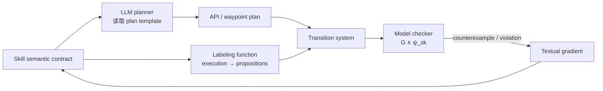

# VASO

核心判断：VASO 给出了“可验证 skill 自进化”的最接近形式化版本：它把 skill 表示成全局/局部时序逻辑规则、proposition-aligned labeling function 与 planner-facing template 的耦合语义合同，并把 model-checker counterexample 变成修改合同的 textual gradient。它强烈支持本项目把 verifier 放进演化循环，但其“形式保证”依赖未经验证的 proposition grounding 和简化的顺序执行模型，且演化对象主要是 semantic contract，而不是 RPent 中跨任务共享的完整 Python skill implementation。

## 元信息

- 标题：VASO: Formally Verifiable Self-Evolving Skills for Physical AI Agents
- 全称：Verification-Guided Automated Skill Optimization
- 作者：Yunhao Yang、Neel P. Bhatt、Kevin Wang、Samuel Tetteh、Zhangyang Wang、Ufuk Topcu
- 版本：arXiv v1，2026-06-03
- 页数：22
- 本地 PDF：[[Source/Papers/vaso-2606.05395.pdf|本地 PDF]]
- 链接：[arXiv:2606.05395](https://arxiv.org/abs/2606.05395)
- 角色：[[安全验证与机器人DSL]]、[[Robot CI-CD与安全门]] 和 [[自进化代码Agent与评估器]] 的直接相关工作；也是本项目“安全门只是过滤器，还是能产生修复信号”这一问题的关键参照。

![[Source/Papers/vaso-2606.05395.pdf#page=2]]

## 一句话版

VASO 先检查一个 LLM 生成的 skill local rule 是否与全局 LTL 安全规范逻辑相容，再把该 skill 引导生成的 API/trajectory plan 编译为 NuSMV transition system；若 model checker 找到违规路径，就把具体违反的公式和 counterexample 转成 textual gradient，迭代更新可复用 semantic contract，而不修改 foundation-model 权重。

## 为什么重要

许多 self-evolving agent 论文把“在若干 rollout 上成功”当作 skill 已被验证。VASO 指出，这只能提供 trace-level evidence：采样过的轨迹成功，不代表未采样执行不会违反罕见但严重的时序安全条件。

对本项目最重要的三个启发是：

1. **Verifier 不应只做最后的 pass/fail gate。** Counterexample 应包含最早违规状态、违反的 contract 和因果前缀，直接进入 repair proposal。
2. **Skill 需要双重接口。** 对 planner 要有可理解的行为模板，对 verifier 要有符号化 proposition 与 transition semantics。
3. **保证必须写清条件。** 如果 observation/action 到 proposition 的映射错误，model checker 可以对错误模型给出完全正确、但对物理世界无效的证明。

VASO 也构成重要边界：如果本项目只是“让 LLM 根据 formal counterexample 改 skill.md / prompt template”，新意会很弱。我们更需要研究 implementation patch、真实执行 trace 与 regression/safety CI 的结合。

## 核心表示：一个 skill 到底是什么

论文定义 skill：

```text
sk = (G, ψ_sk, C_sk)
```

其中：

- `G={φ1,...,φm}`：所有 skill 都必须遵守的 global LTL specifications；
- `ψ_sk`：该 skill 的 local LTL rule，表达局部目标或行为要求；
- `C_sk=(L_sk, C^p_sk)`：semantic contract；
- `L_sk`：把 robot state、observation 和 command 映射到 atomic propositions 的 labeling function；
- `C^p_sk`：给语言模型 planner 使用的文本/代码式 plan template。

这个设计试图让同一个 skill 同时服务三个消费者：



这比只给 skill 写一句自然语言描述更强，因为它显式定义了可执行接口和符号语义；但也比验证实际 closed-loop controller 更弱，因为 plan compilation 与 labeling function 本身形成了新的可信基。

## Section-by-section

### Abstract：从“验证一次 plan”转向“修复产生 plan 的 skill”

摘要的核心区别是：传统 formal planner/checker 通常对一次生成的 plan 做接受或拒绝；VASO 用失败原因更新产生这些 plan 的 reusable skill contract，使后续新任务 prompt 也受益。

论文报告，在 Clearpath Jackal 与 PX4 quadcopter 任务、11 条 temporal-logic specification 上，优化后的 skill 达到最高 97.2% formal-specification compliance，使用少于 100 个 optimization samples。这里的“97.2%”是有限测试计划上的 specification satisfaction，不是对真实连续物理系统的 97.2% 无事故保证。

### 1. Introduction：skill creation 变便宜，skill trust 没有

引言认为 foundation model 已显著降低 skill authoring 成本，却没有同步降低 assurance 成本。一个自然语言或代码模板看似合理，仍可能产生：

- Jackal 看到人后没有在下一步停止；
- PX4 略微超过 altitude 或 velocity envelope；
- 在 sampled rollout 上都成功，但某个未采样边界输入违反时序条件。

作者指出，只在 plan 生成后做 model checking，会让 verifier 退化成筛选器；只更新 flat planner prompt 或模型权重，又不会留下可独立检查和复用的 skill artifact。于是论文将 formal counterexample 直接作用于 semantic contract。

这一问题设定与本项目的安全门方向一致，但 VASO 的目标更偏“提高由 skill 诱导的 plan specification compliance”，本项目还需同时保持 task success、旧任务 regression 与真实机器人风险界限。

### 2. Related Work：VASO 的定位

论文将相关工作分为三组：

- LLM planning / plan verification：生成或验证每个 task 的 fresh plan；
- prompt/model optimization：把 feedback 吸收到 prompt 或权重；
- skill evolution：从 execution reward、unit test 或 self-critique 形成复用 skill。

VASO 声称的交叉点是：形式 counterexample 不只拒绝一次 plan，而是更新一个显式、可复用的 skill contract；模型权重保持冻结。

### 3. Problem Formulation：从执行轨迹到逻辑轨迹

给定 atomic propositions `AP={a1,...,an}`，物理/执行轨迹记为 `σ=σ0,σ1,...`。`L_sk(σ_t)` 把每个时刻映射为当前成立的 proposition 集合，进而得到 proposition trace。

Planner 根据 task prompt `τ` 和 semantic contract 生成 plan `π`。论文再把 plan 编译为：

```text
A_π = (S, S0, T, L)
```

每个 plan element——API call、waypoint 或 trajectory segment——对应一个状态，顺序相邻元素形成 transition。验证目标在问题定义中写成：

```text
A_π ⊗ M ⊨ G ∧ ψ_sk
```

其中 `M` 是环境/系统动态 transition system。最终目标还包括：

- local rule 与 global rules 至少存在一个共同满足轨迹，即 skill 逻辑可行；
- skill 诱导的 plan 在所有被该形式模型覆盖的执行中满足 global/local specifications。

应特别注意：这里的“所有可能执行”只覆盖 `A_π ⊗ M` 表达的状态和 transition。没有进入 symbolic model 的摩擦、感知误差、时延和连续动力学，不在证明范围内。

### 4. Verifiable Self-Evolving Skills：冻结模型，演化合同

VASO 保持 `G` 和 foundation-model 权重不变，迭代更新 `ψ_sk` 与 `C_sk`。它有两级 verification。

#### 4.1 Skill-Level Verification

第一层检查 local rule 与 global rules 是否逻辑相容：

```text
Φ_sk = (∧_{φ∈G} φ) ∧ ψ_sk
```

作者构造一个覆盖 `2^AP` proposition assignments 的 universal transition system，把可行性化为 LTL satisfiability/model-checking 问题。如果没有任何轨迹满足 `Φ_sk`，就重新请求 skill model 修正 local rule。

这一步只能证明“规则在逻辑上不自相矛盾”，不能证明物理机器人能实现。比如“永远低于 10m 且最终到达 9m”可能逻辑可行，但给定推力、风扰和电量未必物理可达。

论文的 Jackal 例子中，原 local rule 大意是：只要“没有障碍或看到人”，下一步就前进；它与 global rule `G(person_observed -> X stop)` 冲突。counterexample 促使模型把条件修成“既没有障碍也没有人时才前进”。

#### 4.2 Plan-Level Verification 与 VASO 优化

逻辑可行后，planner 根据 contract 生成 API calls 或 waypoint trajectory。VASO 用 `L_sk` 给每个 execution element 标 proposition，并编译成 NuSMV automaton。

若验证失败，输出形如：

```text
violate specification: G(person_observed -> X stop)
```

这一输出和 counterexample trace 被视为离散的 textual gradient。系统基于 LLM-AutoDiff 迭代：

```text
C_sk^(k) → plan π^(k) → automaton A_π^(k)
     ↑                         ↓
updated contract ← textual gradient
```

其“梯度”不是可微模型的参数梯度，而是结构化自然语言修订信号。优化对象仍是 prompt-level semantic contract，包括 proposition wrapper 和 plan template。

#### Guarantee and Assumption

论文明确写道，plan-level guarantee **conditioned on the correctness of proposition alignments**。这是整篇最重要的限定语。Model checker 可以完美证明 symbolic trace，却不能证明自动生成的 `L_sk` 正确感知和解释了真实物理状态。

### 5. Empirical Evaluation

实验使用 GPT-5-nano 作为 `F_skill`，GPT-4o-mini 作为 `F_plan`，覆盖 Jackal 地面机器人和 PX4 无人机。主要评测问题包括：

1. verification feedback 是否改善 skill；
2. structured skill 是否优于 flat prompt optimization；
3. 优化后 skill 是否迁移到未见 prompt；
4. 自动 proposition alignment 是否接近手写 mapping。

#### Specification 与数据规模

共有 11 条规格：

- Jackal global：看到人下一步停止、看到障碍下一步不前进、speed `<0.5`；
- Jackal local：安全时最终继续前进、遇障碍最终转向；
- PX4 global：altitude `<10`、velocity change `≤1`、linear velocity `≤1`；
- PX4 local：最终落地静止、地面时速度为零、最终发生正向运动。

论文生成 20 个 skills；global specifications 在 400 个 plan 上评估，local contract 只在对应 skill 的 plan 上评估。

#### 主要结果

| 方法 | Safety Score | Task Completion |
| --- | ---: | ---: |
| LLM+P | 79.5 | 88.3 |
| ReAct | 73.3 | 86.5 |
| LLM-Planner | 90.3 | 89.3 |
| DSPy | 86.8 | 87.0 |
| RoboInstruct | 82.5 | 67.0 |
| RLVF | 94.3 | 82.5 |
| VASO，手写 proposition alignment | 97.2 | 85.3 |
| VASO，自动 proposition alignment | 96.8 | 86.5 |

初始 skill 中约 89% 通过 feasibility check，一次 feedback 后约 97% 通过。优化 7 步后，plan 在 11 条规格上的平均 safety score 约 95%。Structured VASO 在 7 步内超过 90%，flat prompt optimization 到 10 步仍约 85%，支持“结构化 skill 是更好的优化单位”。

同预算比较中，VASO 用约 100 个 training samples 达到最高 safety score，训练时间约为 fine-tuning 路线的四分之一。论文也报告每个 skill 少于 20 分钟；这些是 paper-reported 成本，尚未独立复现。

#### Held-Out Skill Reuse

作者选取 drive、find-object、bypass-object 和 fly-square 四个 skill。每个 skill 用 5 个 in-domain prompts 优化，再冻结 skill，在 5 个 held-out prompts 上测试；每 prompt 生成 5 个 plan，共 200 个 plan。

未见 prompt 上 safety 为 92–100%，task completion 为 80–96%。这说明同一 task family 内的 wording、parameterization 与简单 composition 能复用，但并不等同于跨 embodiment、跨动力学或跨 API 的泛化。

#### Automatic Proposition Alignment

自动 mapping 与手写 mapping 的最终 safety score 相差不到 1 个百分点，表面上说明人工符号工程可以显著减少。然而平均指标会掩盖罕见的致命 grounding error；论文自己的 failure case 正好证明这一点。

### 6. Conclusion

结论认为，显式 skill abstraction 让 planning primitive 同时可解释、可复用和可验证；formal counterexample 可作为高质量优化信号，而不必微调模型。

### 7. Limitations and Future Directions

论文明确承认两个核心限制：

- 自动生成的 `L_sk` 未经验证，mapping error 会使 formal guarantee 失效；
- 当前只覆盖 sequential, non-concurrent execution，不能处理交叠 skill 或多 agent 并发。

作者建议加入 proposition confidence/calibration，并扩展到多 agent、共享环境约束。

### Appendices：最值得看的两个案例

#### Jackal：从“停下不再动”修到安全恢复

初始 plan template 在检测到人或障碍后 `break`，随后永远 `stop()`。它满足“遇人停车”，却违反“安全后最终继续前进”的 liveness rule。VASO 经过迭代，把 template 改为持续循环：看到人则停，看到障碍则停或转向，安全时前进。

这个例子说明 safety 不能只写禁止条件，还要包含 progress/liveness，否则最简单的“永远不动”会成为形式上安全的最优解。

#### PX4：10m 边界与错误 norm

初始 square-flight template 以 1m/s 上升 10 秒，恰好到 10m，但规格要求严格 `<10`；离散控制还会在下一命令到达前略微继续上升。一次优化把 vertical speed 从 1 降到 0.5，消除 violation。

更关键的 failure case 是错误的 `linear_velocity()` 只计算 N/E 平面、忽略 vertical component。命令 `(0.8,0.6,-0.5)` 被错误算成 `1.0`，真实三维 norm 却约为 `1.12`。Model checker 因此会错误接受。这个案例几乎可以直接作为本项目的 trusted-kernel 教材：**不能允许被修复 agent 同时修改 specification grounding 与待验证 implementation，除非另有独立 oracle。**

## 局限与批判

### 已有证据

- Formal guarantee 以 proposition alignment 正确为前提，而 alignment 恰好由 LLM 自动生成且未经形式验证。
- Plan-to-automaton 主要按 API/waypoint 的顺序建立线性 transition；复杂 branching、closed-loop perception、异步控制、连续动力学和并发未得到充分覆盖。
- 主要安全指标是在生成 plans/形式模型上计算，task completion 也有 simulation 评估；论文展示 Jackal/PX4 实机例子，但还不足以证明全套 97.2% 指标等价于真实硬件安全率。
- Held-out reuse 仍在相同 task family 和相同底层 command/specification 内，外推范围有限。
- 97.2% 仍意味着约 2.8% 形式规格未满足；对严重物理风险，平均 compliance 不能取代“零严重违规”约束。

### 合理推断

- 如果 skill optimizer 能改 `L_sk`，它可能通过改变 proposition 定义来“修复”证明，而不是真正修复行为。`L_sk` 更适合作为只读 trusted kernel，或必须经过独立 differential/oracle tests。
- Universal proposition transition system 的 skill-level check 只回答逻辑 satisfiability，不能替代物理 feasibility、reachability 或 dynamics-aware verification。
- Textual gradient 给出了违反哪条公式，但未必提供真实根因；例如 velocity violation 可能来自 unit conversion、frame convention、sampling period或 controller lag，仍需 execution trace 完成因果归因。
- VASO 的优化目标偏 safety score，若不同时约束 completion、回归和成本，系统可能学到保守停机。

## 与 Harness VLA、RPent 和本项目的精确边界

| 维度 | VASO | Harness VLA / RPent | 本项目 |
| --- | --- | --- | --- |
| 演化对象 | LTL local rule + proposition mapping + plan template | memory/recipe 与固定 primitive 调用 | 白名单内共享 Python skill/monitor implementation |
| 反馈 | model-checker counterexample | execution success/failure + multimodal observation | execution trace + tests + regression + safety counterexample |
| 底层 policy | command/API planner | 冻结 VLA + 解析 primitive | 冻结 VLA/可信内核 |
| 验证范围 | symbolic plan/spec compliance | task-level execution | hidden held-in/held-out、旧任务回归、安全门 |
| 最大风险 | proposition grounding 错误 | evaluator/retry/memory 混杂 | patch reward hacking 与跨任务回归 |

本项目不应声称“首次把 formal verification 用于 self-evolving skill”。更可辩护的表述是：**将 execution-driven implementation repair 与分层 software verification 结合，在固定 Harness VLA 系统内评估真实共享组件 patch 的条件性收益与回归风险。**

## 对本项目架构的影响

1. 将 trusted kernel `K` 细化为：外部 evaluator、raw tracer、global safety specs、proposition grounding、hidden tests、budget/model policy 和部署/回滚器。
2. 第一版默认不允许 agent 修改 `K`；可编辑 workspace `W` 只包含 skill implementation 与明确允许的 local postcondition。
3. 每个 skill 至少增加：

```text
precondition
postcondition
invariant / safety contract
observable proposition mapping（只读或独立验证）
implementation
regression dependencies
```

4. Gate 失败不能只返回“test failed”，而应返回 violation、最短 counterexample、首次偏离步骤和受影响 contract，作为 structured repair evidence。
5. Safety 与 progress 必须联合评估；既防止危险 patch，也防止“永远停机”的保守退化。

## 对实验假设的影响

- **Verifier necessity hypothesis**：同一候选 patch pool 下，counterexample-guided gate 应比 deploy-first 或只看 task reward 显著降低 false acceptance 与 regression。
- **Grounding robustness hypothesis**：只读、经 oracle test 的 proposition mapping 应比允许 repair agent 同时修改 mapping 的设置更少出现虚假通过。
- **Generalization hypothesis**：contract-guided patch 应在相同 component 的未见任务/参数上迁移，而不是只满足触发 counterexample。
- **Safety non-inferiority**：主结果不能只报告平均 safety score；必须预注册零 severe violation，并对 minor violation 做非劣检验。
- **Boundary hypothesis**：formal counterexample 能增强安全修复，但不能替代 perception/dynamics/evaluator failure 的正确升级与 abstention。

## 我会追问的问题

- `L_sk` 由谁验证？如果它与 implementation 一起被优化，如何防止 specification gaming？
- `A_π` 中的 branching、loop、sensor nondeterminism 和 controller delay 如何表达？有限展开会漏掉哪些 liveness/safety bug？
- 97.2% 中剩余失败集中在哪些 specification 与哪些 skill？是否存在少数高严重度违规被平均指标掩盖？
- 如果对相同 skill 连续加入多条 local rule，如何检测它们之间的新冲突和 contract drift？
- 将 counterexample 与真实 multimodal primitive trace 联合输入 repair agent，是否优于只给违反公式的 textual gradient？
- 在 RPent 中，哪些 contract 能由 observation 实现，哪些依赖 simulator ground truth、不能安全迁移到真实机器人？
