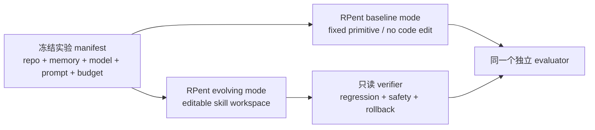

# Harness VLA 作为 Codebase 与 Baseline 的采用决策

核心判断：RPent 是公开框架与 codebase，Harness VLA 是 RPent 的首个论文系统和当前 fixed-harness 方法配置；因此“用 RPent 做 codebase”和“用 Harness VLA 做 baseline”并不冲突。我们可以在同一框架上开发，但必须把论文对照所用的 RPent commit、配置和资源冻结下来，不能用持续变化的 `main` 充当 baseline。

判断日期：2026-07-29。

## 决策摘要

| 角色 | 当前决策 | 适用范围 | 原因 |
| --- | --- | --- | --- |
| Scientific baseline | **GO** | 冻结 VLA + 固定 primitive + memory + planner re-grounding/retry | 它是与本项目最接近、最能排除“只是更会调用工具”这一解释的对照 |
| 原型执行底座 | **Conditional GO** | 先限于 Pi0.5 + LIBERO-Pro 的 3–5 天 spike | 进程隔离、planner/toolkit 接口和 trace 结构值得复用，但成熟度与复现闭合度不足 |
| 唯一长期 codebase | **现在 NO-GO** | 不立即围绕滚动 `main` 做大规模二次开发 | 缺少明确许可证、版本仍是 pre-alpha、公开实现覆盖面小于论文、依赖和 memory 会漂移 |
| 本项目方法 | **独立 overlay/fork** | skill registry、defect、repair agent、verifier、regression、rollback | 必须让“能否修改并验证 skill code”成为唯一处理变量 |

## 术语澄清：它们不是两套独立系统

[RPent README](https://github.com/RLinf/RPent)把 Harness VLA 称为 RPent 的首个 publication，Harness VLA 项目页的 Code 按钮也直接指向 RPent。因此在当前公开实现中：

- **RPent** 是可继续扩展的框架/codebase；
- **Harness VLA** 是在 RPent 上实现并发表的具体方法与实验配置：冻结 VLA、固定 primitive、task/global memory、planner re-grounding 和 retry；
- “复现 Harness VLA baseline”实际就是运行一份被冻结的 RPent baseline 配置。

我仍然把下面两个决定分开，不是因为它们是两个项目，而是因为它们在实验中承担不同角色：

1. **Baseline 决定**回答“论文中我们必须击败谁”。
2. **Codebase 决定**回答“我们的系统长期建立在哪套软件上”。

所以完全可以采用同一个 RPent repository，但需要保留两个可切换且可比较的运行模式：`fixed_harness` 与 `code_evolving`。

## 为什么它适合做 Baseline

[[Harness VLA]] 把冻结 VLA 封装为可重试的接触 primitive，用解析 primitive 负责定位、staging、transport、release，并让 planner 根据 task-specific trace 与 global failure model 做重绑定和恢复。[论文 v3](https://arxiv.org/abs/2607.08448) 报告了 LIBERO-Pro、RoboCasa365 和 RoboTwin C2R 上的显著收益。

这正好构成对本项目最严格的替代解释：

> 如果 fixed primitive、memory、re-grounding 和 retry 已经足以修复失败，为什么还需要 coding agent 修改代码？

因此本项目必须证明：

- fixed harness 已经用尽相同的 planner、memory、VLA、感知和执行预算；
- code-repair 版本仍能修复实现级 failure；
- 收益出现在 held-out failure/scene 上，而不是只拟合触发修复的 trace；
- 旧任务 regression 和安全违规没有增加。

需要准确命名这个 baseline。论文在每个任务的 reference seed 上先允许 `RESET` 和较宽松探索，再把成功结构迁移到同任务的新 seed 或扰动场景。因此它更接近 **task-bootstrap / few-shot fixed harness**，不应被笼统称为完全 unseen-task zero-shot。

## RPent 值得继承的部分

Harness VLA 就建立在 [RLinf/RPent](https://github.com/RLinf/RPent) 上。从公开实现看，以下设计和本项目高度一致：

- planner、toolkit、environment server、VLA server 分离；
- `api`、Claude Code、Codex planner 面对同一套 tool schema；
- learned policy 以可重试 primitive 进入系统，而不是端到端接管 episode；
- 仿真环境和 VLA 分进程运行，可分别替换或远程部署；
- 每步保留状态、图像、transcript、action artifact，并提供 dashboard；
- 文档明确要求把工作空间和安全限制放在 environment server，而不是只写进 prompt。

这些部分适合作为 execution plane 与 fixed-harness baseline 的起点。[[核心架构]] 中的 typed learned skill 也可以从 `VLA_ACT`/`pi0_pick` 接口演化，而不是重新造一套 planner runtime。

### 第一批实际代码落点

本地只读审计显示，LIBERO 的首批受限编辑面可以直接落在 [`robots/libero/tools.py`](https://github.com/RLinf/RPent/blob/main/robots/libero/tools.py) 的 `LiberoPrimitives`，其 primitive 由 [`robots/libero/toolkit.py`](https://github.com/RLinf/RPent/blob/main/robots/libero/toolkit.py) 注册给 planner。适合构造的 implementation defect 包括：

- geometry/frame/unit 与局部 pose 处理；
- primitive 参数传递和 contract；
- skill-local postcondition、early return 与 stale state；
- exception/fallback/FSM 分支。

第一阶段不开放 environment server、外部 evaluator、timeout/truncation 聚合、planner core 或 VLA 权重。这样 `fixed_harness` 与 `code_evolving` 可以共用 runner，只在声明的 skill workspace 上产生差异。路径与类名仍需随最终冻结 commit 写入 manifest，不能依赖滚动 `main`。

## 现在不能直接锁成主 Codebase 的原因

### 1. 公开实现还处于快速成形期

截至判断日，[`pyproject.toml`](https://github.com/RLinf/RPent/blob/main/pyproject.toml) 将版本写为 `0.0.0`，并标记为 `Development Status :: 2 - Pre-Alpha`。README 的 feature matrix 与[架构文档](https://github.com/RLinf/RPent/blob/main/docs/source-zh/rst_source/development/architecture.rst)显示：

- 当前完整参考路径是 Pi0.5 + LIBERO-Pro；
- CLI 目前只接受 `--env libero`；
- RoboCasa、Franka、SO-101 仍在研发中；
- 论文使用的 RoboCasa365/RLDX-1 路径尚未形成同等完整的公开实现；维护者也在 [issue #21](https://github.com/RLinf/RPent/issues/21) 中说明 RoboCasa 支持仍在计划发布。

积极的一面是仓库近期提交活跃，并非无人维护；风险在于接口、依赖和实验行为仍可能快速变化。

### 2. 许可证是当前硬门

截至判断日，[仓库根目录](https://github.com/RLinf/RPent)没有实际 `LICENSE` 文件，[GitHub repository API](https://api.github.com/repos/RLinf/RPent) 的 `license` 也是 `null`，但 `pyproject.toml` 又声明 `license = {file = "LICENSE"}`。

这不只是文档瑕疵。GitHub 官方说明：没有许可证时默认版权法适用，公开仓库允许用户查看和在 GitHub 内 fork，但不自动授予复制、修改、分发衍生作品所需的一般开源许可。[GitHub Licensing a repository](https://docs.github.com/en/repositories/managing-your-repositorys-settings-and-features/customizing-your-repository/licensing-a-repository)

因此，在作者补充明确许可证或书面授权之前：

- 可以做只读审计和有限复现评估；
- 不应默认我们有权把 RPent 修改后作为本项目公开 codebase 再分发；
- 许可证澄清必须放在工程 spike 的第 0 项。

这不是法律意见，而是项目发布风险的必要前置检查。

### 3. 论文 artifact 还没有完全冻结

RPent 的 memory 不在代码仓库内，而在 [RLinf/RPent-memory](https://huggingface.co/datasets/RLinf/RPent-memory)。[`resources.py`](https://github.com/RLinf/RPent/blob/main/rpent/utils/resources.py) 默认在每次运行时同步数据集的最新环境子目录，没有固定 revision。

所以仅记录一个 RPent commit 还不够。同一条命令在不同日期可能读到不同的：

- global memory rule；
- seed-0 task recipe；
- failure model；
- task-specific audit。

此外，Pi0.5 checkpoint 当前[没有 model card](https://huggingface.co/RLinf/RLinf-Pi05-LIBERO-130-fullshot-SFT)，公开配置中的若干依赖也没有 lockfile 或精确版本约束。合理推断是：若不自行冻结完整 manifest，baseline 会静默漂移。

### 4. Evaluator 需要独立复核

[开放 PR #61](https://github.com/RLinf/RPent/pull/61)指出，当前 LIBERO client 曾把 `terminated` 与 `truncated` 合并，时间上限截断可能被暴露为任务成功。无论这个问题何时修复，它都说明：

- benchmark completion predicate 不能直接视为不可质疑的 trusted kernel；
- 我们必须记录并区分 success、failure、timeout/truncation；
- baseline 和本项目方法应使用同一个独立评估 adapter；
- 论文结果必须从冻结 commit 上重跑，而不能把滚动 `main` 的当前行为等同于论文 artifact。

本地只读审计还发现仓库没有随主分支分发的单元测试目录，GitHub Actions 也没有项目自定义的测试 workflow；目前主要是 Ruff pre-commit。Python 源码可以通过语法编译，但这远低于机器人实验所需的运行时、回归和 evaluator 验证。

## 我们应如何建立在 RPent 之上

推荐在同一个 RPent codebase 中保留双轨运行模式，而不是让同一套滚动配置同时扮演 baseline 和方法：



### 冻结的 baseline

至少固定：

- RPent commit SHA；
- container / OS / CUDA / MuJoCo 与所有 Python dependency；
- VLA checkpoint revision 与文件 hash；
- RPent-memory dataset commit；
- planner provider、精确 model snapshot、system prompt；
- task suite、seed、bootstrap/deployment split；
- reset、primitive call、episode step、token、wall-clock 与 API cost budget；
- success predicate 与 timeout/truncation 规则。

### 同一框架中的本项目扩展

在 RPent 中新增、但不反向污染冻结 baseline 的模块：

- typed skill registry；
- deliberate defect injection；
- component-level failure attribution；
- editable skill workspace；
- patch proposal 与版本历史；
- 外部只读 verifier；
- held-in fix tests 与 held-out regression；
- safety gate 和 rollback。

相同的 environment、VLA、planner、perception、memory snapshot 和预算必须同时供 baseline 与 ours 使用。唯一核心差异应是：ours 能否在受限工作区内修改并验证实现。

## 3–5 天采用 Spike

### Day 0：法律与复现前置

向维护者确认：

- 代码许可证；
- 论文结果对应的 repo commit/tag；
- RPent-memory revision；
- checkpoint revision/hash；
- planner model、prompt 与 bootstrap/deployment budgets；
- RoboCasa365/RLDX-1 公开计划。

### Day 1：干净环境 Smoke Test

固定当前 artifact，在单个 LIBERO-Pro task 上从空环境跑通，并确认能导出：

- seed 和完整配置；
- primitive trace 与 transcript；
- success、truncation 和 failure；
- VLA calls、environment steps、tokens、latency 与估算成本。

### Day 2–3：Mini Replication

选 4 个 LIBERO-Pro tasks，覆盖 instruction/position perturbation 与短接触/长时序任务。每个任务用 reference seed bootstrap，再在 10 个 held-out seeds 上成对比较：

1. direct frozen VLA；
2. fixed harness without task-specific memory；
3. full Harness VLA fixed harness。

小样本目标不是精确复刻 headline，而是检查效果方向、方差、运行失败率和实际成本。

### Day 4：扩展性 Probe

加入一个可归因的故意缺陷，例如错误 z-offset 或错误 postcondition。只实现最小外部 verifier，检查能否完成：

```text
defect -> trace -> candidate patch -> static/sim test
       -> held-out regression -> accept/reject -> rollback
```

如果这一条链必须侵入或重写 RPent 的 planner、environment trusted core，RPent 就不适合做我们的长期底座。

## Go / No-Go 门

只有同时满足以下条件，才把 RPent 升级为正式 codebase：

1. **Legal**：获得明确、兼容本项目发布方式的许可证或授权。
2. **Reproducibility**：repo、memory、model、planner、prompt、依赖和预算均可冻结。
3. **Replicability**：mini replication 方向一致，infra failure 可控，成功判定通过独立 sanity check。
4. **Extensibility**：新增 skill、trace schema、外部 verifier 和 rollback 不需要破坏 trusted core。
5. **Scientific control**：baseline 与 ours 可在同一 runner 下只切换 `allow_code_edit` 之类的单一处理变量。
6. **Cost**：GPU、wall-clock 与 LLM API 成本支持多 seed、消融和回归测试。

任一关键门失败时，保留 Harness VLA / RPent 的接口与实验思想，自建更小、可许可、可冻结的 harness；但优先方案仍是在 RPent 中同时维护 frozen baseline mode 与 code-evolving mode。

## 最终建议

现在应做的不是“全面押注 RPent”，而是：

> 采用 RPent 作为候选 codebase，在其中冻结 Harness VLA baseline mode，再新增我们的 validated code-evolution mode。

这个选择既最大化复用，也保留了当前待验证的差异化假设：对共享 skill implementation 的最小修复，能否在 [[Robot CI-CD与安全门|外部验证]]和可回滚约束下，产生 fixed harness 之外的 held-out 增量。

采用之后究竟要检验什么、哪些 failure 才算 code-repairable，以及如何隔离 `allow_code_edit` 的增量效应，见 [[问题定义与实验假设]]。
